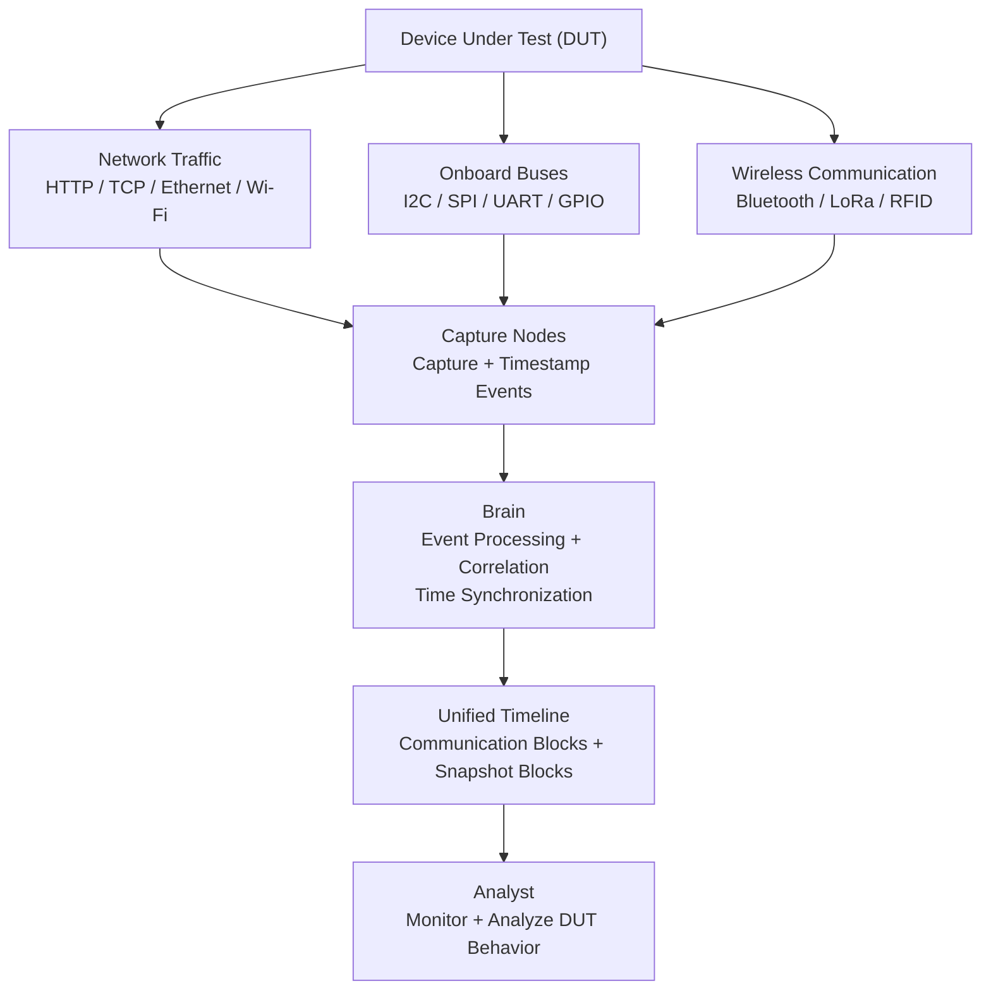
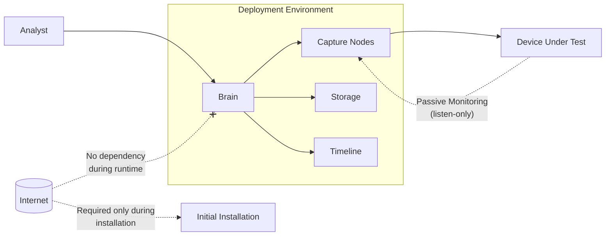
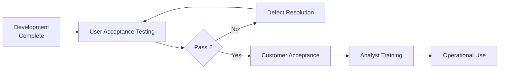

# Business Requirements → Functional Requirements

## BR-MON — Monitoring

**Source BR:** BR-MON-01 to BR-MON-08,
**Assignee:** BK,
**Status:** In progress.

### Summary
The monitoring module provides a unified live view of DUT communications and device states, correlating events and snapshots on a synchronized timeline.

### Monitoring System Data Flow

### Functional Requirements

| FR ID | Requirement | Priority | Acceptance Criteria |
|---|---|---|---|
| FR-MON-01-1 | The system shall display network communication events. | Must | Network events are visible in the monitoring interface. |
| FR-MON-01-2 | The system shall display onboard-bus communication events. | Must | Supported onboard-bus events are visible in the monitoring interface. |
| FR-MON-01-3 | The system shall display wireless communication events. | Must | Supported wireless events are visible in the monitoring interface. |
| FR-MON-01-4 | The system shall provide a unified live view of captured communications. | Must | Events from supported sources appear in one live interface. |
| FR-MON-02-1 | The system shall correlate related communication events. | Must | Related events are grouped or linked correctly. |
| FR-MON-02-2 | The system shall order correlated events chronologically. | Must | Events appear in correct time order on the timeline. |
| FR-MON-03-1 | The system shall display live events within a documented latency limit. | Should | Measured event-to-display latency is documented and validated. |
| FR-MON-04-1 | The system shall synchronize Capture Nodes to a common time reference. | Must | All Capture Nodes use the configured common time reference. |
| FR-MON-04-2 | The system shall synchronize the Brain to the common time reference. | Must | The Brain uses the configured common time reference. |
| FR-MON-04-3 | The system shall document the maximum clock drift between monitoring components. | Must | Maximum observed clock drift is measured and documented. |
| FR-MON-05-1 | The system shall document the maximum supported number of simultaneous Capture Nodes. | Should | Maximum supported Capture Nodes are identified through testing. |
| FR-MON-05-2 | The system shall document the maximum supported number of simultaneous protocols. | Should | Maximum supported simultaneous protocols are identified through testing. |
| FR-MON-06-1 | The system shall support triggering a Snapshot Node based on a defined trigger event or signal. | Should | A configured trigger event or signal activates the Snapshot Node. |
| FR-MON-06-2 | The system shall support triggering a Snapshot Node after a defined delay. | Should | The Snapshot Node is triggered after the configured delay. |
| FR-MON-06-3 | The system shall support triggering a Snapshot Node based on a detected packet or pattern. | Should | Detection of a configured packet or pattern activates the Snapshot Node. |
| FR-MON-06-4 | The system shall capture the configured DUT state when a Snapshot Node is triggered. | Should | The configured physical, electrical, or internal state is captured. |
| FR-MON-07-1 | The system shall timestamp Snapshot Node outputs. | Should | Each snapshot output contains a timestamp. |
| FR-MON-07-2 | The system shall correlate Snapshot Node outputs with related communication events. | Should | Snapshots are linked to corresponding communication events. |
| FR-MON-07-3 | The system shall display Snapshot Node outputs on the unified timeline. | Should | Snapshot outputs appear at the correct position on the timeline. |
| FR-MON-08-1 | The system shall analyze Snapshot Node captured outputs. | Should | Supported snapshot data is processed to identify observable device behavior. |
| FR-MON-08-2 | The system shall generate descriptive information from analyzed snapshot outputs. | Should | The system generates a description of the observed device state or behavior. |
| FR-MON-08-3 | The system shall display generated descriptions on the unified timeline. | Should | Generated descriptions appear at the corresponding timeline position. |

### Assumptions & Dependencies
- Capture Nodes and the Brain can synchronize to a common local time reference.
- Required hardware for supported network, onboard-bus, wireless, and snapshot monitoring is available.
- Snapshot capabilities depend on the type of Snapshot Node being used.
- Maximum supported nodes, protocols, latency, and clock drift require validation on the final hardware configuration.
- The first version supports monitoring one DUT per session.

### Open Questions
- What is the target maximum latency for live event display?
- What is the acceptable maximum clock drift?
- Will NTP or PTP be used for time synchronization?
- What is the maximum number of Capture Nodes and protocols targeted for the first release?
- Which Snapshot Node types will be supported in the first release?
- Which snapshot analysis capabilities will be available in the first release?

---

## BR-ANA — Analytics

**Source BR:**
**Assignee:** HK
**Status:** Not started

### Summary
_One or two sentences restating the business need in plain language._

### Functional Requirements

| FR ID | Requirement | Priority | Acceptance Criteria |
|---|---|---|---|
| FR-ANA-01 | | Must / Should / Could | |
| FR-ANA-02 | | | |

### Assumptions & Dependencies
-

### Open Questions
-

---

## BR-ACT — Actions

**Source BR:**
**Assignee:** ME
**Status:** Not started

### Summary
_One or two sentences restating the business need in plain language._

### Functional Requirements

| FR ID | Requirement | Priority | Acceptance Criteria |
|---|---|---|---|
| FR-ACT-01 | | Must / Should / Could | |
| FR-ACT-02 | | | |

### Assumptions & Dependencies
-

### Open Questions
-

---

## BR-SEC — Security

**Source BR:**
**Assignee:** RA
**Status:** Not started

### Summary
_One or two sentences restating the business need in plain language._

### Functional Requirements

| FR ID | Requirement | Priority | Acceptance Criteria |
|---|---|---|---|
| FR-SEC-01 | | Must / Should / Could | |
| FR-SEC-02 | | | |

### Assumptions & Dependencies
-

### Open Questions
-

---

## BR-DEP — Deployment

**Source BR:**
**Assignee:** M
**Status:** Not started

### Summary
_One or two sentences restating the business need in plain language._

### Functional Requirements

| FR ID | Requirement | Priority | Acceptance Criteria |
|---|---|---|---|
| FR-DEP-01 | | Must / Should / Could | |
| FR-DEP-02 | | | |

### Assumptions & Dependencies
-

### Open Questions
-

---

## BR-EXT — Extensibility

**Source BR:**
**Assignee:** M
**Status:** Not started

### Summary
_One or two sentences restating the business need in plain language._

### Functional Requirements

| FR ID | Requirement | Priority | Acceptance Criteria |
|---|---|---|---|
| FR-EXT-01 | | Must / Should / Could | |
| FR-EXT-02 | | | |

### Assumptions & Dependencies
-

### Open Questions
-

---

## BR-ENV — Non-Interference & Operating Environment

**Source BR:** BR-ENV-01 to BR-ENV-02 ,
**Assignee:** YS ,
**Status:** Completed.

### Summary
The system must behave as a passive observer during normal monitoring — never altering the DUT's behavior — and must be fully deployable and operable inside an isolated, air-gapped test-bench network, with internet access confined to initial setup only.

### Environment Operation Flow

### Functional Requirements

| FR ID | Requirement | Priority | Acceptance Criteria |
|---|---|---|---|
| FR-ENV-01-1 | The system shall operate in a listen-only (passive) mode on all monitored interfaces — network, onboard-bus, and wireless — during standard monitoring sessions. | Must | No outbound transmission, injection, or signal alteration occurs on any monitored interface while in passive monitoring mode. |
| FR-ENV-01-2 | The system shall not transmit, inject, or otherwise alter any signal on a monitored interface while operating in passive monitoring mode. | Must | Electrical/timing measurements on tapped interfaces show no measurable deviation from baseline DUT behavior during passive monitoring. |
| FR-ENV-01-3 | The system shall visually indicate to the analyst which mode is currently active — passive monitoring or active reconnaissance (per FR-ACT). | Should | The active mode is clearly and unambiguously displayed in the interface at all times. |
| FR-ENV-01-4 | The system shall exclude active reconnaissance actions performed under FR-ACT-01/03 from the non-interference constraint, since those are explicitly intended to affect the DUT. | Must | Active reconnaissance actions execute normally and are not blocked or flagged by non-interference checks. |
| FR-ENV-02-1 | The system's runtime — including live monitoring, correlation, session recording, and active reconnaissance — shall function fully with no outbound or inbound internet connection. | Must | All core runtime functions operate correctly with the test-bench network disconnected from the internet. |
| FR-ENV-02-2 | The system shall not depend on any internet-hosted service (e.g., license checks, telemetry, update checks) during normal operation. | Must | No outbound requests to external/internet-hosted endpoints are observed during normal operation. |
| FR-ENV-02-3 | The system's time synchronization mechanism (per FR-MON-04) shall use only a local network time reference, not an internet-hosted NTP/PTP source. | Must | The configured time reference server resides within the isolated test-bench network. |
| FR-ENV-02-4 | The system may require internet access solely during initial installation/setup (e.g., pulling container images per BR-DEP-01), and this exception shall be explicitly documented. | Must | Documentation clearly states which setup steps require internet access and confirms no such dependency exists post-setup. |

### Assumptions & Dependencies
- The monitoring hardware is correctly connected to the DUT.
- The deployment environment provides local networking between the Brain and Capture Nodes.
- Docker images and required dependencies are downloaded before deployment into an air-gapped environment.

### Open Questions
- Will software updates also support fully offline installation?
- What operating systems are officially supported for deployment?
- What quantitative threshold (e.g., timing/electrical tolerance) defines "no interference" for passive taps on each protocol?
- Is there a need to detect and alert if an outbound internet call is attempted during normal operation, or is documentation-only compliance sufficient for the first release?

---

## BR-ACC — Acceptance, Adoption & Support

**Source BR:**  BR-ACC-01 to BR-ACC-02 ,
**Assignee:** YS ,
**Status:** Completed.

### Summary
Before the system is considered delivered, it must pass a formal User Acceptance Testing process against real DUT scenarios, and analysts must receive training material to support onboarding and full adoption.

### Acceptance & Adoption Pipeline

### Functional Requirements

| FR ID | Requirement | Priority | Acceptance Criteria |
|---|---|---|---|
| FR-ACC-01-1 | The system shall be validated through a documented UAT test plan covering all Must-priority business requirements, executed against real DUT scenarios. | Must | A UAT test plan exists mapping test cases to Must-priority BRs, and all cases are executed against a real DUT. |
| FR-ACC-01-2 | The system shall record UAT results (pass/fail per scenario, with evidence) for review. | Must | UAT results are documented per scenario with pass/fail status and supporting evidence (logs, screenshots, or captures). |
| FR-ACC-01-3 | The system shall require formal stakeholder sign-off confirming UAT completion before being considered delivered. | Must | A signed/recorded acceptance confirmation exists from the designated stakeholder(s) referencing the completed UAT results. |
| FR-ACC-02-1 | The project shall produce training material (e.g., user guide, quick-start guide, walkthrough) covering core system operation. | Should | Training material exists and covers, at minimum, session setup, live monitoring, snapshot triggering, and session export/reporting. |
| FR-ACC-02-2 | The project shall deliver an onboarding session or equivalent training activity to analysts prior to full system adoption. | Should | At least one training session is conducted and attendance/completion is recorded prior to declaring full adoption. |
| FR-ACC-02-3 | The training material shall be reviewed for completeness and accuracy against the delivered system's actual functionality. | Could | A review/feedback checklist confirms training material matches current system behavior, with discrepancies logged and resolved. |

### Assumptions & Dependencies
- Real DUT hardware is available for UAT execution, consistent with the assumption in Section 7 of the BRD.
- UAT scenarios are derived from the Must-priority requirements across all BR categories (MON, ANA, ACT, SEC, ENV, DEP, EXT).
- Designated stakeholder(s) authorized to grant sign-off are identified before UAT begins.
- Training is delivered before production deployment.

### Open Questions
- Who is responsible for approving UAT?
- Will training be instructor-led, self-paced, or both?
- What is the minimum number/coverage of real DUT scenarios required for UAT to be considered representative?