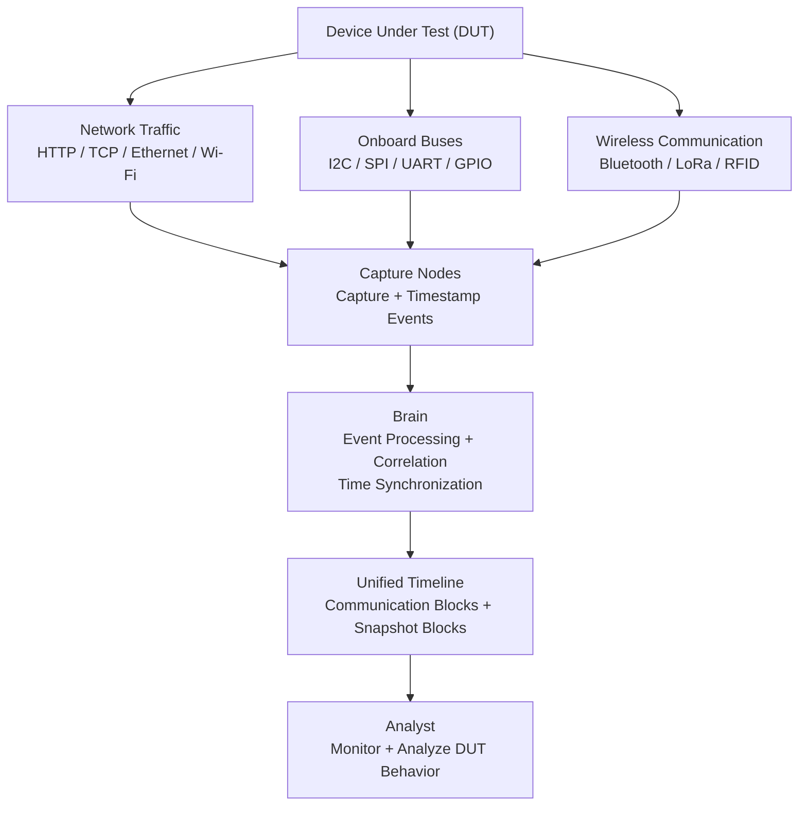

# Business Requirements → Functional Requirements

## BR-MON — Monitoring

**Source BR:** BR-MON-01 to BR-MON-08,
**Assignee:** BK,
**Status:** In progress.

### Summary
The monitoring module provides a unified live view of DUT communications and device states, correlating events and snapshots on a synchronized timeline.

### Monitoring System Data Flow

### Functional Requirements

| FR ID | Requirement | Priority | Acceptance Criteria |
|---|---|---|---|
| FR-MON-01-1 | The system shall display network communication events. | Must | Network events are visible in the monitoring interface. |
| FR-MON-01-2 | The system shall display onboard-bus communication events. | Must | Supported onboard-bus events are visible in the monitoring interface. |
| FR-MON-01-3 | The system shall display wireless communication events. | Must | Supported wireless events are visible in the monitoring interface. |
| FR-MON-01-4 | The system shall provide a unified live view of captured communications. | Must | Events from supported sources appear in one live interface. |
| FR-MON-02-1 | The system shall correlate related communication events. | Must | Related events are grouped or linked correctly. |
| FR-MON-02-2 | The system shall order correlated events chronologically. | Must | Events appear in correct time order on the timeline. |
| FR-MON-03-1 | The system shall display live events within a documented latency limit. | Should | Measured event-to-display latency is documented and validated. |
| FR-MON-04-1 | The system shall synchronize Capture Nodes to a common time reference. | Must | All Capture Nodes use the configured common time reference. |
| FR-MON-04-2 | The system shall synchronize the Brain to the common time reference. | Must | The Brain uses the configured common time reference. |
| FR-MON-04-3 | The system shall document the maximum clock drift between monitoring components. | Must | Maximum observed clock drift is measured and documented. |
| FR-MON-05-1 | The system shall document the maximum supported number of simultaneous Capture Nodes. | Should | Maximum supported Capture Nodes are identified through testing. |
| FR-MON-05-2 | The system shall document the maximum supported number of simultaneous protocols. | Should | Maximum supported simultaneous protocols are identified through testing. |
| FR-MON-06-1 | The system shall support triggering a Snapshot Node based on a defined trigger event or signal. | Should | A configured trigger event or signal activates the Snapshot Node. |
| FR-MON-06-2 | The system shall support triggering a Snapshot Node after a defined delay. | Should | The Snapshot Node is triggered after the configured delay. |
| FR-MON-06-3 | The system shall support triggering a Snapshot Node based on a detected packet or pattern. | Should | Detection of a configured packet or pattern activates the Snapshot Node. |
| FR-MON-06-4 | The system shall capture the configured DUT state when a Snapshot Node is triggered. | Should | The configured physical, electrical, or internal state is captured. |
| FR-MON-07-1 | The system shall timestamp Snapshot Node outputs. | Should | Each snapshot output contains a timestamp. |
| FR-MON-07-2 | The system shall correlate Snapshot Node outputs with related communication events. | Should | Snapshots are linked to corresponding communication events. |
| FR-MON-07-3 | The system shall display Snapshot Node outputs on the unified timeline. | Should | Snapshot outputs appear at the correct position on the timeline. |
| FR-MON-08-1 | The system shall analyze Snapshot Node captured outputs. | Should | Supported snapshot data is processed to identify observable device behavior. |
| FR-MON-08-2 | The system shall generate descriptive information from analyzed snapshot outputs. | Should | The system generates a description of the observed device state or behavior. |
| FR-MON-08-3 | The system shall display generated descriptions on the unified timeline. | Should | Generated descriptions appear at the corresponding timeline position. |

### Assumptions & Dependencies
- Capture Nodes and the Brain can synchronize to a common local time reference.
- Required hardware for supported network, onboard-bus, wireless, and snapshot monitoring is available.
- Snapshot capabilities depend on the type of Snapshot Node being used.
- Maximum supported nodes, protocols, latency, and clock drift require validation on the final hardware configuration.
- The first version supports monitoring one DUT per session.

### Open Questions
- What is the target maximum latency for live event display?
- What is the acceptable maximum clock drift?
- Will NTP or PTP be used for time synchronization?
- What is the maximum number of Capture Nodes and protocols targeted for the first release?
- Which Snapshot Node types will be supported in the first release?
- Which snapshot analysis capabilities will be available in the first release?

---

## BR-ANA — Analytics

**Source BR:**
**Assignee:** HK
**Status:** Not started

### Summary
_One or two sentences restating the business need in plain language._

### Functional Requirements

| FR ID | Requirement | Priority | Acceptance Criteria |
|---|---|---|---|
| FR-ANA-01 | | Must / Should / Could | |
| FR-ANA-02 | | | |

### Assumptions & Dependencies
-

### Open Questions
- 

---

## BR-ACT — Actions

**Source BR:**
**Assignee:** ME
**Status:** Not started

### Summary
_One or two sentences restating the business need in plain language._

### Functional Requirements

| FR ID | Requirement | Priority | Acceptance Criteria |
|---|---|---|---|
| FR-ACT-01 | | Must / Should / Could | |
| FR-ACT-02 | | | |

### Assumptions & Dependencies
-

### Open Questions
-

---

## BR-SEC — Security

**Source BR:**
**Assignee:** RA
**Status:** Not started

### Summary
_One or two sentences restating the business need in plain language._

### Functional Requirements

| FR ID | Requirement | Priority | Acceptance Criteria |
|---|---|---|---|
| FR-SEC-01 | | Must / Should / Could | |
| FR-SEC-02 | | | |

### Assumptions & Dependencies
-

### Open Questions
-

---

## BR-DEP — Deployment

**Source BR:** BR-DEP_01 to BR-DEP_02
**Assignee:** M
**Status:** Completed

### Summary
_The system shall run on Docker with fixed, predictable versions, and let users move their configuration and session data without losing it when containers are stopped, updated, or replaced._

### Functional Requirements

| FR ID | Requirement | Priority | Acceptance Criteria |
|---|---|---|---|
| FR-DEP-01-1 | System components (Brain + all dependencies) shall be packaged as Docker images defined via Dockerfile(s) and orchestrated via Docker Compose. | Must | Each system component has a corresponding Dockerfile and is defined as a service in `docker compose build` and that it completes successfully with exit code 0. |
| FR-DEP-01-2 | All image versions shall be pinned (no :`latest tags`; locked dependency versions via committed lockfiles) | Must | Every `FROM` in all Dockerfiles and every image: in `docker-compose.yml` — has an explicit version tag (e.g. postgres:16.3), not latest . |
| FR-DEP-01-3 | All Dockerfile install steps shall install strictly from the lockfile. | Must | No use of npm install, or unpinned pip install in place of their lockfile-strict equivalents.
| FR-DEP-02-1 | The system shall provide a function to export the current configuration and recorded session data to a file stored outside the container's writable layer  | Should | Confirm persistence after the container is stopped/removed. |
| FR-DEP-02-2 | The system shall provide a function to import previously exported configuration and recorded session data into a running or newly deployed instance. | Should | Import a previously exported data into both  a running instance and  a freshly deployed instance; confirm the operation completes successfully in both cases. |
| FR-DEP-02-3 | The system shall validate imported data for integrity and compatibility (e.g., correct format/schema). | Should |  Confirm validation runs before any data is applied. |
| FR-DEP-02-4| The system shall log export and import operations, including timestamp and outcome (success/failure). | Should | Perform successful and failed export/import operations; confirm each is recorded. |

### Assumptions & Dependencies
- The application has a defined, versioned schema for configuration and session data to support import validation.
- Exported files are stored on a host-accessible path that persists independently of the container.

### Open Questions
- Does import into a running instance hot-apply the config/session data, or does it require a restart?
- On import, is the behavior full overwrite or merge with existing session data?
- What happens if validation (FR-DEP-02-3) fails partway through an import?
- What export/import formats are required (JSON, SQL dump, encrypted archive)?

---

## BR-EXT — Extensibility

**Source BR:** BR-EXT-01 to BR-EXT-02
**Assignee:** M
**Status:** Completed

### Summary
_The system shall grow to support new communication protocols over time, and let external capture nodes plug in as an additional data source._

### Functional Requirements

| FR ID | Requirement | Priority | Acceptance Criteria |
|---|---|---|---|
| FR-EXT-01-1 | Implement communication protocol via a modular architecture, allowing new protocol modules without modifying the core system codebase. | Should | Isolate protocol handling in separate modules with a defined interface. |
| FR-EXT-01-2 | Define a standard protocol module interface (e.g., required methods/functions for connect, parse, send, disconnect) that any new protocol implementation must conform to. | Should | Review documentation/code for a defined protocol interface (abstract class, contract, or schema); confirm an existing protocol module implements it fully. |
| FR-EXT-02-1 | Provide a documented API (e.g., REST, or similar) enabling external hardware capture tools to submit captured data to the system. | Could | Call the documented API from an external tool/script and confirm data is accepted. |
| FR-EXT-02-2 | Treat data received from external capture tools as an additional data source, processed through the same correlation/monitoring pipeline as data from native Capture Nodes. | Could | Equivalent handling for data from both the external integration interface and a native Capture Node.|
| FR-EXT-02-3 | Validate data submitted by external capture tools for correct format/schema before ingesting it into the pipeline. | Could | Reject invalid payloads without disrupting the pipeline. |  
| FR-EXT-02-4 | Log all connections and data submissions from external capture tools, including source identity, timestamp, and outcome (success/failure). | Could | Submited data via the integration interface is logged with source, timestamp, and outcome. |

### Assumptions & Dependencies
- External capture nodes are assumed to be semi-trusted; hence explicit validation and logging requirements (FR-EXT-02-3, 02-4).

### Open Questions
- Should rejected/invalid payloads (FR-EXT-02-3) be queued for review, or simply dropped with an error response to the sender?

---

## BR-ENV — Environment

**Source BR:**
**Assignee:** YS
**Status:** Not started

### Summary
_One or two sentences restating the business need in plain language._

### Functional Requirements

| FR ID | Requirement | Priority | Acceptance Criteria |
|---|---|---|---|
| FR-ENV-01 | | Must / Should / Could | |
| FR-ENV-02 | | | |

### Assumptions & Dependencies
-

### Open Questions
-

---

## BR-ACC — Accessibility

**Source BR:** 
**Assignee:** YS
**Status:** Not started

### Summary
_One or two sentences restating the business need in plain language._

### Functional Requirements

| FR ID | Requirement | Priority | Acceptance Criteria |
|---|---|---|---|
| FR-ACC-01 | | Must / Should / Could | |
| FR-ACC-02 | | | |

### Assumptions & Dependencies
-

### Open Questions
-