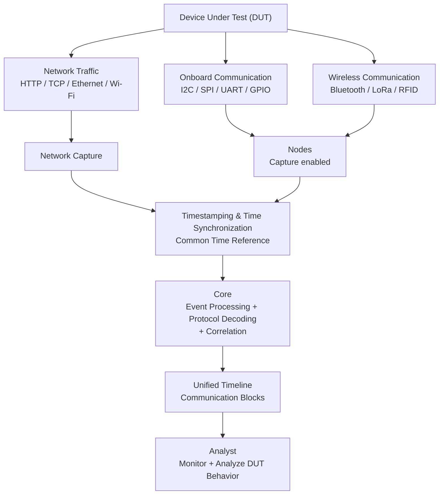
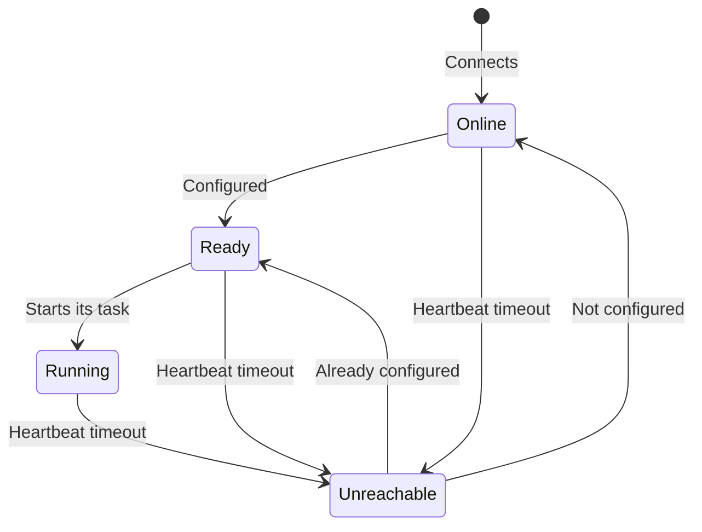
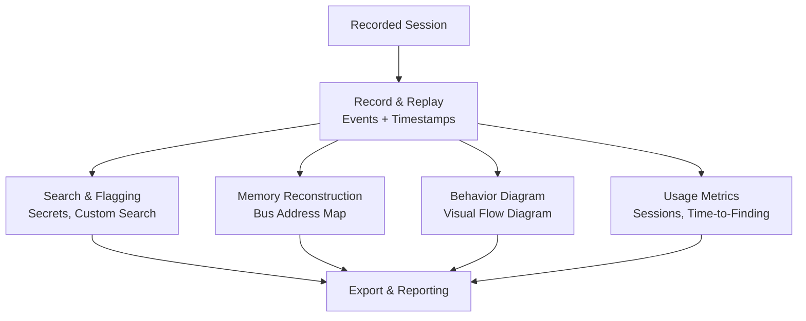
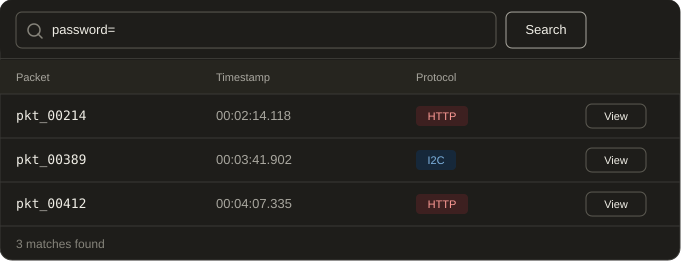
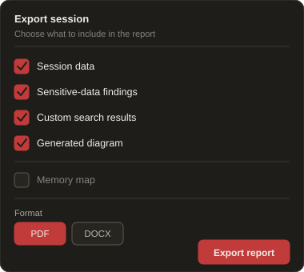
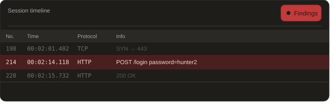
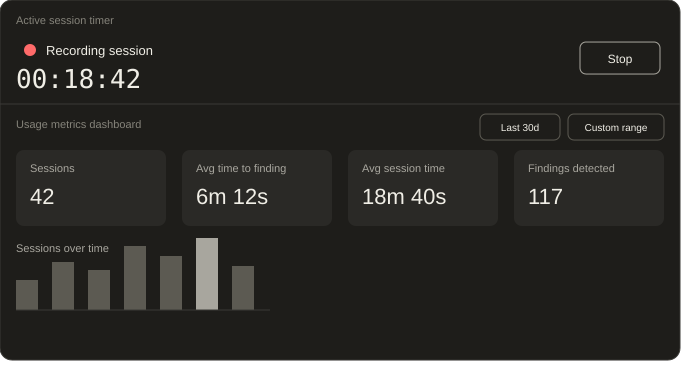
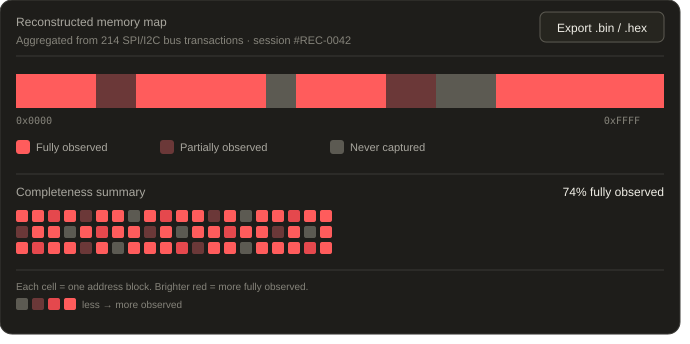
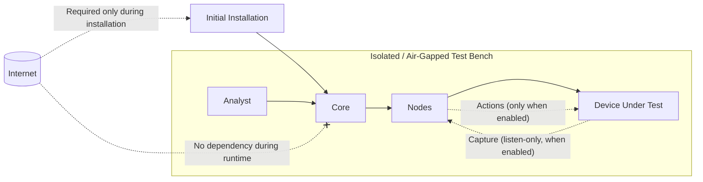
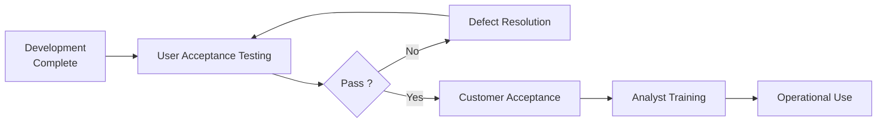

# Business Requirements → Functional Requirements

## BR-MON — Monitoring

**Source BR:** BR-MON-01 to BR-MON-12,
**Assignee:** BK,
**Status:** Completed.

### Summary
The monitoring module provides a unified live view of DUT communications across network, onboard-bus, and wireless interfaces, processing and correlating captured events on a synchronized timeline.

### Monitoring System Data Flow

```mermaid
flowchart TD
    DUT["Device Under Test (DUT)"]

    NET["Network Traffic<br/>HTTP / TCP / Ethernet / Wi-Fi"]
    BUS["Onboard Communication<br/>I2C / SPI / UART / GPIO"]
    WIRELESS["Wireless Communication<br/>Bluetooth / LoRa / RFID"]

    NET_CAPTURE["Network Capture"]
    NODES["Nodes<br/>Capture enabled"]

    TIMESTAMP["Timestamping & Time Synchronization<br/>Common Time Reference"]

    CORE["Core<br/>Event Processing + Protocol Decoding<br/>+ Correlation"]

    TIMELINE["Unified Timeline<br/>Communication Blocks"]

    ANALYST["Analyst<br/>Monitor + Analyze DUT Behavior"]

    DUT --> NET
    DUT --> BUS
    DUT --> WIRELESS

    NET --> NET_CAPTURE
    BUS --> NODES
    WIRELESS --> NODES

    NET_CAPTURE --> TIMESTAMP
    NODES --> TIMESTAMP

    TIMESTAMP --> CORE
    CORE --> TIMELINE
    TIMELINE --> ANALYST
```

### Node state machine

Solid transitions are reported by the Node. The dashed transitions into Unreachable are inferred by the Core from a heartbeat timeout.

```mermaid
stateDiagram-v2
    [*] --> Online: Connects
    Online --> Ready: Configured
    Ready --> Running: Starts its task
    Online --> Unreachable: Heartbeat timeout
    Ready --> Unreachable: Heartbeat timeout
    Running --> Unreachable: Heartbeat timeout
    Unreachable --> Online: Not configured
    Unreachable --> Ready: Already configured
```

### Functional Requirements

| FR ID | Requirement | Priority |
|---|---|---|
| FR-MON-01-1 | The system shall display network communication events. | Must |
| FR-MON-01-2 | The system shall display onboard-bus communication events. | Must |
| FR-MON-01-3 | The system shall display wireless communication events. | Must |
| FR-MON-01-4 | The system shall provide a unified live view of captured communications. | Must |
| FR-MON-02-1 | The system shall correlate related communication events. | Must |
| FR-MON-02-2 | The system shall order correlated events chronologically. | Must |
| FR-MON-03-1 | The system shall display live events within a documented latency limit. | Should |
| FR-MON-04-1 | The system shall synchronize Nodes with capture enabled to a common time reference. | Must |
| FR-MON-04-2 | The system shall synchronize the Core to the common time reference. | Must |
| FR-MON-04-3 | The system shall document the maximum clock drift between monitoring components. | Must |
| FR-MON-05-1 | The system shall document the maximum supported number of simultaneous Nodes. | Should |
| FR-MON-05-2 | The system shall document the maximum supported number of simultaneous protocols. | Should |
| FR-MON-06-1 | The system shall support triggering a state capture on a Node with capture enabled, based on a defined trigger event or signal. | Should |
| FR-MON-06-2 | The system shall support triggering a state capture on a Node with capture enabled after a defined delay. | Should |
| FR-MON-06-3 | The system shall support triggering a state capture on a Node with capture enabled based on a detected packet or pattern. | Should |
| FR-MON-06-4 | The system shall capture the configured DUT state when a state capture is triggered on a Node. | Should |
| FR-MON-07-1 | The system shall timestamp state-capture outputs from a Node. | Should |
| FR-MON-09-1 | The system shall allow the capture function to be enabled or disabled on each Node. | Must |
| FR-MON-09-2 | The system shall allow the actions function to be enabled or disabled on each Node, independently of capture. | Must |
| FR-MON-10-1 | When a Node connects, the Core shall read its Node ID, assign a unique color, and store general settings: Node ID, Node name, Node description, and that color. | Must |
| FR-MON-10-2 | The Core shall show each Node in the Node list using that Node's unique color. | Must |
| FR-MON-10-3 | The Node hardware shall light an indication LED in the same unique color shown for that Node on the Core. | Must |
| FR-MON-11-1 | When capture is enabled, the system shall let the analyst select the protocol that Node captures. | Must |
| FR-MON-11-2 | When capture is enabled, the system shall let the analyst configure the settings of the selected protocol. | Must |
| FR-MON-12-1 | The system shall track each Node in exactly one of four states: Online, Ready, Running, or Unreachable. | Must |
| FR-MON-12-2 | When a Node connects, the Core shall read its Node ID, assign its unique color, add it to the Node list, and set its state to Online. | Must |
| FR-MON-12-3 | When the analyst finishes configuring a Node that is Online, the system shall set its state to Ready. | Must |
| FR-MON-12-4 | When a Ready Node starts its task — capturing, decoding, matching packets, performing actions, and sending data packets — the system shall set its state to Running. | Must |
| FR-MON-12-5 | The Core shall set a Node to Unreachable when its heartbeat times out, from Online, Ready, or Running. Heartbeat loss includes the Node hanging, being turned off, or losing battery. | Must |
| FR-MON-12-6 | When an Unreachable Node reconnects, the system shall return it to Online if it was not configured, and to Ready if it was already configured. | Must |

### Assumptions & Dependencies
- Nodes with capture enabled, and the Core, can synchronize to a common local time reference.
- Required hardware for supported network, onboard-bus, and wireless capture, and for state capture, is available.
- Which state a Node can record depends on the capture interfaces configured on that Node, not on a separate node type.
- Maximum supported nodes, protocols, latency, and clock drift require validation on the final hardware configuration.
- The first version supports monitoring one DUT per session.

### Open Questions

- What is the target maximum latency for live event display?
- What is the acceptable maximum clock drift?
- Will NTP or PTP be used for time synchronization?
- Which capture interfaces (camera, GPIO/voltage, memory/register) will be supported on a Node in the first release?
- Which state-capture analysis capabilities will be available in the first release?
- Which protocol-specific settings are required for each protocol a Node can capture?
- What heartbeat timeout marks a Node as Unreachable?

---

## BR-ANA — Analytics

**Source BR:** BR-ANA-01 to BR-ANA-09
**Assignee:** HK
**Status:** Completed

### Summary
The analytics module records sessions and runs analysis engines. A domain is a protocol. Engines are categorized by how many sessions they use and how many domains they use. Single-session engines are single-domain, multiple-domain, or active. Multiple-session engines are single-domain or multiple-domain. Recording, export, and usage metrics are not analysis engines.

### Analysis engine categories

| Scope | Group | Engines in this document |
|---|---|---|
| Single session | Single domain | Memory reconstruction (FR-ANA-07, FR-ANA-08). IP/domain name detection (FR-ANA-09). Sensitive-data search and flagging (FR-ANA-02, FR-ANA-05). |
| Single session | Multiple domain | Behavioral analysis (FR-ANA-03). |
| Single session | Active | Packet replay, packet injection, and fuzzing (BR-ACT). |
| Multiple session | Single domain | Memory comparison (FR-ANA-09). |
| Multiple session | Multiple domain | Baseline analysis and pattern detection (FR-ANA-09). |

### Analytics Module Data Flow

```mermaid
flowchart TD

    SESSION["Recorded Session"]

    RECORD["Record & Replay<br/>Events + Timestamps"]
    SEARCH["Search & Flagging<br/>Secrets, Custom Search"]
    MEMORY["Memory Reconstruction<br/> Bus Address Map"]
    DIAGRAM["Behavior Diagram<br/>Visual Flow Diagram"]
    METRICS["Usage Metrics<br/>Sessions, Time-to-Finding"]

    EXPORT["Export & Reporting"]

    SESSION --> RECORD
    RECORD --> SEARCH
    RECORD --> MEMORY
    RECORD --> DIAGRAM
    RECORD --> METRICS

    SEARCH --> EXPORT
    MEMORY --> EXPORT
    DIAGRAM --> EXPORT
    METRICS --> EXPORT
```

### Functional Requirements

#### FR-ANA-01 — Session Recording & Replay

Not an analysis engine. This stores and plays back a session that engines run on.

| FR ID | Requirement | Priority |
|---|---|---|
| FR-ANA-01-1 | The system shall record all captured communication events from an active session, beginning when the analyst starts the session and ending when they stop it. | Must |
| FR-ANA-01-2 | The system shall record a timestamp for each captured event. | Must |
| FR-ANA-01-3 | The system shall persist a session to storage when the analyst stops it. | Must |
| FR-ANA-01-4 | The system shall allow an analyst to play back a previously recorded session. | Must |
| FR-ANA-01-5 | The system shall preserve the original chronological order and timestamps of recorded events during replay. | Must |

---

#### FR-ANA-02 — Search & Navigation

**Category:** Single session / Single domain. Search inspects one protocol in one session.

| FR ID | Requirement | Priority |
|---|---|---|
| FR-ANA-02-1 | The system shall allow an analyst to search a recorded session using a custom search phrase. | Must |
| FR-ANA-02-2 | The system shall display the exact location (packet/timestamp/protocol) of each search match. | Must |
| FR-ANA-02-3 | The system shall allow an analyst to navigate directly from a search result to its corresponding timeline event. | Must |

---

#### FR-ANA-03 — Behavior Diagram Generation

**Category:** Single session / Multiple domain. Behavioral analysis relates events across more than one protocol in one session.

| FR ID | Requirement | Priority |
|---|---|---|
| FR-ANA-03-1 | The system shall generate a Mermaid-based visual behavior diagram (e.g., a sequence diagram) from a recorded session's captured events, so analysts can understand a device's communication flow at a glance instead of manually reading the raw timeline, and so the diagram can be dropped directly into a client report. | Should |
| FR-ANA-03-2 | The system shall represent correlated communication events as linked steps within the diagram (e.g., in a sequence diagram, a login attempt's HTTP request and the I2C read it triggers on the DUT appear as connected messages between the same pair of lifelines), so analysts can easily see how events are connected without checking the raw session. | Should |

---

#### FR-ANA-04 — Export & Reporting

Not an analysis engine. This exports the results of engines and the recorded session.

| FR ID | Requirement | Priority |
|---|---|---|
| FR-ANA-04-1 | The system shall allow an analyst to export recorded session data (e.g., as JSON or CSV). | Should |
| FR-ANA-04-2 | The system shall allow an analyst to export detected sensitive-data findings (e.g., as JSON or CSV). | Should |
| FR-ANA-04-3 | The system shall allow an analyst to export custom search results (e.g., as JSON or CSV). | Should |
| FR-ANA-04-4 | The system shall export the generated diagram (e.g., a Mermaid sequence diagram of the session) in a report-ready format (e.g., PNG/SVG). | Should |
| FR-ANA-04-5 | The system shall allow an analyst to export the reconstructed memory map (e.g., binary/hex dump). | Should |
| FR-ANA-04-6 | The system shall allow an analyst to choose which of the following to include in a single consolidated report: recorded session data, detected sensitive-data findings , custom search results , and the generated diagram  — exported in one or more report-ready formats (e.g., PDF, DOCX). | Should |

---

#### FR-ANA-05 — Sensitive-Data Flagging

**Category:** Single session / Single domain. Flagging inspects packets of one protocol in one session.

| FR ID | Requirement | Priority |
|---|---|---|
| FR-ANA-05-1 | The system shall inspect captured packets for predefined clear-text sensitive data patterns and automatically flag matching packets, without analyst action. | Should |
| FR-ANA-05-2 | The system shall provide a "Findings" control that toggles a contextual highlight mode on the timeline, emphasizing communication blocks containing flagged findings and fading unrelated blocks when active. | Should |

---

#### FR-ANA-06 — Usage Metrics

Not an analysis engine. This reports tool usage, not protocol content.

| FR ID | Requirement | Priority |
|---|---|---|
| FR-ANA-06-1 | The system shall display a running timer showing elapsed time for the current active session. | Should |
| FR-ANA-06-2 | The system shall track the number of completed analysis sessions. | Should |
| FR-ANA-06-3 | The system shall calculate the average time required to identify findings. | Should |
| FR-ANA-06-4 | The system shall track the number of automatically detected sensitive-data findings. | Should |
| FR-ANA-06-5 | The system shall present the tracked usage metrics (e.g., session count, average time, average session time, findings detected) in a dashboard, filterable by a selectable time period. | Should |

---

#### FR-ANA-07 — Memory Reconstruction

**Category:** Single session / Single domain. Reconstruction uses one bus protocol in one session.

| FR ID | Requirement | Priority |
|---|---|---|
| FR-ANA-07-1 | The system shall extract address/data pairs from captured (e.g., SPI/I2C) bus transactions. | Should |
| FR-ANA-07-2 | The system shall aggregate extracted address/data pairs into a unified reconstructed memory map. | Should |
| FR-ANA-07-3 | The system shall allow an analyst to view the reconstructed memory map. | Should |

---

#### FR-ANA-08 — Reconstruction Completeness

**Category:** Single session / Single domain. Completeness is part of memory reconstruction.

| FR ID | Requirement | Priority |
|---|---|---|
| FR-ANA-08-1 | The system shall classify each observed memory address range as fully observed, partially observed, or never captured. | Should |
| FR-ANA-08-2 | The system shall visually distinguish fully observed, partially observed, and never-captured ranges in the memory map. | Should |
| FR-ANA-08-3 | The system shall display a completeness summary statistic (e.g., % of address space fully observed) alongside the memory map. | Should |

---

#### FR-ANA-09 — Remaining engine categories

| FR ID | Requirement | Priority |
|---|---|---|
| FR-ANA-09-1 | The system shall provide an IP/domain name detection engine that inspects one protocol in one session. | Should |
| FR-ANA-09-2 | The system shall provide a memory-comparison engine that compares reconstructed memory of one protocol across more than one session. | Should |
| FR-ANA-09-3 | The system shall provide baseline-analysis and pattern engines that use more than one protocol across more than one session. | Should |
| FR-ANA-09-4 | Packet replay, packet injection, and fuzzing shall be provided as single-session active engines, and shall run only through a Node whose actions function is enabled. | Must |

### Assumptions & Dependencies
- Accurate search/flagging depends on reliable timestamps from time sync (FR-MON-04).
- Session storage/format depends on BR-DEP export-import design (FR-DEP-02-x).
- At-rest protection of exported findings depends on FR-SEC-01 (encryption at rest).
- The finding count metric (FR-ANA-06-4) depends on the flagging logic defined in FR-ANA-05-1; changes to detection patterns will affect the reported count.

### Open Questions
- What default credential/token patterns should auto-flagging (FR-ANA-05-1) detect out of the box?
- What diagram type(s)/tooling will be used to generate behavior diagrams (FR-ANA-03-1)?
- Which export formats will be supported for v1 (FR-ANA-04)?
- BR-ANA-01 does not define behavior if an analyst leaves a session running indefinitely (e.g., forgets to stop it) — should there be a maximum session duration, an idle timeout, or is indefinite recording acceptable?

---

## BR-ACT — Actions
Derived from Business Requirements **BR-ACT-01** and **BR-ACT-03**.
---

### 1. Active Reconnaissance Workflow

| ID | Functional Requirement | Priority |
|---|---|---|
| **FR-ACT-01.1** | The system shall provide a dedicated "Active Reconnaissance" mode, distinct from passive observation mode, which the analyst must explicitly enter before any active action can be initiated. | Must |
| **FR-ACT-01.2** | Upon initiating any active reconnaissance action, the system shall display a confirmation dialog that clearly states: (a) the action to be performed, (b) the target DUT identifier, (c) the potential impact on DUT state, and (d) requires the analyst to explicitly confirm (e.g., typed confirmation or dual-button approval) before execution. | Must |
| **FR-ACT-01.3** | The system shall log all active reconnaissance actions with timestamp, analyst identity, action type, DUT target, and confirmation event into an immutable audit trail. | Must |
| **FR-ACT-01.4** | During and after an active reconnaissance action, the system shall simultaneously capture and record the DUT's response across all connected Nodes whose capture function is enabled (wired, wireless, on-board buses) for subsequent analysis. | Must |
| **FR-ACT-01.5** | The system shall allow the analyst to abort an active reconnaissance action mid-execution if the action type supports interruption (e.g., canceling a signal replay), with an immediate notification of partial completion. | Should |

---

### 2. Actions settings: trigger and action

| ID | Functional Requirement | Priority |
|---|---|---|
| **FR-ACT-03.1** | On a Node whose actions function is enabled, the system shall let the analyst configure one trigger and one action as that Node's actions settings. | Must |
| **FR-ACT-03.2** | The trigger shall be one of: manual, on packet match, scheduled, or on peer notification. | Must |
| **FR-ACT-03.3** | The action shall be one of: inject a DUT payload, run a Node script, or send a notification signal. | Must |
| **FR-ACT-03.4** | A notification signal shall be addressable to the Core, to all (the Core and the other Nodes), or to one specific Node. | Must |
| **FR-ACT-03.5** | The analyst shall confirm the configured trigger and action before they are armed. A manual trigger shall run the action when the analyst starts it. An on-packet-match, scheduled, or peer-notification trigger shall run the action when that condition is met. | Must |
| **FR-ACT-03.6** | A peer-notification trigger shall fire when the Node receives a notification signal sent by another Node. | Must |
| **FR-ACT-03.7** | The system shall reject an action on a Node whose actions function is disabled. | Must |

---

## BR-SEC — Security

**Source BR:** BR-SEC-01 to BR-SEC-03
**Assignee:** RA
**Status:** Completed

### Summary
The system shall protect captured session data by encrypting and password-protecting each session as a single unit. This encryption also serves as tamper-proofing: a modified session file cannot be successfully decrypted/opened, so no separate detection mechanism is needed. The system shall also support role-based access control with predefined roles (Admin, Analyst, Viewer).

### Functional Requirements

| FR ID | Requirement | Priority |
|---|---|---|
| FR-SEC-01-1 | The system shall encrypt and password-protect each recorded session as a single unit. This encryption shall also serve as tamper-proofing, such that any modification to the encrypted file renders it unreadable/invalid. | Must |
| FR-SEC-03-1 | The system shall support defining roles with distinct permissions for captured session data (e.g., Admin: full access; Analyst: view, export, run analysis engines, and annotate over the timeline; Viewer: view only). | Could |
| FR-SEC-03-2 | The system shall enforce role-based restrictions such that a user can only view, export, or modify session data permitted by their assigned role. | Could |

### Assumptions & Dependencies
- A password/key management approach (how the session password is generated, stored, and recovered) is defined before implementation.
- Role definitions (Admin, Analyst, Viewer) and their exact permission sets are agreed upon with stakeholders prior to implementation.
- No cloud-based server is available or used for storing logs or any other data; all logging/storage stays local to the deployment.

### Open Questions
- Who sets the session password — the system automatically, or the analyst manually — and what happens if it's lost?
- Are Admin / Analyst / Viewer the only roles needed, or are additional roles expected later?

---

## BR-DEP — Deployment

**Source BR:** BR-DEP_01 to BR-DEP_02
**Assignee:** M
**Status:** Completed

### Summary
_The system shall run on Docker with fixed, predictable versions, and let users move their configuration and session data without losing it when containers are stopped, updated, or replaced._

### Functional Requirements

| FR ID | Requirement | Priority |
|---|---|---|
| FR-DEP-01-1 | System components (Core + all dependencies) shall be packaged as Docker images defined via Dockerfile(s) and orchestrated via Docker Compose. | Must |
| FR-DEP-01-2 | All image versions shall be pinned (no `:latest` tags; only locked dependency versions). | Must |
| FR-DEP-01-3 | All Dockerfile install steps shall install strictly from the lockfile or `requirements.txt` with specified versions. | Must |
| FR-DEP-02-1 | The system shall provide a function to export the current configuration and recorded session data to a file stored outside the container's writable layer. | Should |
| FR-DEP-02-2 | The system shall provide a function to import previously exported configuration and recorded session data into a running or newly deployed instance. | Should |
| FR-DEP-02-3 | The system shall log export and import operations, including timestamp and outcome (failure only). | Should |

### Assumptions & Dependencies
- The application has a defined, versioned schema for configuration and session data to support import validation.
- Exported files are stored on a host-accessible path that persists independently of the container.

### Open Questions
- What are the configurations needed in import/export?
- What export/import formats are required (JSON, SQL dump, encrypted archive)?

---

## BR-EXT — Extensibility

**Source BR:** BR-EXT-01 to BR-EXT-02
**Assignee:** M
**Status:** Completed

### Summary
_The system shall grow to support new sniffed protocols over time, and let external tools plug in as an additional data source alongside Nodes with capture enabled._

### Functional Requirements

| FR ID | Requirement | Priority |
|---|---|---|
| FR-EXT-01-1 | Implement sniffed protocol via a modular architecture, allowing new protocol modules without modifying the core system codebase. | Should |
| FR-EXT-01-2 | Define a standard protocol module interface (e.g., required methods/functions for connect, parse, send, disconnect) that any new protocol implementation must conform to. | Should |
| FR-EXT-02-1 | Provide a documented API (e.g., REST, or similar) enabling external hardware capture tools to submit captured data to the system. | Could |
| FR-EXT-02-2 | Treat data received from external capture tools as an additional data source, processed through the same correlation/monitoring pipeline as data from native Nodes with capture enabled. | Could |
| FR-EXT-02-3 | Validate data submitted by external capture tools and mark them in view if malformed. | Could |
| FR-EXT-02-4 | Log failed connections and data submissions from external capture tools, including source identity, timestamp, and outcome. | Could |

---

## BR-ENV — Non-Interference & Operating Environment

**Source BR:** BR-ENV-01 to BR-ENV-02 ,
**Assignee:** YS ,
**Status:** Completed.

### Summary
The system must behave as a passive observer during normal monitoring — never altering the DUT's behavior — and must be fully deployable and operable inside an isolated, air-gapped test-bench network, with internet access confined to initial setup only.

### Environment Operation Flow

```mermaid
flowchart LR

    Analyst --> Core
    Core --> Nodes["Nodes"]
    Nodes --> DUT["Device Under Test"]
    DUT -. "Capture (listen-only, when enabled)" .-> Nodes
    Nodes -. "Actions (only when enabled)" .-> DUT

    subgraph AirGap["Isolated / Air-Gapped Test Bench"]
        Analyst
        Core
        Nodes
        DUT
    end

    Internet[(Internet)]
    Installer["Initial Installation"]

    Internet -. "Required only during installation" .-> Installer
    Installer --> Core

    Internet -. "No dependency during runtime" .-x Core
```
### Functional Requirements

| FR ID | Requirement | Priority |
|---|---|---|
| FR-ENV-01-1 | The system shall operate in a listen-only (passive) mode on all monitored interfaces — network, onboard-bus, and wireless — during standard monitoring sessions. | Must |
| FR-ENV-01-2 | The system shall not transmit, inject, or otherwise alter any signal on a monitored interface while operating in passive monitoring mode. | Must |
| FR-ENV-01-3 | The system shall visually indicate to the analyst which mode is currently active — passive monitoring or active reconnaissance (per FR-ACT). | Should |
| FR-ENV-01-4 | The system shall apply the non-interference constraint only while operating in Passive Monitoring mode. When operating in Active Reconnaissance mode the system shall permit authorized actions that intentionally interact with the Device Under Test (DUT), provided they have been explicitly confirmed by the analyst and the target Node has its actions function enabled. | Must |
| FR-ENV-02-1 | The system shall support live monitoring without requiring an outbound or inbound internet connection during runtime. | Must |
| FR-ENV-02-2 | The system shall perform event correlation without requiring an outbound or inbound internet connection during runtime. | Must |
| FR-ENV-02-3 | The system shall record sessions without requiring an outbound or inbound internet connection during runtime. | Must |
| FR-ENV-02-4 | The system shall execute active reconnaissance functions without requiring an outbound or inbound internet connection during runtime. | Must |
| FR-ENV-02-5 | The system shall not require an outbound or inbound internet connection for normal runtime operation. | Must |
| FR-ENV-02-6 | The system shall not depend on any internet-hosted service (e.g., license checks, telemetry, update checks) during normal operation. | Must |
| FR-ENV-02-7 | The system's time synchronization mechanism (per FR-MON-04) shall use only a local network time reference, not an internet-hosted PTP source. | Must |
| FR-ENV-02-8 | The system may require internet access solely during initial installation/setup (e.g., pulling container images ), and this exception shall be explicitly documented. | Must |

### Assumptions & Dependencies
- The monitoring hardware is correctly connected to the DUT.
- The deployment environment provides local networking between the Core and Nodes.
- Docker images and required dependencies are downloaded before deployment into an air-gapped environment.

### Open Questions
- Will software updates also support fully offline installation?
- What operating systems are officially supported for deployment?
- What quantitative threshold (e.g., timing/electrical tolerance) defines "no interference" for passive taps on each protocol?
- Is there a need to detect and alert if an outbound internet call is attempted during normal operation, or is documentation-only compliance sufficient for the first release?

---

## BR-ACC — Acceptance, Adoption & Support

**Source BR:**  BR-ACC-01 to BR-ACC-02 ,
**Assignee:** YS ,
**Status:** Completed.

### Summary
Before the system is considered delivered, it must pass a formal User Acceptance Testing process against real DUT scenarios, and analysts must receive training material to support onboarding and full adoption.

### Acceptance & Adoption Pipeline

```mermaid
flowchart LR
    UAT["User Acceptance Testing"]  --> Decision{Pass ?}
    DEV["Development<br/>Complete"] --> UAT["User Acceptance Testing"]
    Decision -->|No| Fixes["Defect Resolution"]
    Fixes -->  UAT["User Acceptance Testing"]
    Decision -->|Yes| Acceptance["Customer Acceptance"]
    Acceptance --> Training["Analyst Training"]
    Training --> Deployment["Operational Use"]
```
### Functional Requirements

| FR ID | Requirement | Priority |
|---|---|---|
| FR-ACC-01-1 | The system shall be validated through a documented UAT test plan covering all Must-priority business requirements, executed against real DUT scenarios. | Must |
| FR-ACC-01-2 | The system shall record UAT results (pass/fail per scenario, with evidence) for review. | Must |
| FR-ACC-01-3 | The system shall require formal stakeholder sign-off confirming UAT completion before being considered delivered. | Must |
| FR-ACC-02-1 | The project shall produce training material (e.g., user guide, quick-start guide, walkthrough) covering core system operation. | Should |
| FR-ACC-02-2 | The project shall deliver an onboarding session or equivalent training activity to analysts prior to full system adoption. | Should |
| FR-ACC-02-3 | The training material shall be reviewed for completeness and accuracy against the delivered system's actual functionality. | Could |

### Assumptions & Dependencies
- Real DUT hardware is available for UAT execution, consistent with the assumption in Section 7 of the BRD.
- UAT scenarios are derived from the Must-priority requirements across all BR categories (MON, ANA, ACT, SEC, ENV, DEP, EXT).
- Designated stakeholder(s) authorized to grant sign-off are identified before UAT begins.
- Training is delivered before production deployment.

### Open Questions
- Who is responsible for approving UAT?
- Will training be instructor-led, self-paced, or both?
- What is the minimum number/coverage of real DUT scenarios required for UAT to be considered representative?
