# Interface Requirements
## Software Interface Requirements Documentation

| Field             | Value                                                        |
|-------------------|--------------------------------------------------------------|
| Project Name      | IoT Reconnaissance & Communication-Block Monitoring System   |
| Working Title     | Wiresploit                                                   |
| Document Status   | `V0.01`                                                      |
| Date              |1-8-2026                                                      |
| Prepared by       | Mariam Essam / Hoda Khaled                                   |

## Table of Contents

1. [Purpose](#1-Purpose)
2. [Overview](#2-overview)
3. [User Interface (UI) Requirements](#3-user-interface-ui-requirements)
4. [Open Questions](#4-Open-Questions)

---

## 1. Purpose
Define the Software interface of the system, including screen layouts and interaction behavior.

## 2. Overview

| Interface ID | Interface Name | Description |
|---|---|---|
| IF-UI-01 | Register | Register page |
| IF-UI-02 | Login | Login page |
| IF-UI-03 | Dashboard | Display DUT live state |
| IF-UI-04 | Metrics | Display session/DUT performance and analysis metrics |
| IF-UI-05 | Logs | List all failed logs |
| IF-UI-06 | View | Display raw/alternate view of captured session data |
| IF-UI-07 | Sessions | List all recorded sessions |
| IF-UI-08 | Snapshots | List all recorded Snapshots |
| IF-UI-09 | Snapshot | Display detailed snapshot data |
| IF-UI-10 | Export-Report | Display report exporting options |
| IF-UI-11 | Report | Display report before exporting |
| IF-UI-12 | Settings | Display systems settings |

---

---

## 3. User Interface (UI) Requirements

# 3.1 Register

This screen enables new users to create a WireSploit account, either via a Microsoft SSO registration flow or by manually entering their full name, work email, and password. It is the primary entry point for onboarding new users into the platform and precedes the Login screen in the authentication flow.

## 3.1.1 Interface Overview

| Field | Value |
|---|---|
| Screen Name | Register |
| Interface ID | IF-UI-01 |
| Entry Point | Clicks "Sign Up" from Login screen |

## 3.1.2 Visual Reference

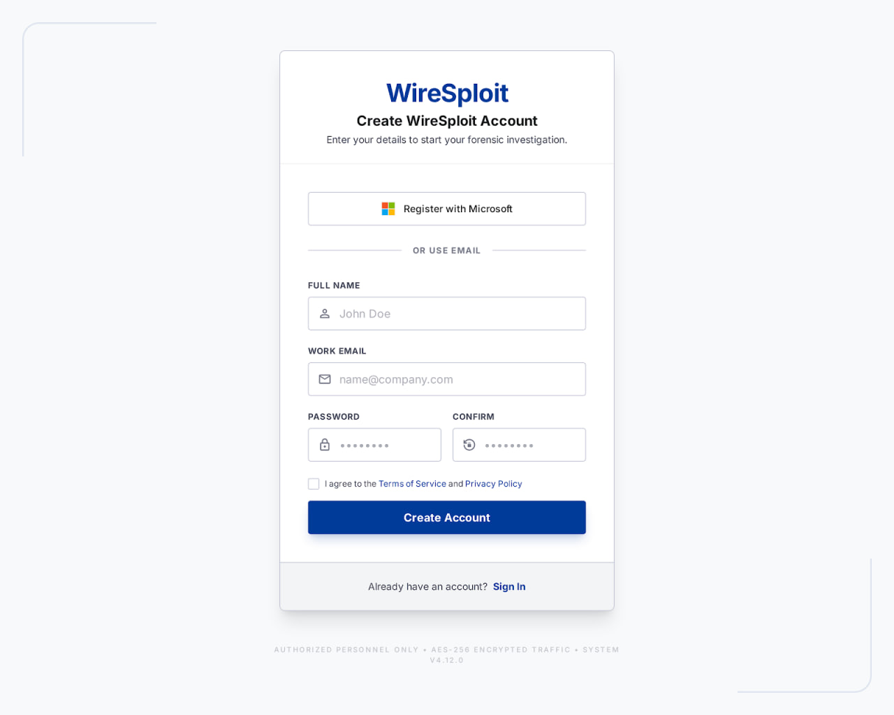

**Figure 3.1.1:** *WireSploit registration screen showing Microsoft SSO registration option, full name, work email, password, confirm password fields, terms agreement checkbox, and **Create Account** action.*

## 3.1.3 Layout & Elements

| Element ID | Element Name | Type | Description / Behavior |
|---|---|---|---|
| EL-01 | Logo / Product Name | Static text/branding | Displays "WireSploit" wordmark at top of card; non-interactive |
| EL-02 | Heading & Subheading | Static text | "Create WireSploit Account" title with supporting description "Enter your details to start your DUT hardware analysis." |
| EL-03 | Register with Microsoft | Secondary button | Initiates Microsoft OAuth/SSO registration flow |
| EL-04 | Divider ("OR USE EMAIL") | Static separator | Visually separates SSO registration from manual email registration |
| EL-05 | Full Name field | Text input | Placeholder "John Doe"; captures user's full name; required field |
| EL-06 | Work Email field | Email input | Placeholder "name@company.com"; captures user's work email; required, must be valid email format |
| EL-07 | Password field | Password input | Masked by default; captures new account password; required field |
| EL-08 | Confirm Password field | Password input | Masked by default; must match Password field value; required field |
| EL-09 | Terms & Privacy checkbox | Checkbox | "I agree to the Terms of Service and Privacy Policy"; must be checked to proceed |
| EL-10 | Terms of Service link | Link | Navigates to Terms of Service page |
| EL-11 | Privacy Policy link | Link | Navigates to Privacy Policy page |
| EL-12 | Create Account | Primary button | Submits registration form; triggers account creation request |
| EL-13 | Sign In link | Link | Navigates to Login screen for users who already have an account |
| EL-14 | Footer / Security notice | Static text | Displays trust/security messaging (e.g., "AUTHORIZED PERSONNEL ONLY • AES-256 ENCRYPTED TRAFFIC") and system version number |

## 3.1.4 Requirements

| Req. ID | Requirement | Description / Notes |
|---|---|---|
| IF-UI-01-01 | The system shall allow users to register a new account using full name, work email, and password. | All fields required; email must be unique and validated server-side. |
| IF-UI-01-02 | The system shall allow users to register via Microsoft SSO. | Uses OAuth 2.0 / OpenID Connect flow with Microsoft identity provider; bypasses manual password creation. |
| IF-UI-01-03 | The system shall require password confirmation to match the original password before submission. | Client-side validation with server-side re-verification. |
| IF-UI-01-04 | The system shall require users to accept the Terms of Service and Privacy Policy before account creation. | "Create Account" button should be disabled or blocked until checkbox is checked. |
| IF-UI-01-05 | The system shall provide a pathway to the Login screen for existing users. | "Sign In" link routes to IF-UI-02 (Login). |

## 3.1.5 Validation & Error States

- **Full Name field:** Must not be empty; minimum length validation (e.g., 2 characters) recommended.
- **Work Email field:** Must be a syntactically valid email address; system should check for duplicate/existing accounts and display "An account with this email already exists" if applicable.
- **Password field:** Must meet minimum complexity requirements (e.g., minimum length, mix of characters); display inline strength guidance if requirements are not met.
- **Confirm Password field:** Must exactly match the Password field; display "Passwords do not match" inline error if mismatched.
- **Terms checkbox:** "Create Account" submission blocked with an inline message (e.g., "Please accept the Terms of Service to continue") if left unchecked.
- **Network/server error:** Display a non-blocking error banner (e.g., "Something went wrong. Please try again.") if the registration request fails to reach the server.

---

# 3.2 Login

This screen allows an existing user to sign in using either email/password credentials or a Microsoft SSO (single sign-on) account. 

## 3.2.1 Interface Overview

| Field | Value |
|---|---|
| Screen Name | Login |
| Interface ID | IF-UI-02 |
| Entry Point | "Sign In" click |

## 3.2.2 Visual Reference

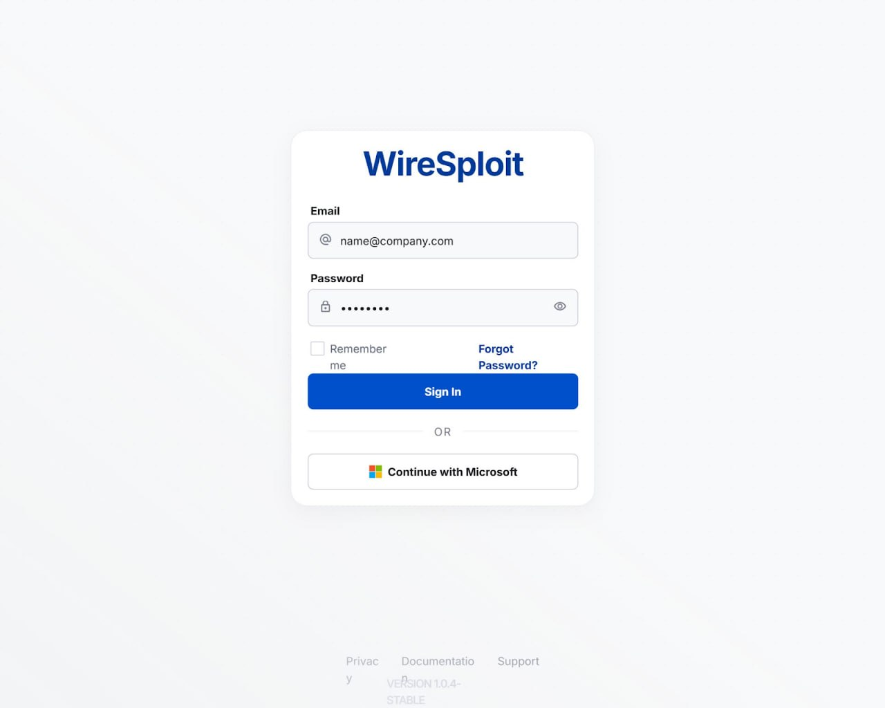

**Figure 3.2.1:** WireSploit login screen showing email/password fields, "Remember me" and "Forgot Password?" options, primary Sign In action, and Microsoft SSO alternative.

## 3.2.3 Layout & Elements

| Element ID | Element Name | Type | Description / Behavior |
|---|---|---|---|
| EL-01 | Logo / Product Name | Static text/branding | Displays "WireSploit" wordmark at top of card; non-interactive |
| EL-02 | Email input field | Text input | Placeholder "name@company.com"; accepts email address; required field |
| EL-03 | Password input field | Password input | Masked by default; includes show/hide toggle icon (eye icon) on the right |
| EL-04 | Show/Hide password toggle | Icon button | Toggles password field between masked and plain text visibility |
| EL-05 | Remember me | Checkbox | Optional; when checked, persists session/login state across visits |
| EL-06 | Forgot Password? | Link | Navigates to password recovery flow |
| EL-07 | Sign In | Primary button | Submits email/password credentials; triggers authentication request |
| EL-08 | Divider ("OR") | Static separator | Visually separates credential login from SSO login |
| EL-09 | Continue with Microsoft | Secondary button | Initiates Microsoft OAuth/SSO authentication flow |
| EL-10 | Footer links (Privacy, Documentation, Support) | Links | Navigate to respective informational pages |

## 3.2.4 Requirements

| Req. ID | Requirement | Description / Notes |
|---|---|---|
| IF-UI-02-01 | The system shall allow users to authenticate using a valid email and password combination. | Credentials validated server-side; invalid attempts return a generic error to avoid user enumeration. |
| IF-UI-02-02 | The system shall allow users to authenticate via Microsoft SSO. | Uses OAuth 2.0 / OpenID Connect flow with Microsoft identity provider. |
| IF-UI-02-03 | The system shall allow users to toggle password field visibility. | Improves usability without compromising security (client-side only). |
| IF-UI-02-04 | The system shall provide a "Remember me" option to persist login state. | Should not persist raw credentials; use secure session/refresh token instead. |
| IF-UI-02-05 | The system shall provide a password recovery pathway. | "Forgot Password?" link routes to a dedicated reset flow. |

## 3.2.5 Validation & Error States

- **Email field:** Must be a syntactically valid email address; empty submission triggers inline "Email is required" message.
- **Password field:** Must not be empty; no strength requirements enforced at login (only at registration/reset).
- **Invalid credentials:** Display a generic error (e.g., "Invalid email or password") without specifying which field is incorrect, to prevent account enumeration.
- **Account lockout:** After a defined number of failed attempts (e.g., 5), temporarily lock the account and display a lockout message with guidance.
- **Network/server error:** Display a non-blocking error banner (e.g., "Something went wrong. Please try again.") if the authentication request fails to reach the server.

---

# 3.3 Dashboard

The Dashboard is the primary workspace for an active hardware analysis session in WireSploit. It provides a live where the analyst monitors captured bus traffic (HTTP, TCP, UART, SPI, I2C, etc), inspects reconstructed memory, analyzes network packets, and views real-time logic analyzer waveforms — all while a recording session is in progress. It is the central hub of the application, reached immediately after login/session start, and each panel within it can be resized, repositioned to support flexible, analyst-driven layouts.

## 3.3.1 Interface Overview

| Field | Value |
|---|---|
| Screen Name | Dashboard |
| Interface ID | IF-UI-03 |
| Entry Point | Top nav "Dashboard" tab |

## 3.3.2 Visual Reference

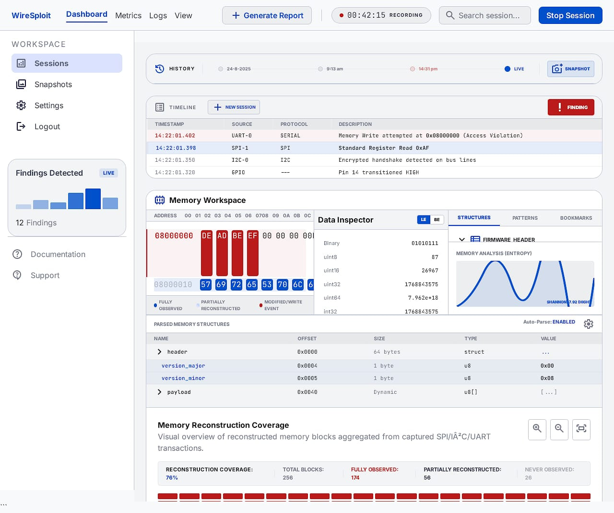

**Figure 3.3.1:** WireSploit Dashboard (top) showing session history, live event timeline, memory workspace with hex/data inspector, parsed memory structures, and reconstruction coverage summary.

**Figure 3.3.2:** WireSploit Dashboard (bottom) showing real-time SPI logic analyzer waveform view and live-capture network inspector (DPI) packet table.

## 3.3.3 Layout & Elements

| Element ID | Element Name | Type | Description / Behavior |
|---|---|---|---|
| EL-01 | Top navigation bar | Navigation | Tabs for Dashboard, Metrics, Logs, View; persistent across the workspace |
| EL-02 | Generate Report | Button | Compiles current session findings/data into an exportable report |
| EL-03 | Recording indicator | Status badge | Displays live elapsed time (e.g., "00:42:15 RECORDING") with pulsing indicator while a session is active |
| EL-04 | Search session | Search input | Filters/searches within the current session's captured data |
| EL-05 | Stop Session | Button | Ends the active capture session; likely prompts confirmation |
| EL-06 | Sidebar navigation (Sessions, Snapshots, Settings, Logout) | Navigation | Left-hand workspace navigation; "Sessions" is active/selected by default |
| EL-07 | Findings Detected panel | Widget (mini bar chart + count) | Shows a live count and trend of findings (e.g., "12 Findings") detected during the session |
| EL-08 | Documentation / Support links | Links | Sidebar shortcuts to help resources |
| EL-09 | History bar | Timeline control | Horizontal scrubber showing session timestamps (date/time markers) with a "LIVE" indicator; includes Snapshot action |
| EL-10 | Snapshot | Button | Captures a point-in-time snapshot of the current session state |
| EL-11 | Timeline | Data table (resizable panel) | Lists captured bus events with Timestamp, Source, Protocol, and Description columns; includes "New Session" action and a "Finding" alert flag for flagged rows |
| EL-11a | Finding filter toggle | Toggle button | When clicked, filters the Timeline to show only rows flagged as findings; all non-finding rows fade out (dimmed/reduced opacity) rather than being removed, preserving their position in the list. Clicking again (toggle off) restores full visibility of all events. |
| EL-11b | Timeline row click-through (jump to source) | Interactive row | Clicking a Timeline row navigates the user to that event's origin in its corresponding panel and highlights/selects the matching record there. E.g., clicking an HTTP-protocol row jumps to and highlights the matching entry in the Network Inspector (DPI) table; clicking an SPI/I2C row jumps to and highlights the matching transaction in the Logic Analyzer waveform; clicking a memory-related row jumps to and highlights the corresponding address/byte range in the Memory Workspace. If the target panel is collapsed, minimized, or not currently visible in the layout, the system brings it into view (e.g., expands or scrolls it into the viewport) before highlighting. |
| EL-12 | Memory Workspace panel | Composite widget (resizable panel) | Hex/address memory viewer showing raw byte data with color-coded observation states (fully observed, partially reconstructed, modified/write event) |
| EL-13 | Data Inspector panel | Widget (resizable panel) | Displays selected memory bytes interpreted as multiple data types (Binary, uint8/16/32/64, int32) |
| EL-14 | Memory Analysis chart | Data visualization | Line chart showing  the memory region|
| EL-15 | Parsed Memory Structures table | Data table (resizable panel) | Expandable tree of parsed structures (e.g., header, version_major, payload) with Offset, Size, Type, and Value columns; includes an Auto-Parse toggle |
| EL-16 | Memory Reconstruction Coverage panel | Widget + visualization (resizable panel) | Summary stats (Reconstruction Coverage %, Total Blocks, Fully Observed, Partially Reconstructed, Never Observed) with a color-coded block-map visualization and zoom/fullscreen controls |
| EL-17 | Logic Analyzer (Real-time SPI) panel | Waveform viewer (resizable panel) | Real-time digital waveform display of SPI/I2C channels with zoom level, transaction highlighting, trigger info, sample rate, auto-scroll, and CSV export |
| EL-18 | Network Inspector (DPI) panel | Data table (resizable panel, "LIVE CAPTURE" badge) | Live packet capture table showing No., Time, Source, Destination, Protocol, Length, and Info (e.g., HTTP/TCP traffic) for deep packet inspection |
| EL-19 | Panel control handles (drag/resize/expand) | UI control (grip icon, zoom icons) | Present on each dashboard panel; allows the user to resize and reposition |

## 3.3.4a Data Sources & Correlation

This screen is the primary consumer of the Monitoring data flow: captured Network, onboard-Bus, and Wireless events are timestamped against a common time reference, decoded and correlated by the Brain, and rendered here as a single time-ordered stream. The Timeline (EL-11), Logic Analyzer (EL-18), and Network Inspector (EL-19) are three synchronized views into that same correlated event stream, which is why clicking a row in one (EL-11b) can highlight the matching record in another.

## 3.3.4 Requirements

| Req. ID | Requirement | Description / Notes |
|---|---|---|
| IF-UI-03-01 | The system shall display a live, auto-updating timeline of captured protocol events (UART, SPI, HTTP, TCP, etc.) during an active session. | Rows should visually flag anomalies/findings (e.g., access violations) distinctly from routine events. |
| IF-UI-03-02 | The system shall provide a memory workspace that visualizes captured memory as a hex/byte grid with selectable regions. | Selection should drive the Data Inspector and Parsed Memory Structures panels. |
| IF-UI-03-03 | The system shall calculate and display analysis for inspected memory regions. | Used to flag potentially encrypted, compressed, or obfuscated data (e.g., "HIGH" entropy flag). |
| IF-UI-03-04 | The system shall display real-time logic analyzer waveforms for supported bus protocols (SPI, I2C, UART). | Should support zoom, trigger markers, sample rate display, and CSV export of captured waveform data. |
| IF-UI-03-05 | The system shall provide a live, deep packet inspection (DPI) view of network traffic during the session. | Should show protocol, source/destination, length, and packet-level info in real time. |
| IF-UI-03-06 | The system shall track and surface aggregate memory reconstruction coverage (percentage and block-level breakdown). | Categorize observation confidence as Fully Observed, Partially Reconstructed, Low Confidence, and Never Observed. |
| IF-UI-03-07 | The system shall allow every dashboard panel to be resized by the user. | Users must be able to drag panel edges/corners to increase or decrease a panel's height/width to prioritize the data most relevant to their analysis. |
| IF-UI-03-08 | The system shall allow every dashboard panel to be repositioned within the workspace. | Users must be able to drag-and-drop panels (via a grip/handle) to rearrange the dashboard layout to their preference; layout changes should persist per user/session. |
| IF-UI-03-9 | The system shall allow the user to generate a report summarizing session findings on demand. | Triggered via the "Generate Report" action in the top navigation bar. |
| IF-UI-03-10 | The system shall display a persistent recording status and elapsed session time while a capture is active. | Must update in real time and remain visible regardless of scroll position or panel layout changes. |
| IF-UI-03-11 | The system shall allow the user to isolate flagged findings within the Timeline via a "Finding" toggle. | When active, only rows flagged as findings remain at full visibility; all other rows fade out (visually dimmed, not removed) so their relative timing/position in the timeline is preserved. Toggling off restores normal visibility for all events. |
| IF-UI-03-12 | The system shall let the user click any Timeline row to navigate directly to that event's source within its originating panel. | Protocol determines the destination panel — e.g., HTTP/TCP rows route to the Network Inspector (DPI) and highlight the matching packet; SPI/I2C/UART rows route to the Logic Analyzer and highlight the matching transaction; memory-write events route to the Memory Workspace and highlight the matching address range. If the destination panel is not currently visible (collapsed, scrolled out of view, or in a different layout arrangement), the system shall bring it into view automatically before highlighting the matching record. |
| IF-UI-03-13 | The system shall allow the analyst to jump from a search result directly to its corresponding position on the Timeline and in the relevant source panel. | Traces to FR-ANA-02-2 / FR-ANA-02-3. Reuses the same cross-panel highlight behavior as IF-UI-03-13. |
| IF-UI-03-14 | The system shall visually flag (e.g., highlight in red) Timeline/Network Inspector entries sourced from an external capture tool integration whose submitted data failed validation. | Traces to FR-EXT-02-3. |

## 3.3.5 Validation & Error States

- **No active session:** If the user reaches the Dashboard without an active or selected session, display an empty state prompting them to start a new session or select one from Sessions.
- **Panel resize limits:** Panels should enforce a sensible minimum size so critical controls/data remain visible and usable; prevent panels from being resized to zero or hidden accidentally.
- **Data stream interruption:** If the live data feed (timeline, waveform, or network capture) is interrupted, display a clear "Connection Lost" / "Capture Paused" indicator on the affected panel(s) rather than silently freezing.
- **Report generation failure:** If "Generate Report" fails, display an inline error with a retry option; do not stop the active recording session.

---

# 3.4 Metrics

The Metrics screen is a sibling tab to Dashboard/Logs/View within the session workspace top navigation. It provides an aggregated, analytical view of session performance and forensic capture activity — summarizing findings, timing, protocol distribution, and memory reconstruction progress — as opposed to the live raw event stream shown on the Dashboard tab. This screen supports both a live/in-progress session (e.g., "LIVE RECORDING") and historical review via a date-range filter (e.g., "Last 30 Days"), and includes a Recent Sessions table for drilling into individual past sessions.

#### 3.4.1 Interface Overview

| Field | Value |
|---|---|
| Screen Name | Metrics |
| Interface ID | IF-UI-04 |
| Entry Point | Top nav "Metrics" tab |

#### 3.4.2 Visual Reference

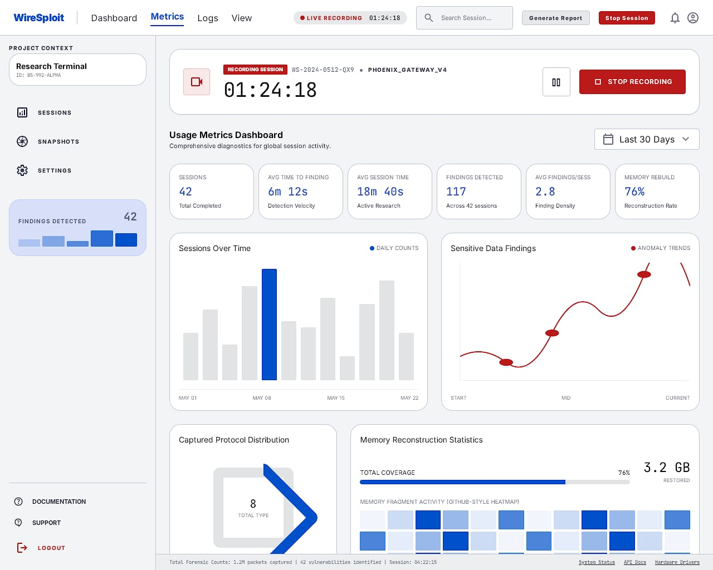

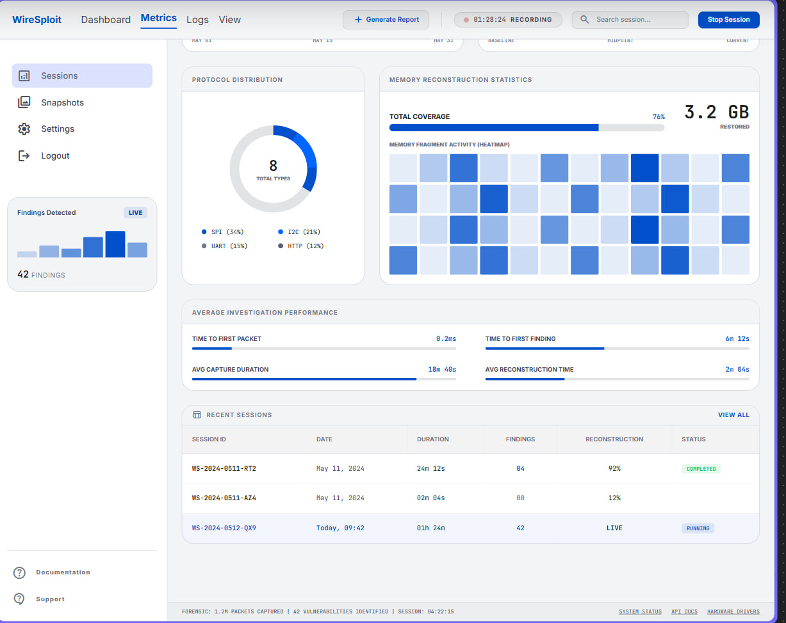

**Figure 3.4.1:** Metrics dashboard displaying aggregated session diagnostics, including Average performance, protocol distribution, memory reconstruction statistics, and a recent sessions table.

#### 3.4.3 Layout & Elements

| Element ID | Element Name | Type | Description / Behavior |
|---|---|---|---|
| EL-02 | Date Range Selector | Dropdown | Filters all metrics below by time window (default "Last 30 Days"). |
| EL-03 | Summary KPI Cards | Card group | Six cards: Sessions (total completed), Avg Time to Finding (detection velocity), Avg Session Time (active research), Findings Detected (total across sessions), Avg Findings/Session, Memory Rebuild % (reconstruction rate). |
| EL-04 | Sessions Over Time | Bar chart | Daily session counts over the selected date range; current/selected day highlighted. |
| EL-05 | Sensitive Data Findings | Line/trend chart | Anomaly trend line showing findings detected over the session timeline (Start/Mid/Current markers). |
| EL-06 | Protocol Distribution | Donut chart | Shows total captured protocol types (e.g., 8) with a breakdown legend (e.g., SPI 34%, I2C 21%, UART 15%, HTTP 12%). |
| EL-07 | Memory Reconstruction Statistics | Progress bar + heatmap | Displays total coverage percentage (e.g., 76%) and absolute data restored (e.g., 3.2 GB), plus a GitHub-style heatmap of memory fragment reconstruction activity. |
| EL-08 | Average Investigation Performance | Metric bars | Four metrics with horizontal progress indicators: Time to First Packet, Time to First Finding, Avg Capture Duration, Avg Reconstruction Time. |
| EL-09 | Recent Sessions Table | Data table | Columns: Session ID (links to session detail), Date, Duration, Findings, Reconstruction %, Status (e.g., COMPLETED, RUNNING, blank/incomplete). Includes "View All" link. |
| EL-10 | Findings Detected Sidebar Widget | Mini chart + counter | Persistent left-sidebar widget showing a small bar sparkline and running total findings count, marked "LIVE" during active sessions. |
| EL-11 | Global Actions | Buttons | Generate Report and Stop Session, available from the top nav bar regardless of active tab. |

#### 3.4.4 Requirements

| Req. ID | Requirement | Description / Notes |
|---|---|---|
| IF-UI-04-01 | The Metrics tab shall display real-time updates to KPI cards and the Findings Detected widget while a session is actively recording. | Reflects "LIVE" state seen in sidebar and Recent Sessions table. |
| IF-UI-04-02 | The Date Range selector shall filter all chart and KPI data on the page consistently. | Avoids partial/inconsistent filtering across widgets. |
| IF-UI-04-03 | The Protocol Distribution chart shall total 100% across displayed protocol categories, with a numeric "Total Types" count in the donut center. | E.g., 8 total types: SPI, I2C, UART, HTTP, etc. |
| IF-UI-04-04 | The Recent Sessions table shall link each Session ID to its corresponding session detail/log view. | Supports drill-down from aggregate to per-session data. |
| IF-UI-04-05 | The Memory Reconstruction heatmap shall visually encode activity intensity per cell using a consistent color scale. | Matches "GitHub-style" contribution heatmap pattern. |

---

### 3.5 Logs

Provide a general description of this screen or component, its purpose, and where it fits in the application.

*[Describe the screen purpose, scope, and context here.]*

#### 3.5.1 Interface Overview

| Field | Value |
|---|---|
| Screen Name | Logs |
| Interface ID | IF-UI-05 |
| Entry Point | Top nav "Logs" tab |

#### 3.5.2 Visual Reference

> 
> *[ INSERT IMAGE HERE ] — Recommended size: 6.25" x 3.5" (or similar) | Format: PNG/JPG*

**Figure 3.5.1:** *[Caption describing the screen/mockup]*

#### 3.5.3 Layout & Elements

| Element ID | Element Name | Type | Description / Behavior |
|---|---|---|---|
| [EL-01] | [Element name] | [Type] | [Expected behavior] |

#### 3.5.4 Requirements

| Req. ID | Requirement | Description / Notes |
|---|---|---|
| [IF-UI-05-01] | [Requirement statement] | [Notes / rationale] |
| [IF-UI-05-02] | [Requirement statement] | [Notes / rationale] |

#### 3.5.5 Validation & Error States

*[Describe input validation rules, error messages, and edge cases.]*

> 
> *[ INSERT IMAGE HERE ] — Optional: error/empty/loading state mockup*

#### 3.5.6 Accessibility Notes
*[Describe accessibility requirements — contrast, keyboard navigation, screen reader labels, etc.]*

#### 3.5.7 Additional Notes
*[Add constraints, assumptions, or dependencies here.]*

---

### 3.6 View

Provide a general description of this screen or component, its purpose, and where it fits in the application.

*[Describe the screen purpose, scope, and context here. This is a sibling tab to Dashboard/Metrics/Logs within the session workspace top navigation, intended to present an alternate/raw view of the captured session data (e.g., a different visualization mode, layout, or export-ready presentation of the same underlying capture).]*

#### 3.6.1 Interface Overview

| Field | Value |
|---|---|
| Screen Name | View |
| Interface ID | IF-UI-06 |
| Trigger / Entry Point | Top nav "View" tab |

#### 3.6.2 Visual Reference

> 
> *[ INSERT IMAGE HERE ] — Recommended size: 6.25" x 3.5" (or similar) | Format: PNG/JPG*

**Figure 3.6.1:** *[Caption describing the screen/mockup]*

#### 3.6.3 Layout & Elements

| Element ID | Element Name | Type | Description / Behavior |
|---|---|---|---|
| [EL-01] | [Element name] | [Type] | [Expected behavior] |

#### 3.6.4 Requirements

| Req. ID | Requirement | Description / Notes |
|---|---|---|
| [IF-UI-06-01] | [Requirement statement] | [Notes / rationale] |
| [IF-UI-06-02] | [Requirement statement] | [Notes / rationale] |

#### 3.6.5 Validation & Error States

*[Describe input validation rules, error messages, and edge cases.]*

> 
> *[ INSERT IMAGE HERE ] — Optional: error/empty/loading state mockup*

#### 3.6.6 Accessibility Notes
*[Describe accessibility requirements — contrast, keyboard navigation, screen reader labels, etc.]*

#### 3.6.7 Additional Notes
*[Add constraints, assumptions, or dependencies here.]*

---

### 3.7 Sessions

Provide a general description of this screen or component, its purpose, and where it fits in the application.

*[Describe the screen purpose, scope, and context here.]*

#### 3.7.1 Interface Overview

| Field | Value |
|---|---|
| Screen Name | Sessions |
| Interface ID | IF-UI-07 |
| Trigger / Entry Point | Sidebar "Sessions"; default post-login screen |

#### 3.7.2 Visual Reference

> 
> *[ INSERT IMAGE HERE ] — Recommended size: 6.25" x 3.5" (or similar) | Format: PNG/JPG*

**Figure 3.7.1:** *[Caption describing the screen/mockup]*

#### 3.7.3 Layout & Elements

| Element ID | Element Name | Type | Description / Behavior |
|---|---|---|---|
| [EL-01] | [Element name] | [Type] | [Expected behavior] |

#### 3.7.4 Requirements

| Req. ID | Requirement | Description / Notes |
|---|---|---|
| [IF-UI-07-01] | [Requirement statement] | [Notes / rationale] |
| [IF-UI-07-02] | [Requirement statement] | [Notes / rationale] |

#### 3.7.5 Validation & Error States

*[Describe input validation rules, error messages, and edge cases.]*

> 
> *[ INSERT IMAGE HERE ] — Optional: error/empty/loading state mockup*

#### 3.7.6 Accessibility Notes
*[Describe accessibility requirements — contrast, keyboard navigation, screen reader labels, etc.]*

#### 3.7.7 Additional Notes
*[Add constraints, assumptions, or dependencies here.]*

---

### 3.8 Snapshots

Provide a general description of this screen or component, its purpose, and where it fits in the application.

*[Describe the screen purpose, scope, and context here.]*

#### 3.8.1 Interface Overview

| Field | Value |
|---|---|
| Screen Name | Snapshots |
| Interface ID | IF-UI-08 |
| Entry Point | Sidebar "Snapshots" |

#### 3.8.2 Visual Reference

> 
> *[ INSERT IMAGE HERE ] — Recommended size: 6.25" x 3.5" (or similar) | Format: PNG/JPG*

**Figure 3.8.1:** *[Caption describing the screen/mockup]*

#### 3.8.3 Layout & Elements

| Element ID | Element Name | Type | Description / Behavior |
|---|---|---|---|
| [EL-01] | [Element name] | [Type] | [Expected behavior] |

#### 3.8.4 Requirements

| Req. ID | Requirement | Description / Notes |
|---|---|---|
| [IF-UI-08-01] | [Requirement statement] | [Notes / rationale] |
| [IF-UI-08-02] | [Requirement statement] | [Notes / rationale] |

#### 3.8.5 Validation & Error States

*[Describe input validation rules, error messages, and edge cases.]*

> 
> *[ INSERT IMAGE HERE ] — Optional: error/empty/loading state mockup*

#### 3.8.6 Accessibility Notes
*[Describe accessibility requirements — contrast, keyboard navigation, screen reader labels, etc.]*

#### 3.8.7 Additional Notes
*[Add constraints, assumptions, or dependencies here.]*

---

### 3.9 Snapshot

Provide a general description of this screen or component, its purpose, and where it fits in the application.

*[Describe the screen purpose, scope, and context here.]*

#### 3.9.1 Interface Overview

| Field | Value |
|---|---|
| Screen Name | Snapshot |
| Interface ID | IF-UI-09 |
| Entry Point | Selects a snapshot from Snapshots list (IF-UI-08) |

#### 3.9.2 Visual Reference

> 
> *[ INSERT IMAGE HERE ] — Recommended size: 6.25" x 3.5" (or similar) | Format: PNG/JPG*

**Figure 3.9.1:** *[Caption describing the screen/mockup]*

#### 3.9.3 Layout & Elements

| Element ID | Element Name | Type | Description / Behavior |
|---|---|---|---|
| [EL-01] | [Element name] | [Type] | [Expected behavior] |

#### 3.9.4 Requirements

| Req. ID | Requirement | Description / Notes |
|---|---|---|
| [IF-UI-09-01] | [Requirement statement] | [Notes / rationale] |
| [IF-UI-09-02] | [Requirement statement] | [Notes / rationale] |

#### 3.9.5 Validation & Error States

*[Describe input validation rules, error messages, and edge cases.]*

> 
> *[ INSERT IMAGE HERE ] — Optional: error/empty/loading state mockup*

#### 3.9.6 Accessibility Notes
*[Describe accessibility requirements — contrast, keyboard navigation, screen reader labels, etc.]*

#### 3.9.7 Additional Notes
*[Add constraints, assumptions, or dependencies here.]*

---

# 3.10 Export-Report

The Export-Report screen is a modal that lets the user select which analysis data to include in a session report, choose export formats (JSON,PDF), and preview or generate the final report.

#### 3.10.1 Interface Overview

| Field | Value |
|---|---|
| Screen Name | Export-Report |
| Interface ID | IF-UI-10 |
| Entry Point | Dashboard "Generate Report" button |

#### 3.10.2 Visual Reference

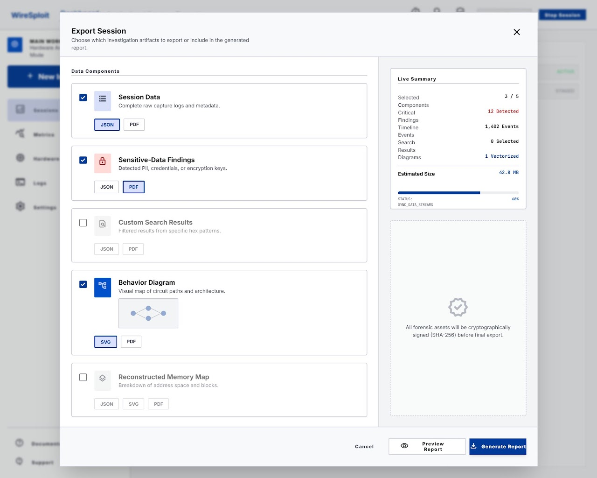

**Figure 3.10.1:** Export Session allow selection of analysis data (Session Data, Sensitive-Data Findings, Custom Search Results, Behavior Diagram, Reconstructed Memory Map), each with its own export format.

#### 3.10.3 Layout & Elements

| Element ID | Element Name | Type | Description / Behavior |
|---|---|---|---|
| EL-01 | Modal Header | Header | Displays title "Export Session" and subtitle explaining the modal's purpose; includes a close (X) icon in the top-right. |
| EL-02 | Data Components List | Checklist (cards) | Five selectable artifact cards: Session Data, Sensitive-Data Findings, Custom Search Results, Behavior Diagram, Reconstructed Memory Map. Each has a checkbox to include/exclude it from the export. |
| EL-03 | Session Data Card | Card w/ checkbox | "Complete raw capture logs and metadata." Format toggle: JSON (selected) / PDF. |
| EL-04 | Sensitive-Data Findings Card | Card w/ checkbox | "Detected PII, credentials, or encryption keys." Format toggle: JSON / PDF (selected). |
| EL-05 | Custom Search Results Card | Card w/ checkbox | "Filtered results from specific hex patterns." Unchecked by default. Format toggle: JSON / PDF. |
| EL-06 | Behavior Diagram Card | Card w/ checkbox | "Visual map of circuit paths and architecture." Includes a thumbnail preview of the diagram. Format toggle: SVG,JPG (selected) . |
| EL-07 | Reconstructed Memory Map Card | Card w/ checkbox | "Breakdown of address space and blocks." Unchecked by default. Format toggle: JSON / SVG . |
| EL-08 | Live Summary Panel | Sidebar summary | Displays real-time counts: Selected Components (e.g., 3/5), Critical Findings (e.g., 12 Detected), Timeline Events (e.g., 1,402 Events), Search Results (e.g., 0 Selected), Diagrams (e.g., 1 Vectorized), and Estimated Size (e.g., 42.8 MB). |
| EL-09 | Action Buttons | Buttons | Cancel (dismiss modal), Preview Report (navigates to Report screen, IF-UI-11), Generate Report (primary action, triggers export). |

#### 3.10.4 Requirements

| Req. ID | Requirement | Description / Notes |
|---|---|---|
| IF-UI-10-01 | The modal shall allow independent selection of each data component and its export format. | Each card's checkbox and format toggle operate independently of other cards. |
| IF-UI-10-02 | The Live Summary panel shall update in real time as components are selected/deselected. | Reflects "Selected Components," estimated size, and related counts dynamically. |
| IF-UI-10-03 | Generate Report and Preview Report actions shall be disabled or warn the user if zero components are selected. | Prevents generating an empty report. |
| IF-UI-10-04 | All exported analysis data shall be cryptographically signed (SHA-256) prior to finalizing the export. | Displayed via the Integrity Notice; must be enforced server-side, not just messaged in UI. |

---

# 3.11 Report

The Report screen presents the Session Summary Report generated from the data selected in the Export-Report page. It is a structured, print/PDF-style document view — including a cover page, executive summary, detailed metrics, sensitive-data findings, custom search results, a system behavior diagram, a memory reconstruction map, and appendix/export metadata

#### 3.11.1 Interface Overview

| Field | Value |
|---|---|
| Screen Name | Report |
| Interface ID | IF-UI-11 |
|  Entry Point | "Preview Report on Export-Report |

#### 3.11.2 Visual Reference

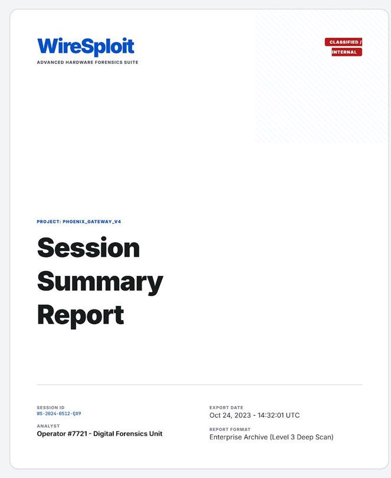
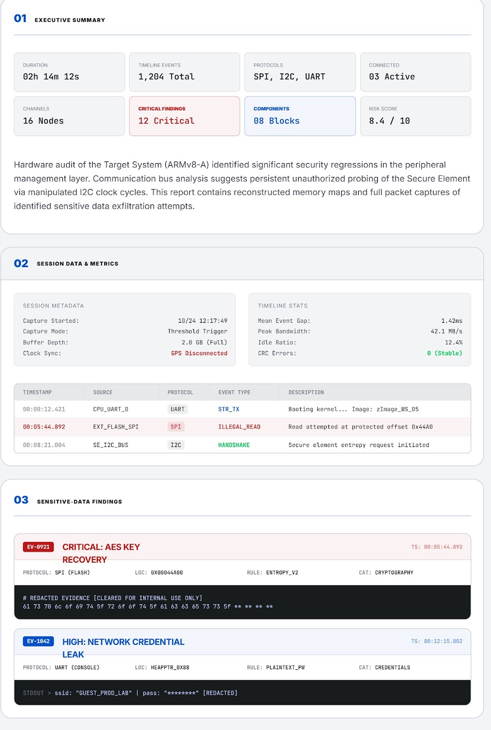
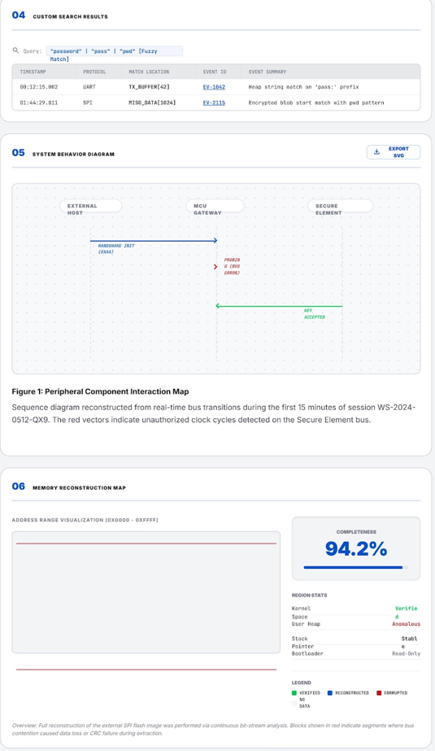
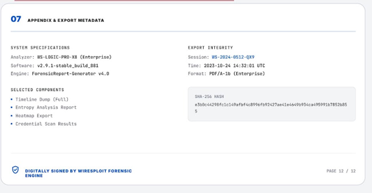

**Figure 3.11.1:** Session Summary Report showing a classified cover page and seven numbered report sections summarizing the full session, with an "Export PDF" action.

#### 3.11.3 Layout & Elements

| Element ID | Element Name | Type | Description / Behavior |
|---|---|---|---|
| EL-01 | Top Bar | Navigation/actions | Contains primary nav (Dashboard/Metrics/Logs/View), Export PDF button, report search field, and Close button to exit back to the workspace. |
| EL-02 | Cover Page | Document header | Displays WireSploit branding, "CLASSIFIED / INTERNAL" tag, project name (e.g., PHOENIX_GATEWAY_V4), report title ("Session Summary Report"), Session ID, Export Date, Analyst, and Report Format. |
| EL-03 | 01 Executive Summary | Section | KPI tiles (Duration, Timeline Events, Protocols, Connected, Channels, Critical Findings, Components, Risk Score) plus a narrative paragraph summarizing the audit findings. |
| EL-04 | 02 Session Data & Metrics | Section | Session Metadata panel and Timeline Stats panel and a detailed event table (Timestamp, Source, Protocol, Event Type, Description). |
| EL-05 | 03 Sensitive-Data Findings | Section | Individually flagged findings each with  timestamp, protocol/location/rule/category metadata, and a redacted evidence/log snippet block. |
| EL-06 | 04 Custom Search Results | Section | Displays the search query used (e.g., "password"/"pass"/"pwd" fuzzy match) and a results table (Timestamp, Protocol, Match Location, Event ID, Event Summary). |
| EL-07 | 05 System Behavior Diagram | Section | Embedded sequence/interaction diagram (Figure 1: Peripheral Component Interaction Map) with an Export SVG action and descriptive caption. |
| EL-08 | 06 Memory Reconstruction Map | Section | Address range visualization, Completeness percentage (e.g., 94.2%), Region Stats (Kernel Space, User Heap, Stack, Pointer, Bootloader with status labels), and a color-coded legend (Verified/Reconstructed/Corrupted/No Data). |
| EL-09 | 07 Appendix & Export Metadata | Section | System Specifications (Analyzer, Software, Engine), Export Integrity (Session, Time, Format), Selected Components list, and a SHA-256 export hash. |

#### 3.11.4 Requirements

| Req. ID | Requirement | Description / Notes |
|---|---|---|
| IF-UI-11-01 | The Report screen shall render only the sections/components selected in the Export-Report modal (IF-UI-10). | Omit sections for unselected components (e.g., Custom Search Results if not selected). |
| IF-UI-11-02 | Sensitive values within findings (e.g., passwords, keys) shall be redacted or masked by default in the rendered report. | See "[REDACTED]" and masked password examples in Sensitive-Data Findings and evidence blocks. |
| IF-UI-11-03 | The Memory Reconstruction Map legend colors (Verified/Reconstructed/Corrupted/No Data) shall be applied consistently to the address range visualization. | Supports accurate interpretation of reconstruction status. |

---

# 3.12 Settings

The Settings screen is the workspace configuration hub for a given session/DUT, accessed via the sidebar "Settings" item. It centralizes session metadata, collaborator access and permissions, backup/restore of investigation data, session ownership transfer, a permission activity audit trail, and destructive/critical actions (archive or permanently delete a session). This screen is scoped to a single session (e.g., WS-992-ALPHA) rather than global application settings.

#### 3.12.1 Interface Overview

| Field | Value |
|---|---|
| Screen Name | Settings |
| Interface ID | IF-UI-12 |
| Trigger / Entry Point | Sidebar "Settings" |

#### 3.12.2 Visual Reference

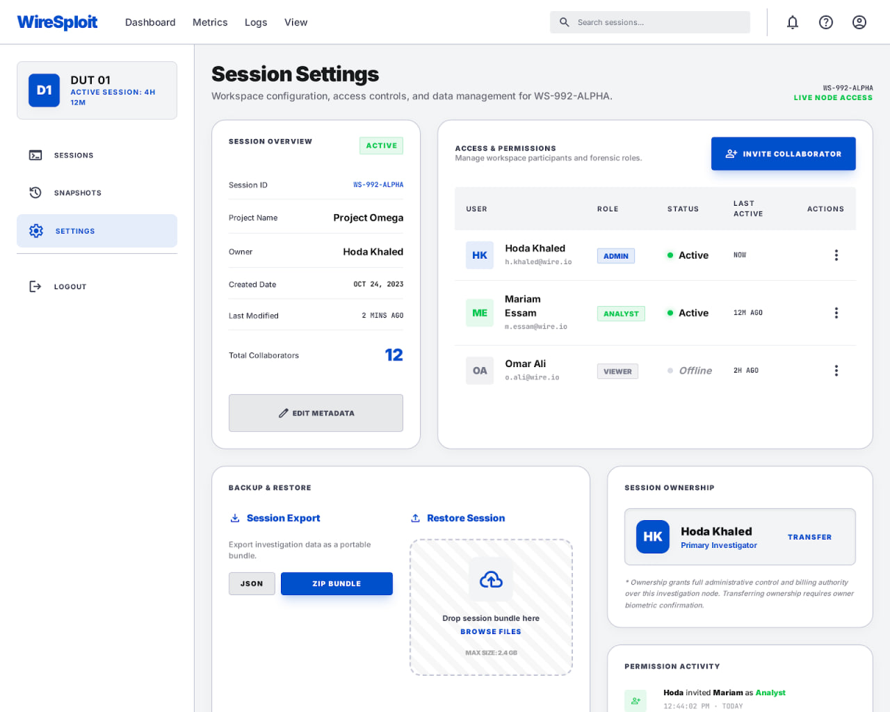

**Figure 3.12.1:** Session Settings screen showing session metadata, collaborator access controls, export/import Config, ownership transfer, permission activity log, and critical (archive/delete) actions.

#### 3.12.3 Layout & Elements

| Element ID | Element Name | Type | Description / Behavior |
|---|---|---|---|
| EL-01 | DUT / Session Status Card | Sidebar card | Displays DUT identifier (e.g., D1 / DUT 01) and session status and its duration (e.g., "ACTIVE SESSION: 4H 12M"). |
| EL-02 | Page Header | Header | "Session Settings" title with subtitle describing workspace configuration, access controls, and data management scope; shows Session ID (e.g., WS-992-ALPHA) and "LIVE NODE ACCESS" indicator top-right. |
| EL-03 | Session Overview Card | Info panel | Displays Session ID, Project Name, Owner, Created Date, Last Modified, Total Collaborators, and an ACTIVE status badge. Includes an "Edit Metadata" button. |
| EL-04 | Access & Permissions Card | Table/list | Lists workspace participants with User (name, avatar initials, email), Role (ADMIN/ANALYST/VIEWER badge), Status (Active/Offline with colored dot), Last Active (e.g., "NOW," "12M AGO," "2H AGO"), and a per-row Actions menu . Includes an "Invite Collaborator" button. |
| EL-05 | Backup & Restore Card | Panel | Contains "Session Export" (download icon, export as JSON or ZIP Bundle)  |
| EL-06 | Session Ownership Card | Panel | Shows current Primary admin (avatar, name, role label) with a "Transfer" action/link; includes a note that ownership grants full administrative and billing authority and that transfer requires owner biometric confirmation. |
| EL-07 | Permission Activity Card | Activity feed | Chronological log of permission/access events (e.g., "Hoda invited Mariam as Analyst," "Hoda updated session to ENCRYPTED_RESTRICTED," "Omar Ali accessed the workspace via Guest Link"), each with an icon, actor/action description, and timestamp. Includes a "View Full Audit Log" link. |
| EL-08 | Critical Actions Banner | Warning panel | Red-bordered alert stating that archiving or deleting a session is irreversible and will purge all recorded waveforms, memory maps, and logic captures; includes "Archive Session" (secondary) and "Delete Forever" (destructive, red) buttons. |

#### 3.12.4 Requirements

| Req. ID | Requirement | Description / Notes |
|---|---|---|
| IF-UI-12-01 | The Access & Permissions panel shall allow Admins to invite new collaborators and modify or revoke existing collaborators' roles. | Managed via "Invite Collaborator" button and per-row Actions menu. |
| IF-UI-12-02 | Session Export shall allow the user to export investigation data as either a JSON file or a ZIP bundle. | Displayed as two distinct export format options. |
| IF-UI-12-03 | The Delete Forever action shall require explicit user confirmation (e.g., a confirmation dialog or typed confirmation) before permanently purging session data. | Action is irreversible per the Critical Actions banner; purges waveforms, memory maps, and logic captures. |
| IF-UI-12-04 | The Permission Activity feed shall log all access/permission-changing events (invites, role changes, encryption/security setting changes, guest link access) with actor and timestamp. | Supports compliance/audit requirements; "View Full Audit Log" provides the complete history. |

## 4. Open Questions