# Interface Requirements
## Software Interface Requirements Documentation

| Field             | Value                                                        |
|-------------------|--------------------------------------------------------------|
| Project Name      | IoT Reconnaissance & Communication-Block Monitoring System   |
| Working Title     | Wiresploit                                                   |
| Document Status   | `V0.0.1`                             |
| Date              | 1-8-2026                                                    |
| Prepared by       | Mariam Essam / Hoda Khaled            |

## Table of Contents

1. [Purpose](#1-purpose)
2. [Overview](#2-overview)
3. [User Interface (UI) Requirements](#3-user-interface-ui-requirements)
4. [Open Questions](#4-open-questions)

---

## 1. Purpose
Define the Software interface of the system, including screen layouts and interaction behavior.

## 2. Overview

| Interface ID | Interface Name | Description |
|---|---|---|
| IF-UI-01 | Register | Register page |
| IF-UI-02 | Login | Login page |
| IF-UI-03 | Dashboard | Display DUT live state |
| IF-UI-04 | Metrics | Display session/DUT performance and analysis metrics |
| IF-UI-05 | Logs | List all failed logs |
| IF-UI-06 | View | Display raw/alternate view of captured session data |
| IF-UI-07 | Sessions | List all recorded sessions |
| IF-UI-08 | Snapshots | List all recorded Snapshots |
| IF-UI-09 | Snapshot | Display detailed snapshot data |
| IF-UI-10 | Export-Report | Display report exporting options |
| IF-UI-11 | Report | Display report before exporting |
| IF-UI-12 | Settings | Display systems settings |

---

## 3. User Interface (UI) Requirements

### 3.1 Register

Provide a general description of this screen or component, its purpose, and where it fits in the application.

*[Describe the screen purpose, scope, and context here.]*

#### 3.1.1 Interface Overview

| Field | Value |
|---|---|
| Screen / Component Name | Register |
| Interface ID | IF-UI-01 |
| Interface Type | User Interface |
| Parent Screen / Module | [e.g., Auth Module] |
| User Role(s) | [e.g., Guest] |
| Platform | [Web / Mobile / Desktop] |
| Trigger / Entry Point | [How the user reaches this screen] |

#### 3.1.2 Visual Reference

Insert a screenshot, wireframe, or mockup illustrating this screen below.

> 
> *[ INSERT IMAGE HERE ] — Recommended size: 6.25" x 3.5" (or similar) | Format: PNG/JPG*

**Figure 3.1.1:** *[Caption describing the screen/mockup]*

#### 3.1.3 Layout & Elements

| Element ID | Element Name | Type | Description / Behavior |
|---|---|---|---|
| [EL-01] | [e.g., Submit Button] | [Button / Field / Dropdown / etc.] | [Expected behavior] |
| [EL-02] | [Element name] | [Type] | [Expected behavior] |

#### 3.1.4 Requirements

| Req. ID | Requirement | Description / Notes |
|---|---|---|
| [IF-UI-01-01] | [Requirement statement] | [Notes / rationale] |
| [IF-UI-01-02] | [Requirement statement] | [Notes / rationale] |
| [IF-UI-01-03] | [Requirement statement] | [Notes / rationale] |

#### 3.1.5 Validation & Error States

*[Describe input validation rules, error messages, and edge cases.]*

> 
> *[ INSERT IMAGE HERE ] — Optional: error/empty/loading state mockup*

#### 3.1.6 Accessibility Notes
*[Describe accessibility requirements — contrast, keyboard navigation, screen reader labels, etc.]*

#### 3.1.7 Additional Notes
*[Add constraints, assumptions, or dependencies here.]*

---

### 3.2 Login

Provide a general description of this screen or component, its purpose, and where it fits in the application.

*[Describe the screen purpose, scope, and context here.]*

#### 3.2.1 Interface Overview

| Field | Value |
|---|---|
| Screen / Component Name | Login |
| Interface ID | IF-UI-02 |
| Interface Type | User Interface |
| Parent Screen / Module | [e.g., Auth Module] |
| User Role(s) | [e.g., Guest] |
| Platform | [Web / Mobile / Desktop] |
| Trigger / Entry Point | [How the user reaches this screen] |

#### 3.2.2 Visual Reference

> 
> *[ INSERT IMAGE HERE ] — Recommended size: 6.25" x 3.5" (or similar) | Format: PNG/JPG*

**Figure 3.2.1:** *[Caption describing the screen/mockup]*

#### 3.2.3 Layout & Elements

| Element ID | Element Name | Type | Description / Behavior |
|---|---|---|---|
| [EL-01] | [Element name] | [Type] | [Expected behavior] |

#### 3.2.4 Requirements

| Req. ID | Requirement | Description / Notes |
|---|---|---|
| [IF-UI-02-01] | [Requirement statement] | [Notes / rationale] |
| [IF-UI-02-02] | [Requirement statement] | [Notes / rationale] |

#### 3.2.5 Validation & Error States

*[Describe input validation rules, error messages, and edge cases.]*

> 
> *[ INSERT IMAGE HERE ] — Optional: error/empty/loading state mockup*

#### 3.2.6 Accessibility Notes
*[Describe accessibility requirements — contrast, keyboard navigation, screen reader labels, etc.]*

#### 3.2.7 Additional Notes
*[Add constraints, assumptions, or dependencies here.]*

---

### 3.3 Dashboard

Provide a general description of this screen or component, its purpose, and where it fits in the application.

*[Describe the screen purpose, scope, and context here.]*

#### 3.3.1 Interface Overview

| Field | Value |
|---|---|
| Screen / Component Name | Dashboard |
| Interface ID | IF-UI-03 |
| Interface Type | User Interface |
| Parent Screen / Module | [e.g., Main Module] |
| User Role(s) | [e.g., Registered User] |
| Platform | [Web / Mobile / Desktop] |
| Trigger / Entry Point | [How the user reaches this screen] |

#### 3.3.2 Visual Reference

> 
> *[ INSERT IMAGE HERE ] — Recommended size: 6.25" x 3.5" (or similar) | Format: PNG/JPG*

**Figure 3.3.1:** *[Caption describing the screen/mockup]*

#### 3.3.3 Layout & Elements

| Element ID | Element Name | Type | Description / Behavior |
|---|---|---|---|
| [EL-01] | [Element name] | [Type] | [Expected behavior] |

#### 3.3.4 Requirements

| Req. ID | Requirement | Description / Notes |
|---|---|---|
| [IF-UI-03-01] | [Requirement statement] | [Notes / rationale] |
| [IF-UI-03-02] | [Requirement statement] | [Notes / rationale] |

#### 3.3.5 Validation & Error States

*[Describe input validation rules, error messages, and edge cases.]*

> 
> *[ INSERT IMAGE HERE ] — Optional: error/empty/loading state mockup*

#### 3.3.6 Accessibility Notes
*[Describe accessibility requirements — contrast, keyboard navigation, screen reader labels, etc.]*

#### 3.3.7 Additional Notes
*[Add constraints, assumptions, or dependencies here.]*

---

### 3.5 Logs

The Logs page provides a view of all significant events, errors, and system messages generated by the Wiresploit platform. It lists failed operations, system warnings, validation errors, and other diagnostic information.

#### 3.5.1 Interface Overview

| Field | Value |
|---|---|
| Screen Name | Logs |
| Interface ID | IF-UI-05 |
| Trigger / Entry Point | From the navigation bar|

#### 3.5.2 Visual Reference

> 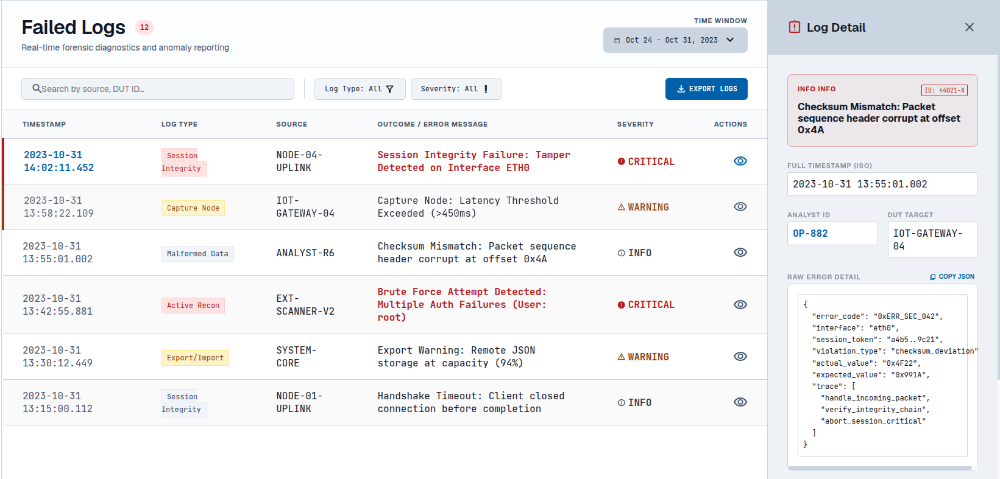

**Figure 3.5.1:** *Light Theme*

> 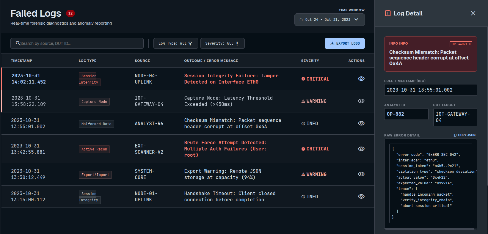

**Figure 3.5.2:** *Dark Theme*

#### 3.5.3 Layout & Elements

| Element ID | Element Name | Type | Description / Behavior |
|---|---|---|---|
| EL-01 | Failed Logs Counter Badge | Badge | Displays total count of failed logs (e.g., "12"); updates in real time as new failures are logged |
| EL-02 | Search Bar | Text Field | Filters rows by source or DUT ID as the user types |
| EL-03 | Log Type Filter | Dropdown | Filters rows by log type (Session Integrity, Capture Node, Malformed Data, Active Recon, Export/Import); default "All" |
| EL-04 | Severity Filter | Dropdown | Filters rows by severity (Critical, Warning, Info); default "All" |
| EL-05 | Export Logs Button | Button | Exports the currently filtered log list |
| EL-06 | Log Table | Data Table | Columns: Timestamp, Log Type, Source, Outcome/Error Message, Severity, Actions |
| EL-07 | Severity Indicator | Icon + Label | Color-coded marker (● Critical, ▲ Warning, ⓘ Info) shown per row |
| EL-08 | View Action Icon | Icon Button | Opens the Log Detail panel for that row |
| EL-09 | Log Detail Side Panel | Panel/Drawer | Slide-in panel with full detail of the selected log |
| EL-10 | Panel Close Button | Icon Button | Closes the Log Detail panel |
| EL-11 | Log ID Tag | Badge | Unique log identifier (e.g., "ID: 44021-X") |
| EL-12 | Analyst ID | Read-only Field | User sign in ID |
| EL-13 | Raw Error Detail Block | Code Block | Raw JSON payload (error_code, interface, trace, etc.) |
| EL-14 | Copy JSON Button | Icon Button | Copies raw error detail JSON to clipboard |

#### 3.5.4 Requirements

| Req. ID | Requirement | Description / Notes | Satisfies (FR) |
|---|---|---|---|
| IF-UI-07-01 | The system shall display all failed log entries in a filterable, real-time table with timestamp, log type, source, message, severity, and actions. | Table refreshes as new failures are generated | **FR-DEP-02-3, FR-EXT-02-4** |
| IF-UI-07-02 | The system shall visually flag malformed data received from external capture tools by marking the row/message in red. | No manual step required to spot a bad submission | **FR-EXT-02-3** |
| IF-UI-07-03 | The system shall log every failed external submission with source identity, timestamp, and outcome, and surface it in this view. | Failure is persisted even when the payload is rejected | **FR-EXT-02-4** |
| IF-UI-07-04 | The system shall allow an analyst to view raw error detail as structured JSON and copy it to the clipboard. | Non-blocking side panel; no navigation away from the list | — traceability support |
| IF-UI-07-05 | The system shall filter/search the log list by severity, log type, time window, and source/DUT ID text. | Filters combine with AND logic | — usability |

#### 3.5.5 Validation & Error States

Abstraction of error in user interface by user friendly text.

- **Malformed payload validation (FR-EXT-02-3 / FR-EXT-02-4):** an external submission is checked against a required-field schema. If validation fails, the submission is still logged — not silently dropped — but flagged `malformed = true` so the UI renders it with a red row and a `[MALFORMED]` prefix on the message.
- **Empty state:** show "No failed logs in the selected time window" when filters return zero results.
- **Search with no matches:** show "No results found for '[query]'" beneath the search bar.
- **Raw error detail fails to load:** show "Unable to load raw error detail" instead of a blank code block.

<table>
  <tr>
    <td align="center">
       
      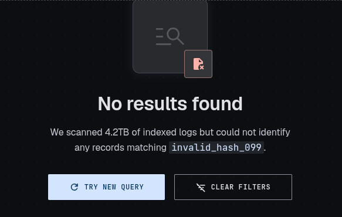
       <em> Search with no matches</em>
    </td>
    <td align="center">
       
      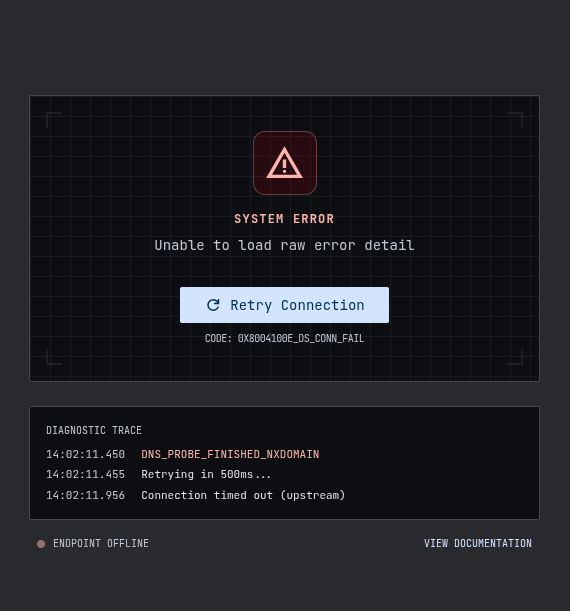
       <em> Raw error detail fails to load</em>
    </td>
    <td align="center">
       
      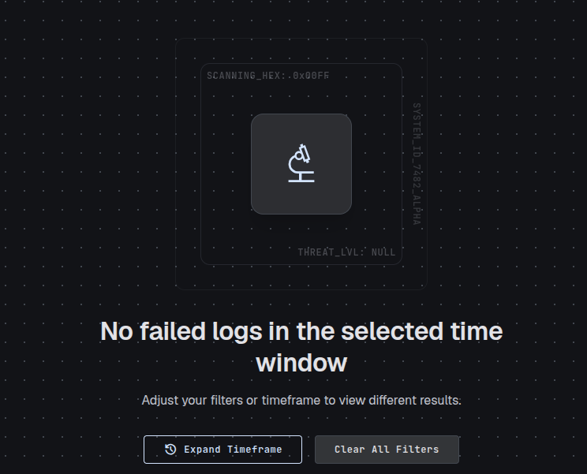
       <em> No logs to search </em>
    </td>
  </tr>
</table>

#### 3.5.6 Accessibility Notes

- Severity is never conveyed by color alone — paired with icon + text label (● CRITICAL / ▲ WARNING / ⓘ INFO).

---

### 3.6 View

Allow analyst to enable or disable some tabs from showing.

#### 3.6.1 Interface Overview

| Field | Value |
|---|---|
| Screen / Component Name | View |
| Interface ID | IF-UI-06 |
| Trigger / Entry Point | navigation bar |

#### 3.6.2 Visual Reference

> 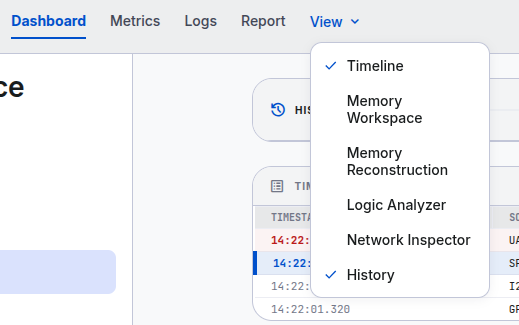

#### 3.6.3 Layout & Elements

| Element ID | Element Name | Type | Description / Behavior |
|---|---|---|---|
| [EL-01] | view component |  Dropdown | Allow analyst to enable or disable some tabs from showing.|

---

### 3.7 Sessions

The Sessions screen is the central repository for all recorded capture sessions, allowing an analyst to review, filter, and search past sessions before drilling into individual session detail.

#### 3.7.1 Interface Overview

| Field | Value |
|---|---|
| Screen Name | Sessions |
| Interface ID | IF-UI-07 |
| Trigger / Entry Point | From the navigation bar |

#### 3.7.2 Visual Reference

> 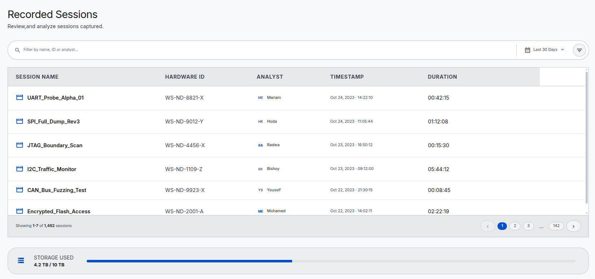

**Figure 3.7.1:** Light mode sessions screen.

#### 3.7.3 Layout & Elements

| Element ID | Element Name | Type | Description / Behavior |
|---|---|---|---|
| EL-01 | Page Title & Subtitle | Text | "Recorded Sessions" heading with "Review, and analyze sessions captured." subtitle |
| EL-02 | Filter Bar | Text Field | Filters the session list by name, ID, or analyst |
| EL-03 | Time Range Filter | Dropdown | Filters sessions by time window (e.g., "Last 30 Days") |
| EL-04 | Additional Filter Icon | Icon Button | Opens extended/advanced filter options |
| EL-05 | Sessions Table | Data Table | Columns: Session Name, Hardware ID, Analyst, Timestamp, Duration |
| EL-06 | Session Icon | Icon | Identifies each row as a session record |
| EL-07 | Session Name | Text Link | Name of the recorded session (e.g., "UART_Probe_Alpha_01"); opens session detail on click |
| EL-08 | Hardware ID | Text | Identifier of the capture hardware used for the session (e.g., "WS-ND-8821-X") |
| EL-09 | Analyst Avatar & Name | Avatar + Text | Initials avatar and name of the analyst who ran the session |
| EL-10 | Timestamp | Text | Date and time the session was captured |
| EL-11 | Duration | Text | Length of the recorded session (HH:MM:SS) |
| EL-12 | Pagination Controls | Pagination | Previous/Next and numbered pages; shows "Showing X-Y of Z sessions" |
| EL-13 | Storage Used Card | Stat Widget | Displays aggregate storage consumed by recorded sessions with a usage bar (e.g., "4.2 TB / 10 TB") |

#### 3.7.4 Requirements

| Req. ID | Requirement | Description / Notes | Satisfies (FR) |
|---|---|---|---|
| IF-UI-07-01 | The system shall list all recorded sessions with session name, hardware ID, analyst, timestamp, and duration. | Core session listing | — (usability) |
| IF-UI-07-02 | The system shall allow the analyst to filter/search sessions by name, ID, or analyst. | Free-text filter bar | — (usability) |
| IF-UI-07-03 | The system shall allow the analyst to filter sessions by time range. | Dropdown filter | — (usability) |
| IF-UI-07-04 | The system shall record and display which analyst captured each session. | Supports traceability/audit | (audit trail identity pattern) |
| IF-UI-07-05 | The system shall allow the analyst to open a session to view its full detail. | Clicking session name navigates to session detail | — (navigation) |
| IF-UI-07-06 | The system shall display aggregate storage consumed by recorded sessions. | "Storage Used" widget with capacity bar | — (operational visibility, consistent with Snapshots screen) |

#### 3.7.5 Validation & Error States

- **Empty state:** show "No sessions found" when there are no recorded sessions or filters return zero results.
- **Filter with no matches:** show "No results found for '[query]'" beneath the filter bar.
- **Storage near/at capacity:** "Storage Used" widget should support a near-limit warning state.
- **Pagination edge cases:** disable "Previous" on page 1 and "Next" on the last page; large session counts (e.g., 1,482) must paginate rather than render all rows at once.

<table>
  <tr>
    <td align="center">
       
      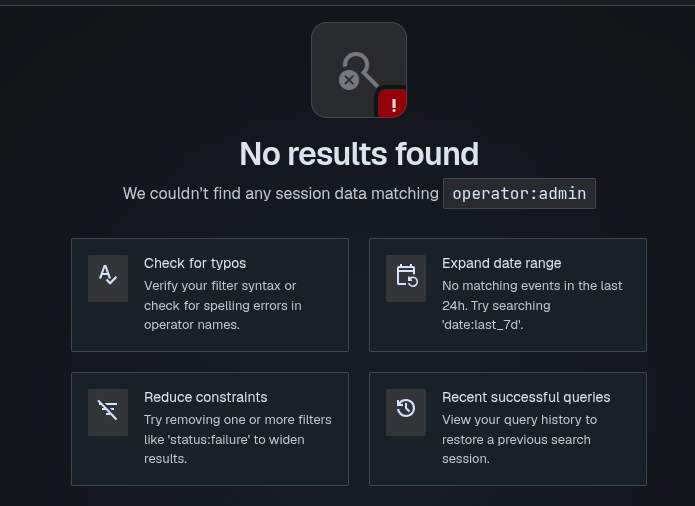
       <em>Figure 3.7.5a: Search with no matches</em>
    </td>
    <td align="center">
       
      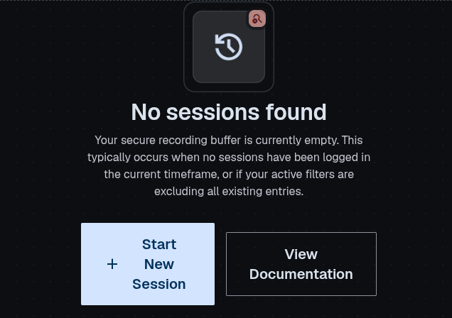
       <em>Figure 3.7.5b: No sessions to search </em>
    </td>
  </tr>
</table>

#### 3.7.6 Accessibility Notes
- Analyst avatars (initials) should include an accessible name (full analyst name), not rely on the two-letter initials alone.

#### 3.7.7 Additional Notes
- Assumes session metadata (hardware ID, analyst, duration, timestamp) is generated and logged by the Brain at session capture time.
- Storage Used widget should reconcile with the equivalent "Total Storage" figure shown on the Snapshots screen (IF-UI-05); confirm whether these are the same underlying metric or scoped separately (sessions vs. snapshots).

---

### 3.8 Snapshots

The Snapshots screen serves as a central repository for all captured Snapshot Blocks (SB) within the system.

#### 3.8.1 Interface Overview

| Field | Value |
|---|---|
| Screen Name | Snapshots |
| Interface ID | IF-UI-08 |
| Trigger / Entry Point | Left Side Panel |

#### 3.8.2 Visual Reference
Snapshot Library shows list of captured Snapshot Blocks with search, time filter, storage usage, and active hardware status.
> 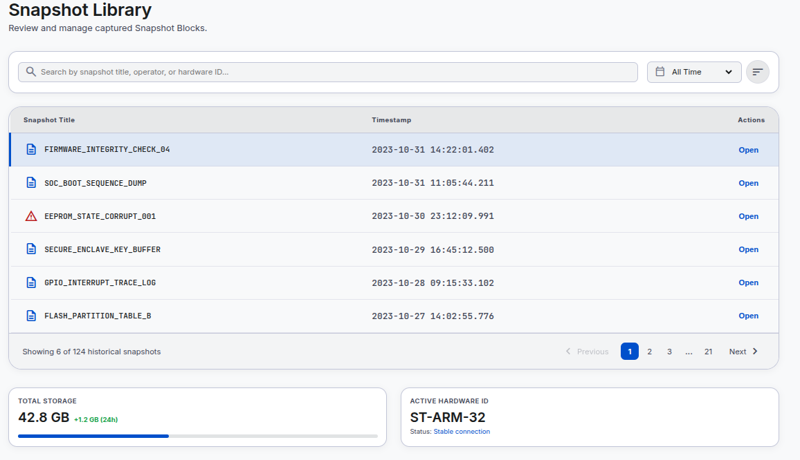
**Figure 3.8.2a:** Light Mode

> 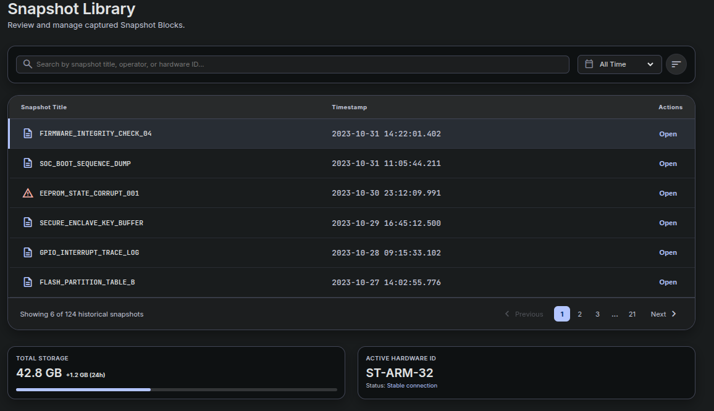
**Figure 3.8.2b:** Dark Mode

#### 3.8.3 Layout & Elements

| Element ID | Element Name | Type | Description / Behavior |
|---|---|---|---|
| EL-01 | Search Bar | Text Field | Filters list by snapshot title,or hardware ID |
| EL-02 | Time Filter | Dropdown | Filters list by time window (e.g., "All Time") |
| EL-03 | Sort Control | Icon Button | Toggles sort order of the list |
| EL-04 | Snapshot Table | Data Table | Columns: Snapshot Title, Timestamp, Actions |
| EL-05 | Snapshot Status Icon | Icon | Document icon for normal snapshots; red warning triangle for a snapshot flagged with an integrity/state issue (e.g., `EEPROM_STATE_CORRUPT_001`) |
| EL-06 | Open Link | Text Link | Navigates to the detailed Snapshot view for that row |
| EL-07 | Pagination Controls | Pagination | Previous/Next and numbered pages; shows "Showing X of Y historical snapshots" |
| EL-08 | Total Storage Card | Stat Card | Displays cumulative storage used by snapshots with a usage bar |
| EL-09 | Active Hardware ID Card | Stat Card | Displays the currently connected capture hardware ID and connection status (e.g., "Stable connection") |

#### 3.8.4 Requirements

| Req. ID | Requirement | Description / Notes | Satisfies (FR) |
|---|---|---|---|
| IF-UI-08-01 | The system shall list all recorded Snapshot Block outputs with their title and timestamp. | List all saved snapshots  | **FR-MON-07-1**|
| IF-UI-08-02 | The system shall allow the analyst to search snapshots by title, or hardware ID. | Free-text search across fields | — (usability) |
| IF-UI-08-03 | The system shall allow the analyst to filter the snapshot list by a time window. | e.g., "All Time", custom range | — (usability) |
| IF-UI-08-04 | The system shall visually flag a snapshot whose captured state indicates a corruption or integrity issue. | Red warning icon on the affected row | — (usability)|
| IF-UI-08-05 | The system shall allow the analyst to open a snapshot to view its detailed data. | Navigates to a specific snapshot | **FR-ANA-09-1** |
| IF-UI-08-06 | The system shall display total storage consumed by recorded snapshots and its recent growth. | Supports capacity awareness/monitoring | — (operational visibility) |
| IF-UI-08-07 | The system shall display the currently active capture hardware ID and its connection status. | Supports the analyst confirming the correct DUT/hardware is connected | — (operational visibility) |

#### 3.8.5 Validation & Error States

Abstraction of error in user interface by user friendly text.

- **Empty state:** show "No snapshots found" when the library is empty or filters return zero results.
- **Search with no matches:** show "No results found for '[query]'" beneath the search bar.
- **Corrupted/partial snapshot** (per `EEPROM_STATE_CORRUPT_001` in the mockup): row displays a red warning icon instead of the default document icon; "Open" shouldn't work.
- **Hardware disconnected:** "Active Hardware ID" card should reflect a non-"Stable connection" status (e.g., "Disconnected") rather than showing stable state.
- **Storage near capacity:** total storage card should support a near-limit warning state, consistent with the "storage at capacity" condition referenced elsewhere in the system (Logs screen, IF-UI-07).

<table>
  <tr>
    <td align="center">
       
      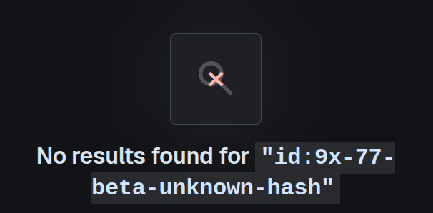
       <em>Figure 3.8.5a: Search with no matches</em>
    </td>
    <td align="center">
       
      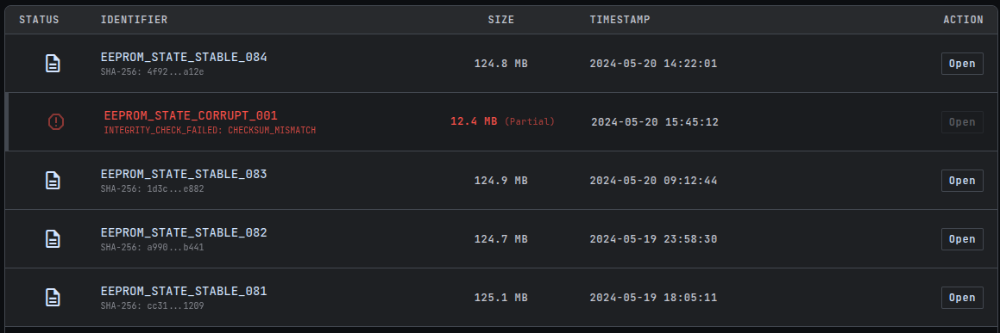
       <em>Figure 3.8.5b: Error detail fails to load</em>
    </td>
    <td align="center">
       
      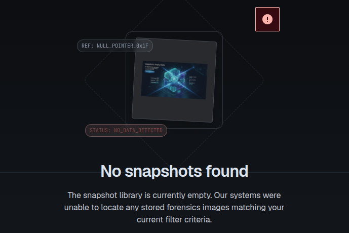
       <em>Figure 3.8.5c: No snapshots to search </em>
    </td>
  </tr>
</table>

#### 3.8.7 Additional Notes
- "Active Hardware ID" depend on runtime from the Brain/Capture Node layer being exposed to the UI.

---

### 3.9 Snapshot

The Snapshot detail screen is the dedicated interface for viewing, analyzing, and interacting with a single Snapshot Block (SB). When an analyst selects a snapshot from the list, this page opens to display the full details of the captured data.

#### 3.9.1 Interface Overview

| Field | Value |
|---|---|
| Screen / Component Name | Snapshot |
| Interface ID | IF-UI-09 |
| Trigger / Entry Point | Selecting "Open" on a row in the Snapshots list (IF-UI-08) |

#### 3.9.2 Visual Reference

<table>
  <tr>
  <td align="center">
       
      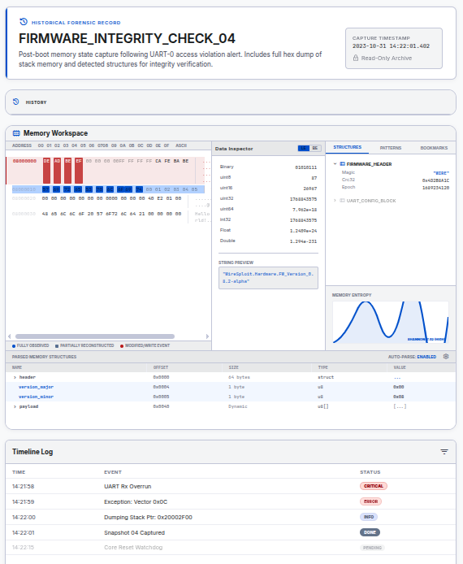
       <em>Figure 3.9.2a: Snapshot detail view in light mode.
 </em>
    </td>
    <td align="center">
       
      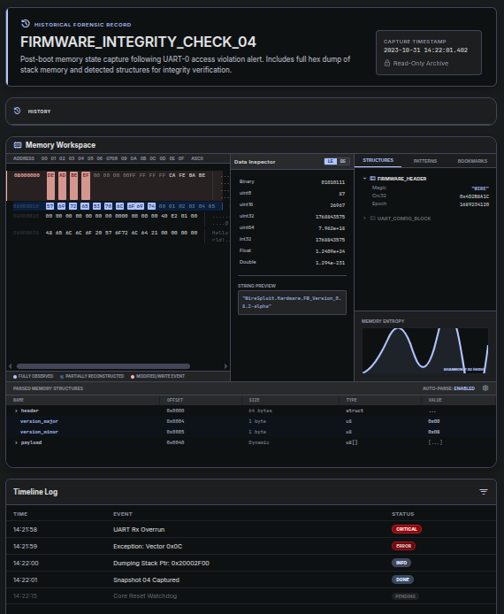
       <em>Figure 3.9.2b: Snapshot detail view in dark mode.</em>
    </td>

  </tr>
</table>

#### 3.9.3 Layout & Elements

| Element ID | Element Name | Type | Description / Behavior |
|---|---|---|---|
| EL-01 | Snapshot Title | Text | Snapshot identifier (e.g., "FIRMWARE_INTEGRITY_CHECK_04") |
| EL-02 | Snapshot Description | Text | Free-text summary of what triggered/what the snapshot contains |
| EL-03 | Capture Timestamp Card | Info Card | Displays capture date/time and a "Read-Only Archive" lock indicator |
| EL-04 | Search Bar | Text Field | Searches within the memory workspace (addresses, structures, values) |

### Consideration : 
- all details in logs or in dashboard is presented in snapshot, not repeated to avoid redundency.  
**View IF-UI-03, IF-UI-05** for more.

#### 3.9.4 Requirements

| Req. ID | Requirement | Description / Notes |
|---|---|---|
| IF-UI-09-01 | The snapshot shall display system metrics at this time. | A snapshot is the system in freeze state at certain time.| 
| IF-UI-09-02 | The snapshot shall display all functions in dashboard. | Display dashboard screen saved at this time.|
| IF-UI-09-03 | The snapshot shall display all logs. | Display failed logs saved at this time.| 

---

### 3.8 Report

Provide a general description of this screen or component, its purpose, and where it fits in the application.

*[Describe the screen purpose, scope, and context here.]*

#### 3.8.1 Interface Overview

| Field | Value |
|---|---|
| Screen / Component Name | Report |
| Interface ID | IF-UI-08 |
| Interface Type | User Interface |
| Parent Screen / Module | [e.g., Reports Module] |
| User Role(s) | [e.g., Registered User] |
| Platform | [Web / Mobile / Desktop] |
| Trigger / Entry Point | [How the user reaches this screen] |

#### 3.8.2 Visual Reference

> 
> *[ INSERT IMAGE HERE ] — Recommended size: 6.25" x 3.5" (or similar) | Format: PNG/JPG*

**Figure 3.8.1:** *[Caption describing the screen/mockup]*

#### 3.8.3 Layout & Elements

| Element ID | Element Name | Type | Description / Behavior |
|---|---|---|---|
| [EL-01] | [Element name] | [Type] | [Expected behavior] |

#### 3.8.4 Requirements

| Req. ID | Requirement | Description / Notes |
|---|---|---|
| [IF-UI-08-01] | [Requirement statement] | [Notes / rationale] |
| [IF-UI-08-02] | [Requirement statement] | [Notes / rationale] |

#### 3.8.5 Validation & Error States

*[Describe input validation rules, error messages, and edge cases.]*

> 
> *[ INSERT IMAGE HERE ] — Optional: error/empty/loading state mockup*

#### 3.8.6 Accessibility Notes
*[Describe accessibility requirements — contrast, keyboard navigation, screen reader labels, etc.]*

#### 3.8.7 Additional Notes
*[Add constraints, assumptions, or dependencies here.]*

---

### 3.9 Export-Report

Provide a general description of this screen or component, its purpose, and where it fits in the application.

*[Describe the screen purpose, scope, and context here.]*

#### 3.9.1 Interface Overview

| Field | Value |
|---|---|
| Screen / Component Name | Export-Report |
| Interface ID | IF-UI-09 |
| Interface Type | User Interface |
| Parent Screen / Module | [e.g., Reports Module] |
| User Role(s) | [e.g., Registered User] |
| Platform | [Web / Mobile / Desktop] |
| Trigger / Entry Point | [How the user reaches this screen] |

#### 3.9.2 Visual Reference

> 
> *[ INSERT IMAGE HERE ] — Recommended size: 6.25" x 3.5" (or similar) | Format: PNG/JPG*

**Figure 3.9.1:** *[Caption describing the screen/mockup]*

#### 3.9.3 Layout & Elements

| Element ID | Element Name | Type | Description / Behavior |
|---|---|---|---|
| [EL-01] | [Element name] | [Type] | [Expected behavior] |

#### 3.9.4 Requirements

| Req. ID | Requirement | Description / Notes |
|---|---|---|
| [IF-UI-09-01] | [Requirement statement] | [Notes / rationale] |
| [IF-UI-09-02] | [Requirement statement] | [Notes / rationale] |

#### 3.9.5 Validation & Error States

*[Describe input validation rules, error messages, and edge cases.]*

> 
> *[ INSERT IMAGE HERE ] — Optional: error/empty/loading state mockup*

#### 3.9.6 Accessibility Notes
*[Describe accessibility requirements — contrast, keyboard navigation, screen reader labels, etc.]*

#### 3.9.7 Additional Notes
*[Add constraints, assumptions, or dependencies here.]*

---

### 3.10 Settings

Provide a general description of this screen or component, its purpose, and where it fits in the application.

*[Describe the screen purpose, scope, and context here.]*

#### 3.10.1 Interface Overview

| Field | Value |
|---|---|
| Screen / Component Name | Settings |
| Interface ID | IF-UI-10 |
| Interface Type | User Interface |
| Parent Screen / Module | [e.g., Settings Module] |
| User Role(s) | [e.g., Registered User, Admin] |
| Platform | [Web / Mobile / Desktop] |
| Trigger / Entry Point | [How the user reaches this screen] |

#### 3.10.2 Visual Reference

> 
> *[ INSERT IMAGE HERE ] — Recommended size: 6.25" x 3.5" (or similar) | Format: PNG/JPG*

**Figure 3.10.1:** *[Caption describing the screen/mockup]*

#### 3.10.3 Layout & Elements

| Element ID | Element Name | Type | Description / Behavior |
|---|---|---|---|
| [EL-01] | [Element name] | [Type] | [Expected behavior] |

#### 3.10.4 Requirements

| Req. ID | Requirement | Description / Notes |
|---|---|---|
| [IF-UI-10-01] | [Requirement statement] | [Notes / rationale] |
| [IF-UI-10-02] | [Requirement statement] | [Notes / rationale] |

#### 3.10.5 Validation & Error States

*[Describe input validation rules, error messages, and edge cases.]*

> 
> *[ INSERT IMAGE HERE ] — Optional: error/empty/loading state mockup*

#### 3.10.6 Accessibility Notes
*[Describe accessibility requirements — contrast, keyboard navigation, screen reader labels, etc.]*

#### 3.10.7 Additional Notes
*[Add constraints, assumptions, or dependencies here.]*

---

## 4. Open Questions
- In the snapshot, Is the complete system gets save or certain tabs (logs/dashboard)?
- Are we considering saaving the metrics to the snapshot?

