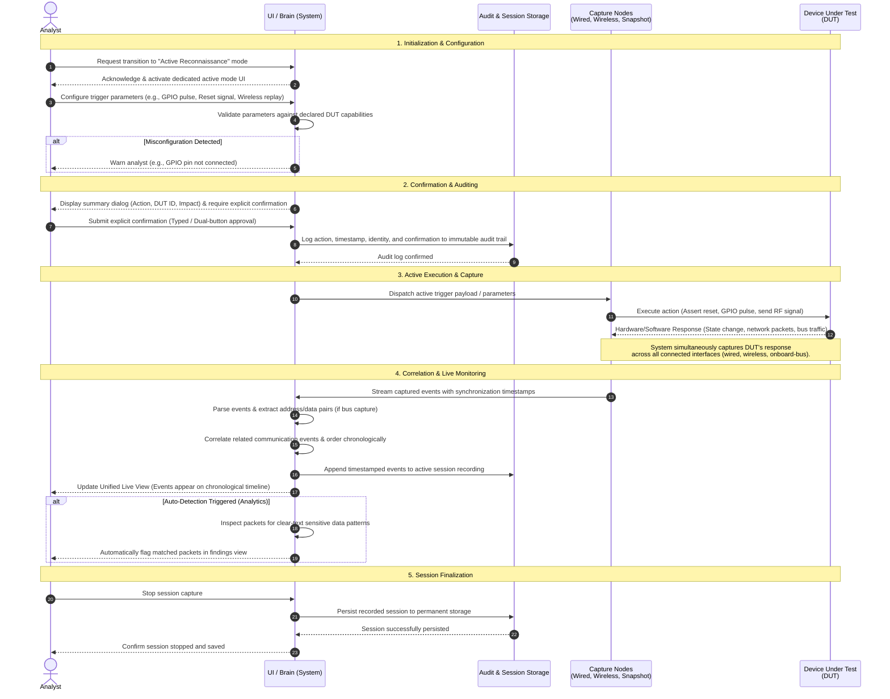
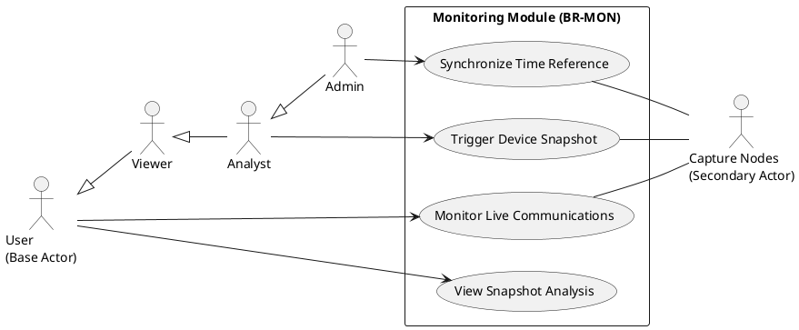
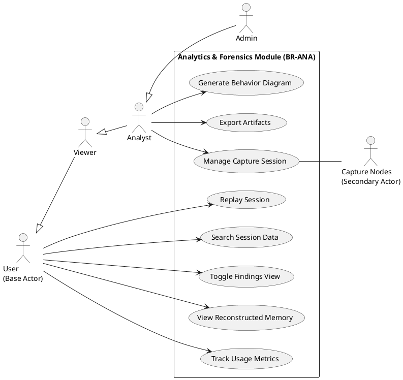
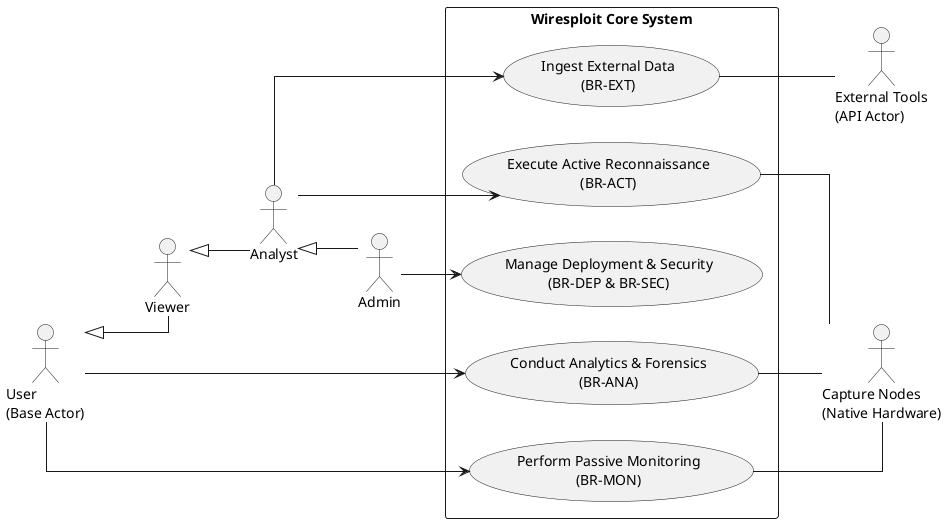

# Behavioral and Model Requirements

## Sequence Diagram

```mermaid
sequenceDiagram
    autonumber

    actor analyst as Analyst
    participant system as UI / Brain (System)
    participant storage as Audit & Session Storage
    participant nodes as Capture Nodes<br/>(Wired, Wireless, Snapshot)
    participant dut as Device Under Test<br/>(DUT)

    Note over analyst, dut: 1. Initialization & Configuration
    analyst->>system: Request transition to "Active Reconnaissance" mode
    system-->>analyst: Acknowledge & activate dedicated active mode UI
    analyst->>system: Configure trigger parameters (e.g., GPIO pulse, Reset signal, Wireless replay)
    system->>system: Validate parameters against declared DUT capabilities

    alt Misconfiguration Detected
        system-->>analyst: Warn analyst (e.g., GPIO pin not connected)
    end

    Note over analyst, dut: 2. Confirmation & Auditing
    system-->>analyst: Display summary dialog (Action, DUT ID, Impact) & require explicit confirmation
    analyst->>system: Submit explicit confirmation (Typed / Dual-button approval)
    system->>storage: Log action, timestamp, identity, and confirmation to immutable audit trail
    storage-->>system: Audit log confirmed

    Note over analyst, dut: 3. Active Execution & Capture
    system->>nodes: Dispatch active trigger payload / parameters
    nodes->>dut: Execute action (Assert reset, GPIO pulse, send RF signal)
    dut-->>nodes: Hardware/Software Response (State change, network packets, bus traffic)

    Note over nodes, dut: System simultaneously captures DUT's response<br/>across all connected interfaces (wired, wireless, onboard-bus).

    Note over analyst, dut: 4. Correlation & Live Monitoring
    nodes->>system: Stream captured events with synchronization timestamps
    system->>system: Parse events & extract address/data pairs (if bus capture)
    system->>system: Correlate related communication events & order chronologically
    system->>storage: Append timestamped events to active session recording

    system-->>analyst: Update Unified Live View (Events appear on chronological timeline)

    alt Auto-Detection Triggered (Analytics)
        system->>system: Inspect packets for clear-text sensitive data patterns
        system-->>analyst: Automatically flag matched packets in findings view
    end

    Note over analyst, dut: 5. Session Finalization
    analyst->>system: Stop session capture
    system->>storage: Persist recorded session to permanent storage
    storage-->>system: Session successfully persisted
    system-->>analyst: Confirm session stopped and saved
```
# Use Case Diagram
# Monitoring

``` plantuml
@startuml
left to right direction
skinparam packageStyle rectangle

actor "User\n(Base Actor)" as BaseUser
actor "Viewer" as Viewer
actor "Analyst" as Analyst
actor "Admin" as Admin
actor "Capture Nodes\n(Secondary Actor)" as CaptureNodes

' Cascading Inheritance
BaseUser <|-- Viewer
Viewer <|-- Analyst
Analyst <|-- Admin

package "Monitoring Module (BR-MON)" {
  usecase "Monitor Live Communications" as UC1
  usecase "Trigger Device Snapshot" as UC2
  usecase "View Snapshot Analysis" as UC3
  usecase "Synchronize Time Reference" as UC4
}

' Base viewing actions (Viewer inherits these automatically)
BaseUser --> UC1
BaseUser --> UC3

' Elevated actions (Admin inherits Analyst actions automatically)
Analyst --> UC2
Admin --> UC4

' Secondary actor integrations
UC1 -- CaptureNodes
UC2 -- CaptureNodes
UC4 -- CaptureNodes
@enduml
```
 # Analytics & Forensics

``` plantuml
@startuml
left to right direction
skinparam packageStyle rectangle

actor "User\n(Base Actor)" as BaseUser
actor "Viewer" as Viewer
actor "Analyst" as Analyst
actor "Admin" as Admin
actor "Capture Nodes\n(Secondary Actor)" as CaptureNodes

' Cascading Inheritance
BaseUser <|-- Viewer
Viewer <|-- Analyst
Analyst <|-- Admin

package "Analytics & Forensics Module (BR-ANA)" {
  usecase "Manage Capture Session" as UC1
  usecase "Replay Session" as UC2
  usecase "Search Session Data" as UC3
  usecase "Generate Behavior Diagram" as UC4
  usecase "Export Artifacts" as UC5
  usecase "Toggle Findings View" as UC6
  usecase "View Reconstructed Memory" as UC7
  usecase "Track Usage Metrics" as UC8
}

' Base viewing and navigation actions
BaseUser --> UC2
BaseUser --> UC3
BaseUser --> UC6
BaseUser --> UC7
BaseUser --> UC8

' Elevated analyst capabilities
Analyst --> UC1
Analyst --> UC4
Analyst --> UC5

' Secondary actor integrations
UC1 -- CaptureNodes
@enduml
```
# Overall

``` plantuml
@startuml
left to right direction
skinparam packageStyle rectangle
skinparam linetype ortho

' Primary Actors
actor "User\n(Base Actor)" as BaseUser
actor "Viewer" as Viewer
actor "Analyst" as Analyst
actor "Admin" as Admin

' Secondary Actors
actor "Capture Nodes\n(Native Hardware)" as CaptureNodes
actor "External Tools\n(API Actor)" as ExtTools

' Cascading Role Inheritance
BaseUser <|-- Viewer
Viewer <|-- Analyst
Analyst <|-- Admin

package "Wiresploit Core System" {
  usecase "Perform Passive Monitoring\n(BR-MON)" as UC1
  usecase "Conduct Analytics & Forensics\n(BR-ANA)" as UC2
  usecase "Execute Active Reconnaissance\n(BR-ACT)" as UC3
  usecase "Manage Deployment & Security\n(BR-DEP & BR-SEC)" as UC4
  usecase "Ingest External Data\n(BR-EXT)" as UC5
}

' Role-to-Module Mapping
BaseUser --> UC1
BaseUser --> UC2
Analyst --> UC3
Analyst --> UC5
Admin --> UC4

' Secondary Actor Integration
UC1 -- CaptureNodes
UC2 -- CaptureNodes
UC3 -- CaptureNodes

UC5 -- ExtTools

@enduml
```

