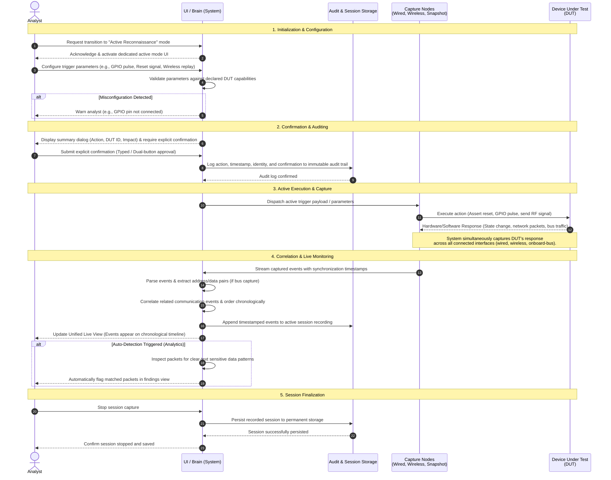

# Behavioral and Model Requirements

## Sequence Diagram

```mermaid
sequenceDiagram
    autonumber

    actor analyst as Analyst
    participant system as UI / Brain (System)
    participant storage as Audit & Session Storage
    participant nodes as Capture Nodes<br/>(Wired, Wireless, Snapshot)
    participant dut as Device Under Test<br/>(DUT)

    Note over analyst, dut: 1. Initialization & Configuration
    analyst->>system: Request transition to "Active Reconnaissance" mode
    system-->>analyst: Acknowledge & activate dedicated active mode UI
    analyst->>system: Configure trigger parameters (e.g., GPIO pulse, Reset signal, Wireless replay)
    system->>system: Validate parameters against declared DUT capabilities

    alt Misconfiguration Detected
        system-->>analyst: Warn analyst (e.g., GPIO pin not connected)
    end

    Note over analyst, dut: 2. Confirmation & Auditing
    system-->>analyst: Display summary dialog (Action, DUT ID, Impact) & require explicit confirmation
    analyst->>system: Submit explicit confirmation (Typed / Dual-button approval)
    system->>storage: Log action, timestamp, identity, and confirmation to immutable audit trail
    storage-->>system: Audit log confirmed

    Note over analyst, dut: 3. Active Execution & Capture
    system->>nodes: Dispatch active trigger payload / parameters
    nodes->>dut: Execute action (Assert reset, GPIO pulse, send RF signal)
    dut-->>nodes: Hardware/Software Response (State change, network packets, bus traffic)

    Note over nodes, dut: System simultaneously captures DUT's response<br/>across all connected interfaces (wired, wireless, onboard-bus).

    Note over analyst, dut: 4. Correlation & Live Monitoring
    nodes->>system: Stream captured events with synchronization timestamps
    system->>system: Parse events & extract address/data pairs (if bus capture)
    system->>system: Correlate related communication events & order chronologically
    system->>storage: Append timestamped events to active session recording

    system-->>analyst: Update Unified Live View (Events appear on chronological timeline)

    alt Auto-Detection Triggered (Analytics)
        system->>system: Inspect packets for clear-text sensitive data patterns
        system-->>analyst: Automatically flag matched packets in findings view
    end

    Note over analyst, dut: 5. Session Finalization
    analyst->>system: Stop session capture
    system->>storage: Persist recorded session to permanent storage
    storage-->>system: Session successfully persisted
    system-->>analyst: Confirm session stopped and saved
```

