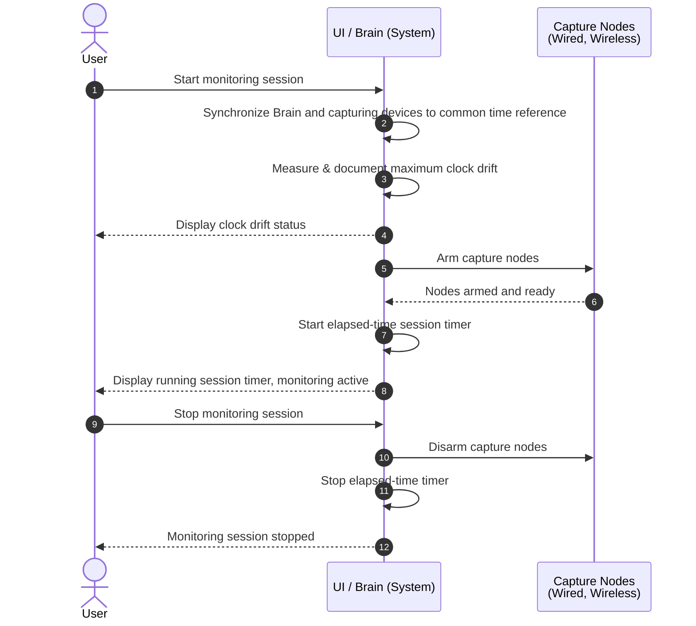
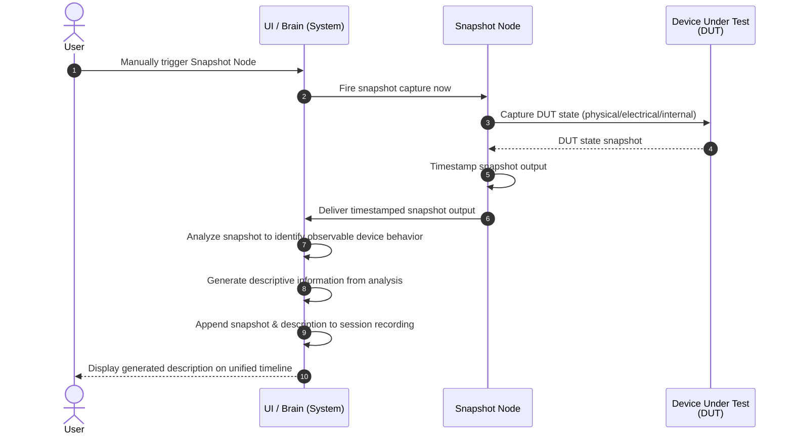
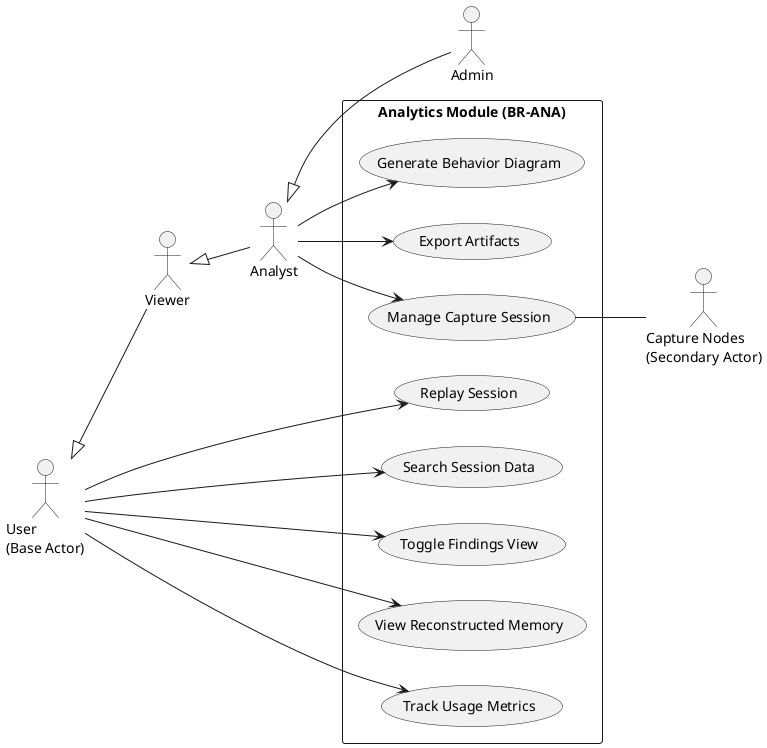
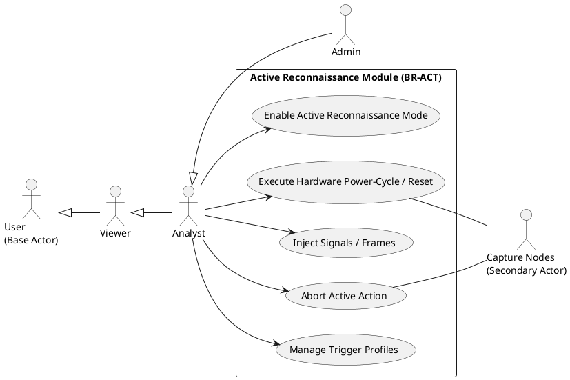
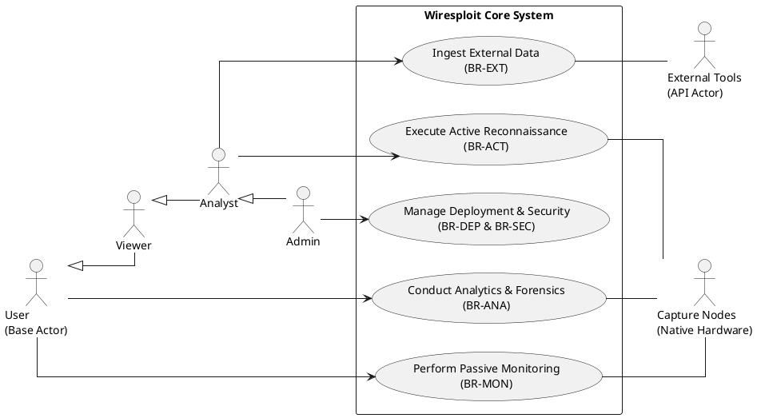

# Behavioral and Model Requirements

## Sequence Diagrams

### Monitoring

#### 1. Start, Stop


#### 2. Manual Triggering

#### 3. Conditional Triggering
```mermaid
sequenceDiagram
    autonumber
    actor user as User
    participant system as UI / Brain (System)
    participant snapshot as Snapshot Node
    participant dut as Device Under Test<br/>(DUT)

    Note over user, dut: User pre-configures trigger condition (delay or pattern)

    alt Delay-based trigger
        snapshot->>snapshot: Fire after configured delay
    else Pattern-based trigger
        snapshot->>snapshot: Fire on detected packet/pattern match
    end

    snapshot->>dut: Capture DUT state (physical/electrical/internal)
    dut-->>snapshot: DUT state snapshot
    snapshot->>snapshot: Timestamp snapshot output
    snapshot->>system: Deliver timestamped snapshot output
    system->>system: Analyze snapshot to identify observable device behavior
    system->>system: Generate descriptive information from analysis
    system->>system: Append snapshot & description to session recording
    system-->>user: Display generated description on unified timeline
  ```
  #### 4. Annotating
  ```mermaid
  sequenceDiagram
    autonumber
    actor user as User
    participant system as UI / Brain (System)

    user->>system: Select event/region on unified timeline
    user->>system: Enter annotation text
    system->>system: Validate user's role permits annotation
    system->>system: Attach annotation to session recording
    system-->>user: Display annotation on timeline
  ```
  ### Analysis
  #### 5. Manual Searching
  ```mermaid
  sequenceDiagram
    autonumber
    actor user as User
    participant system as UI / Brain (System)

    user->>system: Enter custom search phrase
    system->>system: Query recorded session for matches
    system-->>user: Display results with exact location (packet/timestamp/protocol)
    user->>system: Select a search result
    system-->>user: Jump timeline view to corresponding event
  ```

  #### 6. Automated Searching
  ```mermaid
  sequenceDiagram
    autonumber
    actor user as User
    participant system as UI / Brain (System)

    system->>system: Inspect captured packets for clear-text sensitive data patterns
    system-->>user: Automatically flag matched packets in findings view

    opt User toggles "Findings" control
        user->>system: Click "Findings" control
        system-->>user: Highlight flagged blocks, fade unrelated blocks
        user->>system: Click "Findings" control again
        system-->>user: Return timeline to normal view
    end
  ```


  #### 7. Automated Correlation and Diagram Generation
  ```mermaid
  sequenceDiagram
    autonumber
    actor user as User
    participant system as UI / Brain (System)

    system->>system: Correlate related communication events & order chronologically
    system-->>user: Update Unified Live View with correlated events

    user->>system: Request behavior diagram from recorded session
    system->>system: Retrieve session's correlated events
    system->>system: Generate Mermaid-based sequence diagram from captured events
    system->>system: Render correlated event pairs as linked/connected steps
    system-->>user: Display generated diagram
  ```

  #### 8. Monitor Performance Metrics
  ```mermaid
  sequenceDiagram
    autonumber
    actor user as User
    participant system as UI / Brain (System)

    user->>system: Open usage metrics dashboard
    user->>system: Select time period filter
    system->>system: Retrieve metrics for selected period<br/>(session count, avg time-to-finding, avg session time, findings detected)
    system-->>user: Display filterable usage metrics dashboard
  ```

  #### 9. Memory Reconstruction
  ```mermaid
  sequenceDiagram
    autonumber
    actor user as User
    participant system as UI / Brain (System)

    user->>system: Request reconstructed memory map for a recorded session
    system->>system: Retrieve session's bus-capture address/data pairs
    system->>system: Aggregate pairs into unified reconstructed memory map
    system->>system: Classify each address range as fully observed, partially observed, or never captured
    system-->>user: Display memory map with visually distinct range states
    system->>system: Calculate completeness statistic (% of address space fully observed)
    system-->>user: Display completeness summary alongside memory map
  ```
  ### Active Reconnaissance

  #### 10. Manual Fire of Active Recon Module (nmap)
  ```mermaid
  sequenceDiagram
    autonumber
    actor user as User
    participant system as UI / Brain (System)
    participant nodes as Capture Nodes<br/>(Wired, Wireless)
    participant dut as Device Under Test<br/>(DUT)

    user->>system: Select active recon module (e.g., nmap-style scan)
    user->>system: Configure module parameters
    system->>system: Validate parameters against declared DUT capabilities

    opt Misconfiguration Detected
        system-->>user: Warn user (e.g., interface not connected)
    end

    system-->>user: Display summary dialog (Action, DUT ID, Impact) & require explicit confirmation
    user->>system: Submit explicit confirmation
    system->>system: Log action, timestamp, identity, confirmation to immutable audit trail

    system->>nodes: Dispatch module payload
    nodes->>dut: Execute scan/action
    dut-->>nodes: Response (state change, network packets, bus traffic)
    nodes->>system: Deliver captured response
    system-->>user: Display scan results
  ```

  #### 11. Automated Condition-Based Trigger
  ```mermaid
  sequenceDiagram
    autonumber
    actor user as User
    participant system as UI / Brain (System)
    participant nodes as Capture Nodes<br/>(Wired, Wireless)
    participant dut as Device Under Test<br/>(DUT)

    Note over user, dut: User pre-authorizes a condition-triggered action & profile

    system->>system: Monitor for configured trigger condition (packet/pattern/state)
    system->>system: Detect trigger condition met
    system-->>user: Notify user, display pending action summary (Action, DUT ID, Impact)
    user->>system: Confirm pre-authorized execution
    system->>system: Log action, timestamp, identity, confirmation to immutable audit trail

    system->>nodes: Dispatch triggered action payload
    nodes->>dut: Execute action
    dut-->>nodes: Response (state change, network packets, bus traffic)
    nodes->>system: Deliver captured response
    system-->>user: Display action result
  ```

  #### 12. Message Replay
  ```mermaid
  sequenceDiagram
    autonumber
    actor user as User
    participant system as UI / Brain (System)
    participant nodes as Capture Nodes<br/>(Wired, Wireless)
    participant dut as Device Under Test<br/>(DUT)

    alt Wireless signal replay
        user->>system: Select wireless signal profile (WiFi, Bluetooth, Zigbee, proprietary RF)<br/>— analyst-provided or pre-recorded
    else On-board protocol frame replay
        user->>system: Select protocol frame profile (SPI, I2C, UART, CAN, JTAG)<br/>with configurable payload, timing, bus parameters
    end

    system->>system: Validate parameters against declared DUT capabilities

    opt Misconfiguration Detected
        system-->>user: Warn user
    end

    system-->>user: Display summary dialog & require explicit confirmation
    user->>system: Submit explicit confirmation
    system->>system: Log action, timestamp, identity, confirmation to immutable audit trail

    system->>nodes: Dispatch replay payload
    nodes->>dut: Replay signal/frame
    dut-->>nodes: Response (state change, network packets, bus traffic)
    nodes->>system: Deliver captured response

    opt Replay supports interruption
        user->>system: Request abort mid-replay
        system->>nodes: Cancel replay
        nodes-->>system: Replay halted (partial completion)
        system->>system: Log abort event to immutable audit trail
        system-->>user: Immediate notification of partial completion
    end

    system-->>user: Display captured response
  ```

  ### Management

  #### 13. Record Session
  ```mermaid
  sequenceDiagram
    autonumber
    actor user as User
    participant system as UI / Brain (System)

    Note over user, system: Session already open — recording is a distinct, repeatable action

    loop User may start/stop multiple recordings within this session
        user->>system: Press "Start Recording"
        system->>system: Log recording-segment start (timestamp)

        Note over system: Capture pipeline runs here<br/>(see Monitoring / Analysis diagrams)

        user->>system: Press "Stop Recording"
        system->>system: Close & persist current recording segment
    end

    user->>system: Stop session
    user->>system: Set session password
    system->>system: Encrypt & password-protect session as a single unit<br/>(also tamper-proofs — modification renders file unreadable)
    system->>system: Persist encrypted session (all segments) to storage
    system->>system: Update usage metrics
    system-->>user: Confirm session stopped and saved
  ```

  #### 14. Open Session
  ```mermaid
sequenceDiagram
    autonumber
    actor user as User
    participant system as UI / Brain (System)

    user->>system: Request to open a previously recorded session
    system-->>user: Prompt for session password
    user->>system: Enter session password
    system->>system: Retrieve encrypted session from storage
    system->>system: Decrypt session (fails if tampered with or password incorrect)
    system-->>user: Replay events in original chronological order and timestamps
  ```


  #### 15. Export Session Data
  ```mermaid
  sequenceDiagram
    autonumber
    actor user as User
    participant system as UI / Brain (System)

    user->>system: Select items to export (session data, findings, search results, diagram, memory map)
    user->>system: Choose export format(s) (e.g., JSON, CSV, PNG/SVG, binary/hex, PDF/DOCX)
    system->>system: Retrieve selected data from storage
    system->>system: Assemble consolidated report containing only selected items
    system-->>user: Deliver exported file(s) / consolidated report
  ```

  #### 16. Access Management
  ```mermaid
  sequenceDiagram
    autonumber
    actor user as User
    participant system as UI / Brain (System)

    Note over user, system: Admin defines roles with distinct permissions<br/>(Admin: full access · Analyst: view/export/run analysis/annotate · Viewer: view only)

    user->>system: Assign role to a user account
    system->>system: Store role assignment

    user->>system: Request an action on session data
    system->>system: Determine requesting user's assigned role
    alt Action permitted by role
        system-->>user: Action allowed — proceed
    else Action not permitted by role
        system-->>user: Deny action — insufficient role permissions
    end
  ```

  #### 17. Installation
  ```mermaid
  sequenceDiagram
    autonumber
    actor user as User
    participant system as UI / Brain (System)
    participant registry as Container Registry

    Note over user, registry: Internet access permitted only during initial installation (documented exception)

    user->>system: Initiate installation
    system->>registry: Pull pinned Docker images (no :latest tags)
    registry-->>system: Container images downloaded
    system->>system: Install dependencies strictly from lockfile/requirements.txt
    system->>system: Orchestrate components via Docker Compose
    system-->>user: Installation complete — ready for offline runtime

    opt Migrating existing configuration/session data
        user->>system: Import previously exported configuration and session data
        system->>system: Validate & load imported data
        alt Import fails
            system->>system: Log import failure (timestamp, outcome)
            system-->>user: Notify import failure
        else Import succeeds
            system-->>user: Import complete
        end
    end
  ```

  ## Use Case Diagram
### Monitoring

```plantuml
@startuml
left to right direction
skinparam packageStyle rectangle

actor "User\n(Base Actor)" as BaseUser
actor "Viewer" as Viewer
actor "Analyst" as Analyst
actor "Admin" as Admin
actor "Capture Nodes\n(Secondary Actor)" as CaptureNodes

' Cascading Inheritance
BaseUser <|-- Viewer
Viewer <|-- Analyst
Analyst <|-- Admin

package "Monitoring Module (BR-MON)" {
  usecase "Monitor Live Communications" as UC1
  usecase "Trigger Device Snapshot" as UC2
  usecase "View Snapshot Analysis" as UC3
  usecase "Synchronize Time Reference" as UC4
}

' Base viewing actions (Viewer inherits these automatically)
BaseUser --> UC1
BaseUser --> UC3

' Elevated actions (Admin inherits Analyst actions automatically)
Analyst --> UC2
Admin --> UC4

' Secondary actor integrations
UC1 -- CaptureNodes
UC2 -- CaptureNodes
UC4 -- CaptureNodes
@enduml
```

### Analytics & Forensics



### Active Recon



### Overall System Use Case

