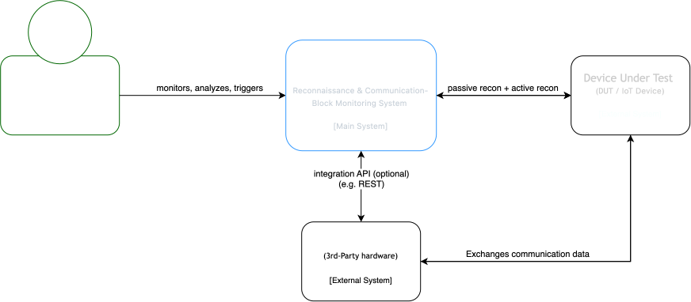
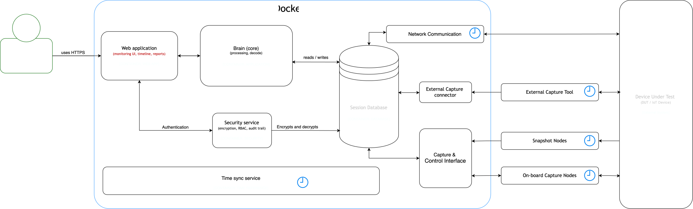
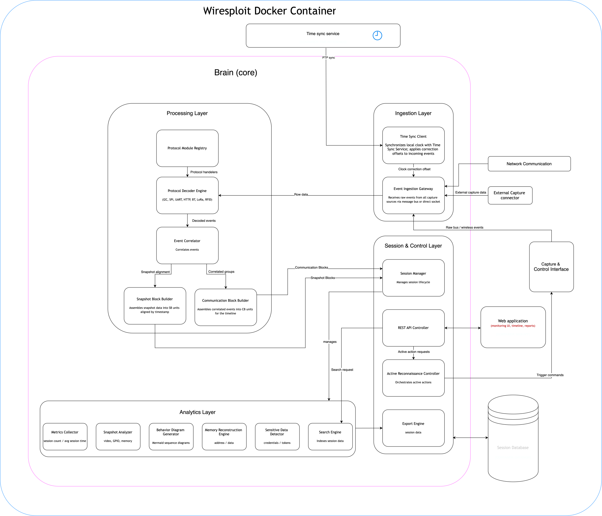
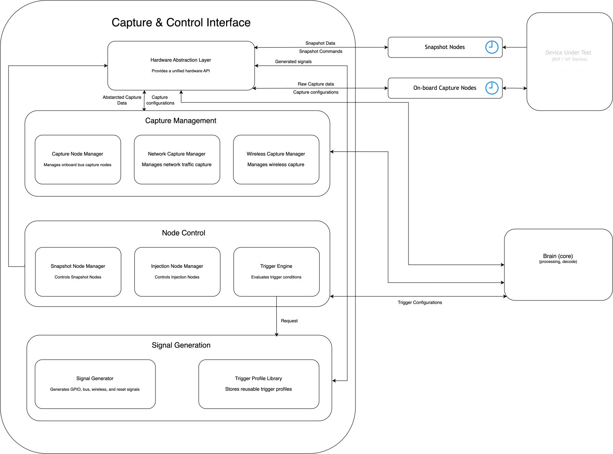
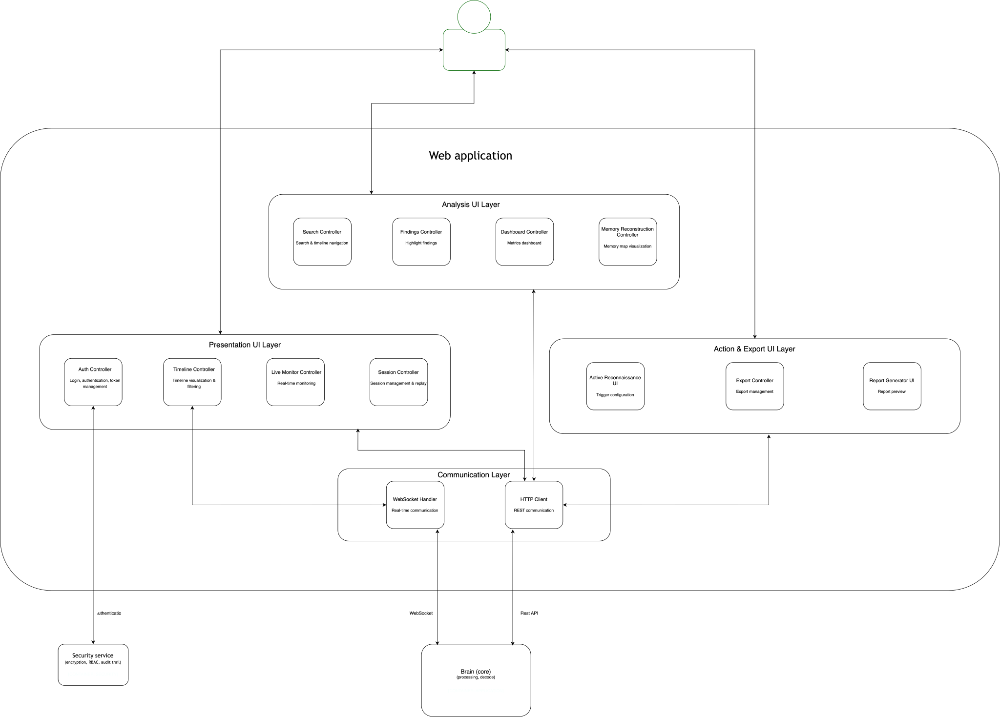
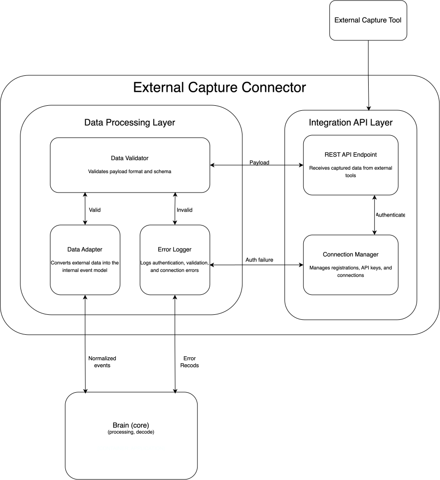
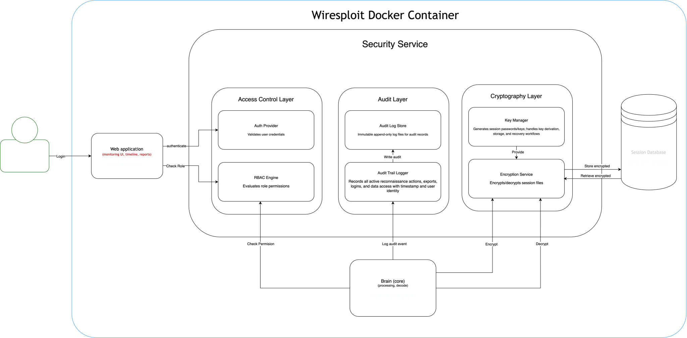

# Wiresploit — System Architecture Document

| Field         | Value                                                               |
| ------------- | ------------------------------------------------------------------- |
| Project       | Reconnaissance & Communication-Block Monitoring System (Wiresploit) |
| Document Type | System Architecture                                                 |
| Status        | Draft v1.0                                                          |

---

## 1. Overview

Wiresploit is an IoT/OT reconnaissance and communication-block monitoring system designed to provide security analysts with a unified platform for monitoring, recording, correlating, analyzing, and actively interacting with a Device Under Test (DUT).

The system replaces the need for multiple disconnected monitoring and analysis tools by collecting communication events from multiple interfaces, synchronizing them to a common time reference, processing and correlating them in the Brain, and presenting the resulting information through a unified user interface.

---

## 2. Architectural Goals

The architecture is designed to satisfy the following goals:

1. Provide a unified monitoring view across heterogeneous communication interfaces.
2. Preserve accurate timestamps across all captured events.
3. Correlate events from different sources into logical Communication Blocks.
4. Preserve the original chronological order of captured events.
5. Support both passive monitoring and explicitly authorized active reconnaissance.
6. Keep passive monitoring non-interfering with DUT behavior.
7. Enable complete session recording and later review.
8. Support advanced offline analysis of recorded sessions.
9. Protect sensitive captured data through encryption and access control.
10. Support operation in an isolated, air-gapped test-bench environment.
11. Allow new protocols and external capture tools to be added without modifying the core architecture.
12. Provide reproducible deployment using Docker and Docker Compose.

---

## 3. High-Level System Context

The system context shows Wiresploit as a unified monitoring and reconnaissance platform interacting with the analyst, the Device Under Test (DUT), capture infrastructure, external tools, and the local time reference.

---

## 4. Container Architecture

The container architecture decomposes Wiresploit into its major deployable and independently manageable parts.

---

## 5. Component Architecture

The component architecture decomposes the major containers into their internal components.

---

### 5.1 Wiresploit Brain

The Brain is the central processing and orchestration layer.

The Brain contains components responsible for:

- Event Ingestion
- Validation
- Timestamp Validation
- Protocol Decoding
- Normalization
- Detection
- Trigger Engine
- Correlation Engine
- Event Ordering
- Communication Block Creation
- Session Management
- Analytics
- Reporting
- Security and Authorization
- Error Logging

---

### 5.2 Capture & Control Interface

The Capture & Control Interface manages communication with capture, snapshot, and injection nodes.

Its responsibilities include:

- Managing Capture Nodes
- Managing Snapshot Nodes
- Managing Injection Nodes
- Hardware communication
- Protocol-specific communication
- Trigger handling
- Capture configuration
- Snapshot triggering
- Active signal generation
- Capture status monitoring

---

### 5.3 Web Application

The Web Application provides the analyst-facing interface.

Its major responsibilities include:

- Dashboard
- Live monitoring
- Timeline visualization
- Communication Block visualization
- Session controls
- Search and filtering
- Findings visualization
- Snapshot analysis
- Memory reconstruction visualization
- Report generation
- Active reconnaissance controls

---

### 5.4 External Capture Connector

The External Capture Connector integrates external capture tools with Wiresploit.

The connector is responsible for:

- Receiving external events
- Validating incoming data
- Normalizing external event formats
- Translating protocol-specific information
- Forwarding events to the Brain
- Reporting connector errors

This provides an extensibility mechanism without tightly coupling external tools to the Brain.

---

### 5.5 Security Architecture

Security is applied across the Web Application, Brain, storage, and active reconnaissance workflow.

The security architecture provides:

- Authentication
- Role-Based Access Control (RBAC)
- Session authorization
- Data encryption
- Secure storage
- Audit logging
- Active-operation authorization
- Immutable active-operation records

---