# Wiresploit — System Architecture Document

| Field | Value |
|---|---|
| Project | IoT Reconnaissance & Communication-Block Monitoring System (Wiresploit) |
| Document Type | System Architecture |
| Status | Draft v1.0 |

---
## 1. Overview

Wiresploit is an IoT/OT reconnaissance and communication-block monitoring system designed to provide security analysts with a unified platform for monitoring, recording, correlating, analyzing, and actively interacting with a Device Under Test (DUT).

The system replaces the need for multiple disconnected monitoring and analysis tools by collecting communication events from multiple interfaces, synchronizing them to a common time reference, processing and correlating them in the Brain, and presenting the resulting information through a unified user interface.

---

## 2. Architectural Goals

The architecture is designed to satisfy the following goals:

1. Provide a unified monitoring view across heterogeneous communication interfaces.
2. Preserve accurate timestamps across all captured events.
3. Correlate events from different sources into logical Communication Blocks.
4. Preserve the original chronological order of captured events.
5. Support both passive monitoring and explicitly authorized active reconnaissance.
6. Keep passive monitoring non-interfering with DUT behavior.
7. Enable complete session recording and later review.
8. Support advanced offline analysis of recorded sessions.
9. Protect sensitive captured data through encryption and access control.
10. Support operation in an isolated, air-gapped test-bench environment.
11. Allow new protocols and external capture tools to be added without modifying the core architecture.
12. Provide reproducible deployment using Docker and Docker Compose.

---
## 3. High-Level System Context

The following diagram presents the overall system context.

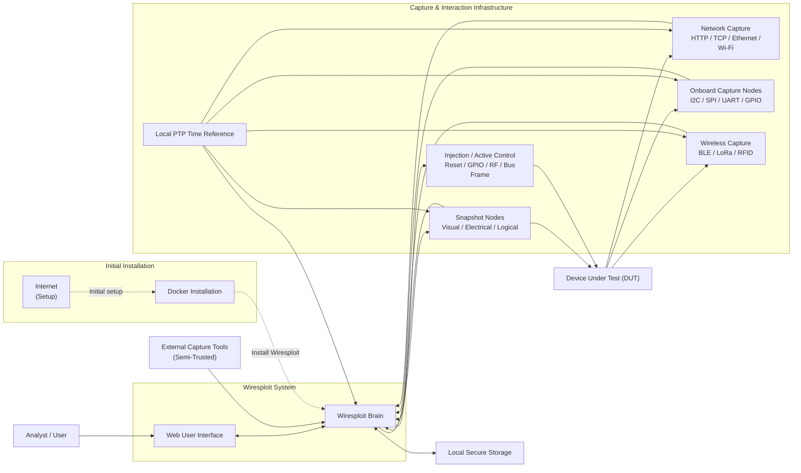
---
## 4. Architectural Boundary

The Wiresploit architecture is divided into the following major boundaries:

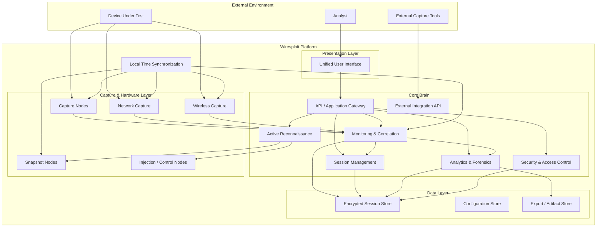
---

## 5. Monitoring and Correlation Pipeline

The monitoring pipeline transforms raw communication data into a unified timeline.

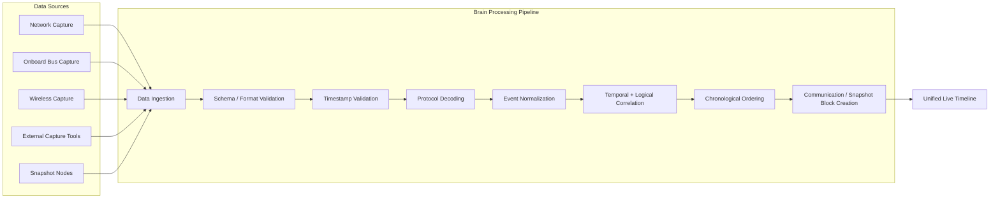

The pipeline ensures that events from different communication layers are processed consistently.

For example, a single DUT operation may result in:

1. An HTTP request.
2. A TCP packet.
3. An internal SPI transaction.
4. An I2C transaction.
5. A GPIO state change.

The correlation engine groups logically related events into a Communication Block.

---

## 6. Time Synchronization Architecture

Accurate time synchronization is a core architectural capability.

The Brain and all relevant capture components synchronize against a local time reference.

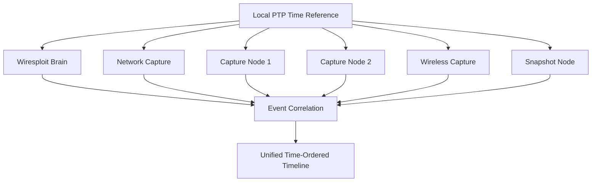

The architecture must support:

* A common local time reference.
* Timestamped events.
* Timestamped snapshots.
* Clock drift measurement.
* Maximum observed clock drift documentation.
* Monitoring of clock synchronization status.

The time reference must operate locally within the isolated test-bench network and must not depend on Internet connectivity.

---

## 7. Session Recording Architecture

Session recording is responsible for creating a persistent representation of a monitoring or active reconnaissance session.

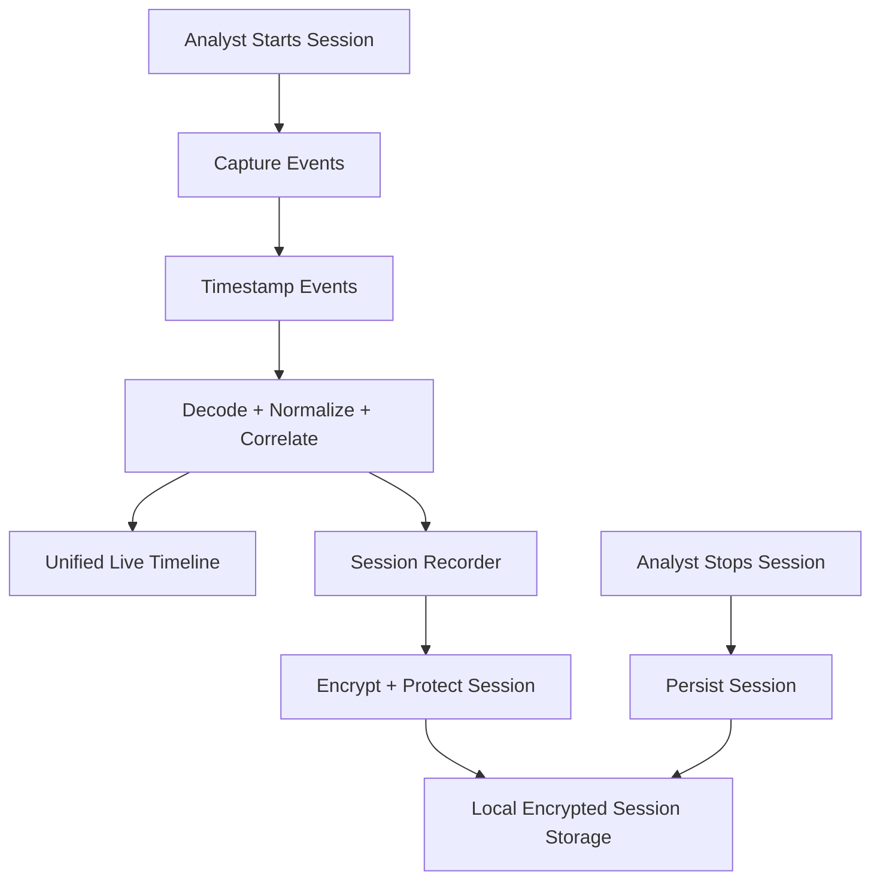

A recorded session contains sufficient information to:

* Reconstruct the original event sequence.
* Preserve original timestamps.
* Review the session.
* Search captured data.
* Run analytics.
* Generate behavior diagrams.
* Reconstruct memory.
* Generate findings.
* Export artifacts.

---
## 8. Analytics and Forensics Architecture

Analytics operates primarily on recorded sessions.

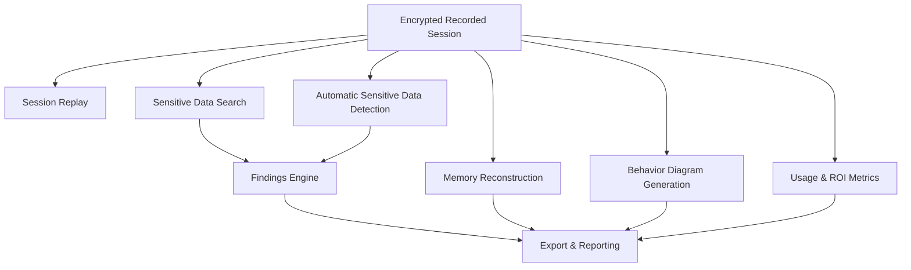

---
## 9. Sensitive Data Detection

The system supports both analyst-driven searching and automatic detection.

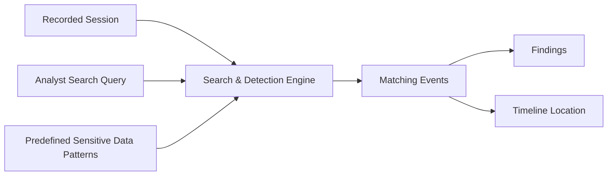

The detection engine may identify:

* Credentials.
* Tokens.
* API keys.
* Other predefined sensitive-data patterns.

Each finding should retain traceability to:

* Packet/event.
* Timestamp.
* Protocol.
* Timeline location.
* Detection method.

---
## 10. Memory Reconstruction Architecture

Memory reconstruction processes captured bus transactions to reconstruct a logical memory map.

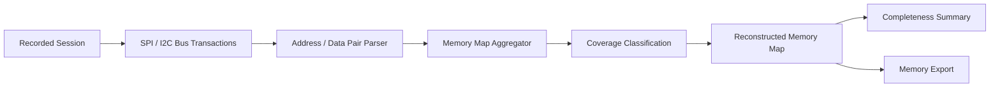

Memory ranges are classified as:

* Fully observed.
* Partially observed.
* Never captured.

The reconstructed memory map is not intended to perform firmware disassembly or static binary analysis.

---
## 11. Active Reconnaissance Architecture

Active reconnaissance is isolated logically from passive monitoring.

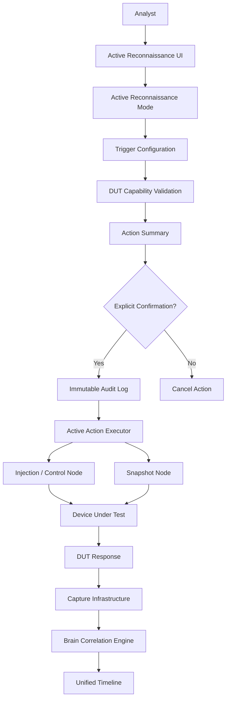

Active reconnaissance actions include:

* Hardware reset.
* Power-cycle.
* GPIO pulse generation.
* Wireless signal replay.
* Onboard protocol frame replay.
* Signal injection.

All active operations require:

1. Explicit Active Reconnaissance mode.
2. Parameter configuration.
3. Parameter validation.
4. Action summary.
5. Explicit analyst confirmation.
6. Audit logging.
7. Execution.
8. DUT response capture.
9. Correlation and analysis.

---

## 12. Passive vs Active Operational Modes

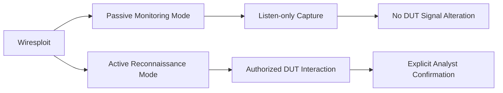

### Passive Monitoring

In Passive Monitoring mode:

* The system listens to monitored interfaces.
* No packets are injected.
* No signals are transmitted.
* No DUT state is intentionally modified.
* Capture data is processed and correlated.

### Active Reconnaissance

In Active Reconnaissance mode:

* The analyst explicitly enters active mode.
* The analyst configures the action.
* The system validates the configuration.
* The system presents the expected impact.
* The analyst explicitly confirms execution.
* The system performs the authorized action.
* DUT responses are captured and analyzed.

---
## 13. Security Architecture

Security is implemented across authentication, authorization, data protection, and auditability.

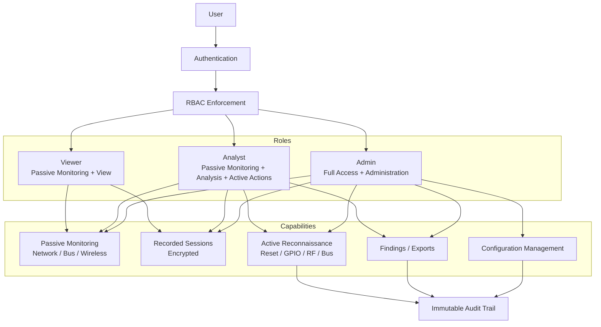

Role permissions:

| Role    | View | Analyze | Export | Active Actions | Administration |
| ------- | ---: | ------: | -----: | -------------: | -------------: |
| Viewer  |  Yes | Limited |     Yes |             No |             No |
| Analyst |  Yes |     Yes |    Yes |            Yes |             No |
| Admin   |  Yes |     Yes |    Yes |            Yes |            Yes |

---
## 14. Extensibility Architecture

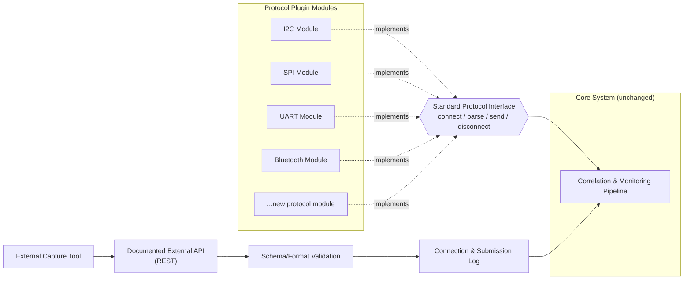

---
## 15. Deployment Architecture

The system is designed to run in an isolated test-bench environment.

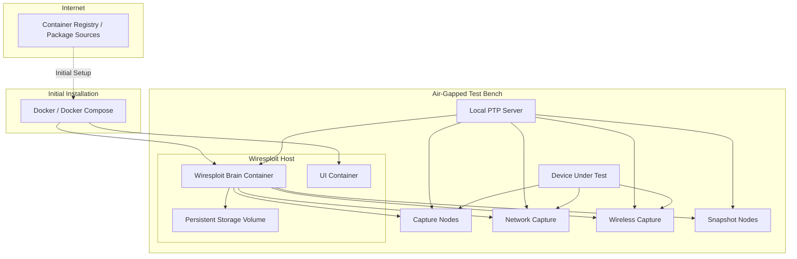

Runtime operation must not depend on:

* Internet access.
* Cloud services.
* Cloud-based storage.
* Online license checks.
* External telemetry.
* Internet-hosted time synchronization.

Internet connectivity may only be required during initial installation or image acquisition.

---
## 16. Docker Deployment Model

The recommended deployment model uses Docker Compose.

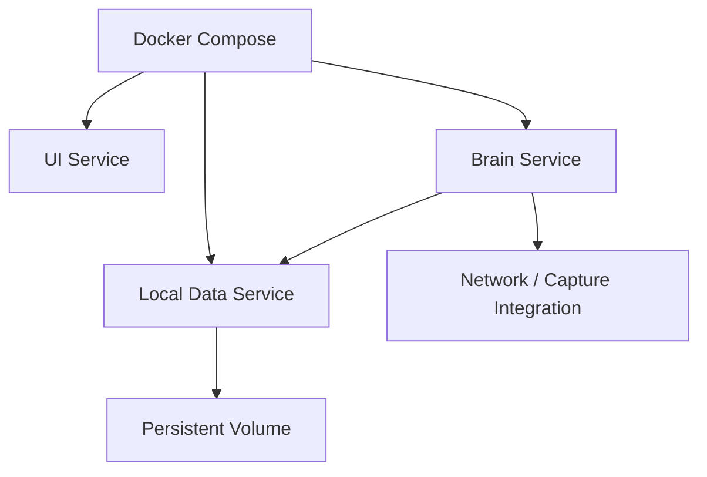

The deployment must ensure:

* All Docker images use pinned versions.
* Dependencies are locked.
* Containers can be recreated without data loss.
* Persistent data is stored outside the container writable layer.
* Configuration can be exported.
* Session data can be exported.
* Configuration and sessions can be imported.
* Imported data is validated before application.
* Import/export operations are logged.

---

## 17. Final Architecture Summary

The Wiresploit architecture is centered around the **Brain**, which provides the core processing and orchestration capabilities of the system.

The complete architecture follows two main paths: Passive Monitoring and Active Reconnaissance:

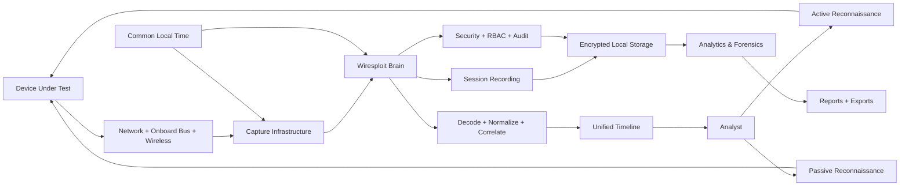

The overall architecture therefore provides a single platform that connects:

**Passive Reconnaissance:**

**Analyst → Passive Reconnaissance → DUT → Capture Infrastructure → Brain → Correlation → Unified Timeline → Session Storage → Analytics → Reports**

**Active Reconnaissance:**

**Analyst → Active Reconnaissance → Injection / Control Nodes → DUT → Capture Infrastructure → Brain → Correlation → Analysis**

The complete data and processing flow can be summarized as:

**DUT → Network / Onboard Bus / Wireless → Capture Infrastructure → Time Synchronization → Brain → Decode + Normalize + Correlate → Unified Timeline → Session Recording → Encrypted Local Storage → Analytics & Forensics → Reports & Exports**

This architecture provides a clear separation between **passive observation** and **active interaction** while preserving the central objective of Wiresploit: **unifying heterogeneous DUT communication capture, passive and active reconnaissance, correlation, analysis, and evidence generation into a single secure and extensible platform.**
