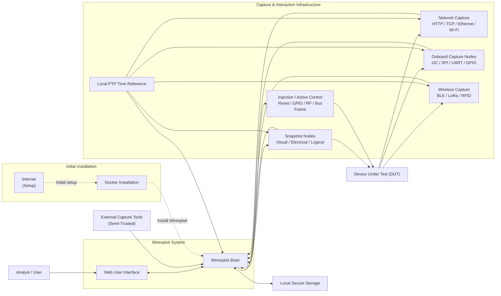
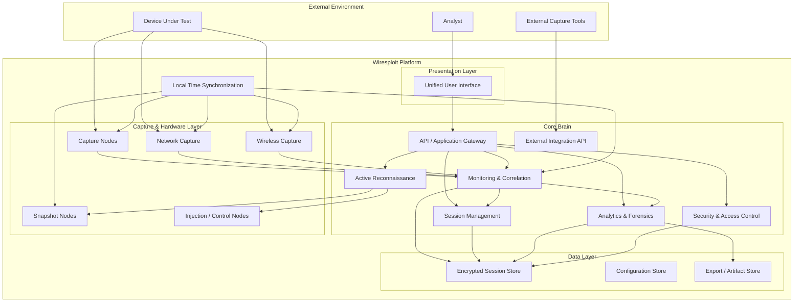
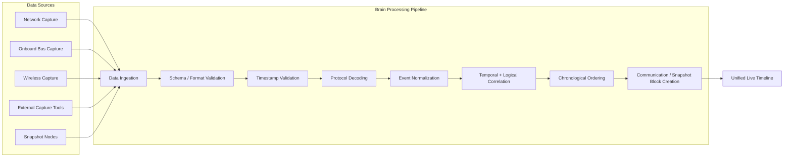
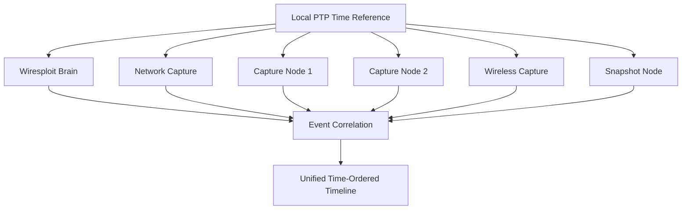
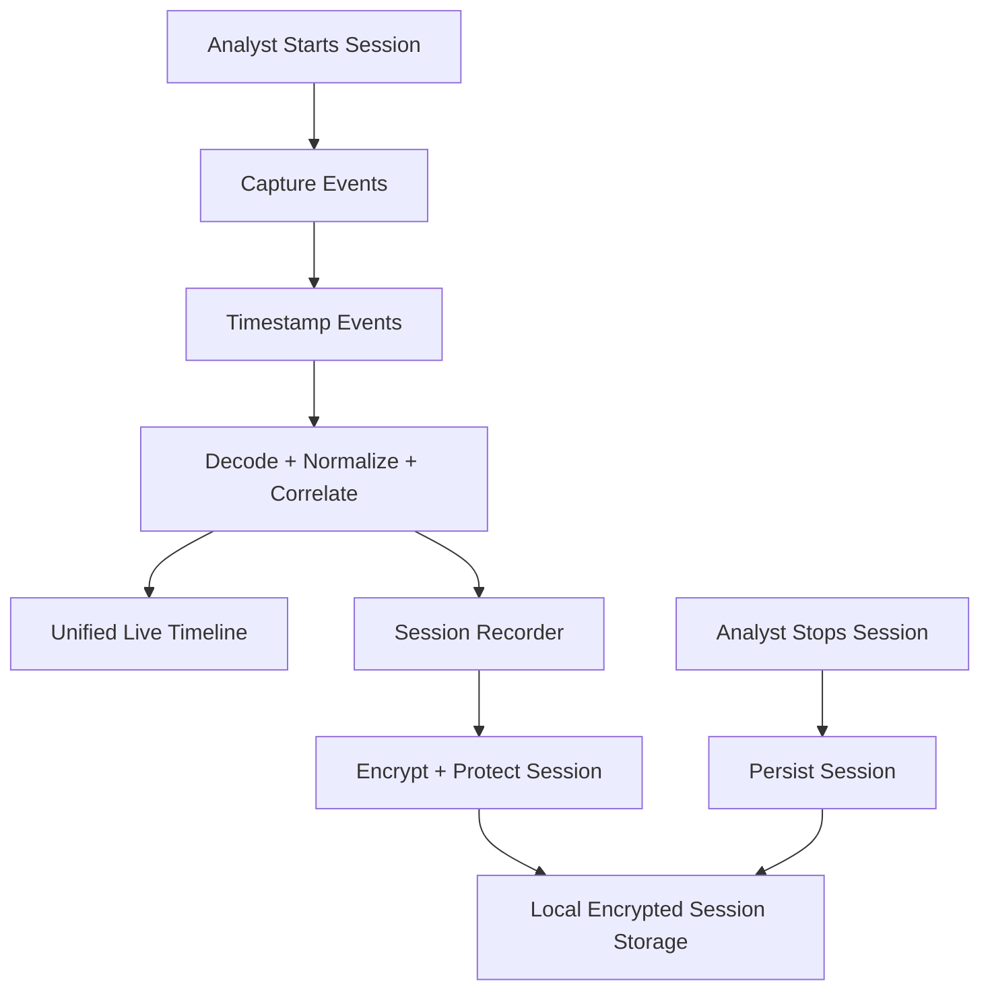
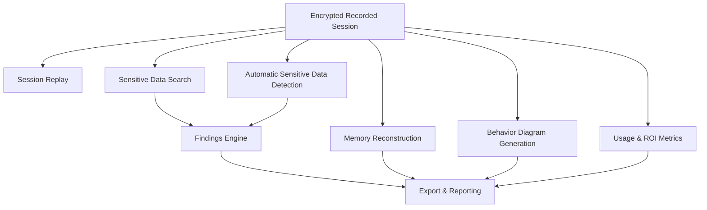

# Wiresploit — System Architecture Document

| Field | Value |
|---|---|
| Project | IoT Reconnaissance & Communication-Block Monitoring System (Wiresploit) |
| Document Type | System Architecture |
| Status | Draft v1.0 |

---
## 1. Overview

Wiresploit is an IoT/OT reconnaissance and communication-block monitoring system designed to provide security analysts with a unified platform for monitoring, recording, correlating, analyzing, and actively interacting with a Device Under Test (DUT).

The system replaces the need for multiple disconnected monitoring and analysis tools by collecting communication events from multiple interfaces, synchronizing them to a common time reference, processing and correlating them in the Brain, and presenting the resulting information through a unified user interface.

---

## 2. Architectural Goals

The architecture is designed to satisfy the following goals:

1. Provide a unified monitoring view across heterogeneous communication interfaces.
2. Preserve accurate timestamps across all captured events.
3. Correlate events from different sources into logical Communication Blocks.
4. Preserve the original chronological order of captured events.
5. Support both passive monitoring and explicitly authorized active reconnaissance.
6. Keep passive monitoring non-interfering with DUT behavior.
7. Enable complete session recording and later review.
8. Support advanced offline analysis of recorded sessions.
9. Protect sensitive captured data through encryption and access control.
10. Support operation in an isolated, air-gapped test-bench environment.
11. Allow new protocols and external capture tools to be added without modifying the core architecture.
12. Provide reproducible deployment using Docker and Docker Compose.

---
## 3. High-Level System Context

The following diagram presents the overall system context.

---
## 4. Architectural Boundary

The Wiresploit architecture is divided into the following major boundaries:

---

## 5. Monitoring and Correlation Pipeline

The monitoring pipeline transforms raw communication data into a unified timeline.

The pipeline ensures that events from different communication layers are processed consistently.

For example, a single DUT operation may result in:

1. An HTTP request.
2. A TCP packet.
3. An internal SPI transaction.
4. An I2C transaction.
5. A GPIO state change.

The correlation engine groups logically related events into a Communication Block.

---

## 6. Time Synchronization Architecture

Accurate time synchronization is a core architectural capability.

The Brain and all relevant capture components synchronize against a local time reference.

The architecture must support:

* A common local time reference.
* Timestamped events.
* Timestamped snapshots.
* Clock drift measurement.
* Maximum observed clock drift documentation.
* Monitoring of clock synchronization status.

The time reference must operate locally within the isolated test-bench network and must not depend on Internet connectivity.

---

## 7. Session Recording Architecture

Session recording is responsible for creating a persistent representation of a monitoring or active reconnaissance session.

A recorded session contains sufficient information to:

* Reconstruct the original event sequence.
* Preserve original timestamps.
* Review the session.
* Search captured data.
* Run analytics.
* Generate behavior diagrams.
* Reconstruct memory.
* Generate findings.
* Export artifacts.

---
## 8. Analytics and Forensics Architecture

Analytics operates primarily on recorded sessions.

---