# Wiresploit

A unified cross-layer analysis platform that correlates every communication—from network packets to hardware buses—into a single, searchable and analysable timeline, revealing the complete behavior of embedded and IoT devices.

-   

-   

-   

-   

## 1. project documents

### 1.1 Project Management Documents

| Document Name                                                                 | Description                                                         | Owner        | Date      | Status   |
|------------------------------------------------------------------------------|---------------------------------------------------------------------|--------------|------------|----------|
| [Project Charter](00_Project_Management/01_Charter.md)                      | Defines project purpose, objectives, scope, and key stakeholders    | CERT-team    | 14-7-2026   | 🟢 Final |
| [Project Plan](00_Project_Management/02_Plan.md)                             | Outlines the detailed project management and approach               |            |          |  |
| [Project Schedule](00_Project_Management/03_Schedule.md)                     | Timeline, milestones, and deliverables schedule                     |            |          |  |
| [Issue Log](00_Project_Management/04_Issue_Log.md)                           | Records project issues and their resolution status                  |            |          |  |

### 1.2 Requirements

| Document Name                                                                 | Description                                                         | Owner                  | Date       | Status   |
|------------------------------------------------------------------------------|---------------------------------------------------------------------|------------------------|------------|----------|
| [Business Requirements Document (BRD)](01_Requirements/00_BRD.md)            | Details business case, objectives, and high-level requirements      | CERT-team    | 14-7-2026  | 🟢 Final |
| [System Requirements Specification (SysRS)](01_Requirements/01_SysRS.md)      | Top-level system requirements for the solution                     |    |  |  |
| [Software Requirements Specification (SwRS)](01_Requirements/02_SwRS.md)      | Software-specific detailed requirements                            |    |  |  |
| [Hardware Requirements Specification (HwRS)](01_Requirements/03_HwRS.md)      | Hardware-specific detailed requirements                            |    |  |  |
| [Firmware Requirements Specification (FwRS)](01_Requirements/04_FwRS.md)      | Firmware-specific detailed requirements                            |    |  |  |
| [Acceptance Criteria](01_Requirements/05_Acceptance_Criteria.md)              | Success criteria for evaluating requirements fulfillment           |    |  |  |

### 1.3 System Architecture

| Document Name                                                                 | Description                                                         | Owner                  | Date       |Status   |
|------------------------------------------------------------------------------|---------------------------------------------------------------------|------------------------|------------|---------|
|                                                                              |                                                                     |                        |            |  |

### 1.4 Documentation

| Document Name                                                                 | Description                                                         | Owner                  | Date       |Status   |
|------------------------------------------------------------------------------|---------------------------------------------------------------------|------------------------|------------|---------|
| [User Manual](03_Documentation/00_User_Manual.md)         | End-user documentation and usage guide                          |    |  | |
| [API Documentation](03_Documentation/01_API_Documentation.md)     | Technical reference for platform APIs                   |    |  | |
| [Installation Guide](03_Documentation/02_Installation_Guide.md)   | Setup & installation instructions for all components    |    |  | |

## 2. Task Management Process

The project leverages [ClickUp](https://app.clickup.com/9015638084/v/o/s/901511461217) as the central platform for managing, tracking, and reviewing all project tasks and deliverables.

### 2.1 Task Lifecycle and States

=== "Task States"
    Tasks flow through distinct stages as visualized in the following chart:

    | Task State   | Description                                                                                                                     |
    |--------------|---------------------------------------------------------------------------------------------------------------------------------|
    | **Backlog**  | All new and pending tasks are added to the backlog, where they await prioritisation and selection.                              |
    | **To Do**    | Tasks selected for the upcoming sprint or iteration are moved here.                                                             |
    | **In Progress** | When a team member (from the Helwan team) begins working on a task, it transitions to "In Progress".                        |
    | **Blocked**  | If a task is impeded by external factors (e.g., dependencies, missing hardware), it's flagged as Blocked for visibility.        |
    | **Completed**| Once finished, tasks move to Completed, pending further review.                                                                 |
    | **In Review**| CERT team reviews the deliverable for quality and completeness.                                                                 |
    | **Rejected** | If the deliverable does not meet acceptance criteria, the CERT team can reject it, requiring further rework.                    |
    | **Closed**   | After CERT approval, the task is marked as Closed, indicating official completion.                                              |

```mermaid
flowchart TD
    BL(BACKLOG):::BACKLOG -- sprint's Tasks --> TODO(TO DO):::TODO
    subgraph Helwan team
        TODO -- task picked up --> INPROGRESS(IN PROGRESS):::INPROGRESS
        INPROGRESS -- waiting on another task or missing hardware --> BLOCKED(BLOCKED):::BLOCKED
        INPROGRESS -- task completed by team member --> COMPLETED(COMPLETED):::COMPLETED
    end
    subgraph CERT team
        COMPLETED -- Task selected by CERT team for formal review --> REVIEW[IN REVIEW]:::REVIEW
        REVIEW -- CERT team reviewed and rejected the task --> REJECTED(REJECTED):::REJECTED
        REVIEW -- CERT team formally approves the deliverable --> CLOSED(CLOSED):::CLOSED
    end
    
    %% Node colors
    classDef BACKLOG fill:#8D8D8D,stroke:#444444,stroke-width:2px,font-weight:bold;
    classDef TODO fill:#5C47CD,stroke:#3B2580,stroke-width:2px,font-weight:bold;
    classDef INPROGRESS fill:#FFC53D,stroke:#B98A1C,stroke-width:2px,color:#000000,font-weight:bold;
    classDef BLOCKED fill:#000000,stroke:#191919,stroke-width:2px,font-weight:bold;
    classDef COMPLETED fill:#12A594,stroke:#07584E,stroke-width:2px,font-weight:bold;
    classDef REVIEW fill:#C36522,stroke:#7A4004,stroke-width:2px,font-weight:bold;
    classDef REJECTED fill:#E5484D,stroke:#831921,stroke-width:2px,font-weight:bold;
    classDef CLOSED fill:#2C8C5E,stroke:#1F4135,stroke-width:2px,font-weight:bold;
```

### 2.2 Responsibilities & Process

- **Task Creation:** Tasks can be created by any stakeholder, with details such as description, assignee, due date, and priority.
- **Assignment:** Tasks are assigned to appropriate team members via ClickUp, clarifying ownership.
- **Regular Updates:** Team members update task status as progress is made, ensuring real-time visibility for all stakeholders.
- **Review & Approval:** The CERT team is responsible for formal reviews, acceptance, or rejection of completed deliveries.
- **Traceability:** All changes, comments, attachments, and status updates are logged in the project's Github repo for a comprehensive project audit.

